# Présentation au titre de **Développeur Web Full Stack** 
<br>
<br>
<h2 style="margin-top: 2rem;"> Damien Goguet </h2>

<h2 style="font-size: 14px; display: inline-flex; align-items: center; gap: 0.5rem;">
  Promo 2024 - 
  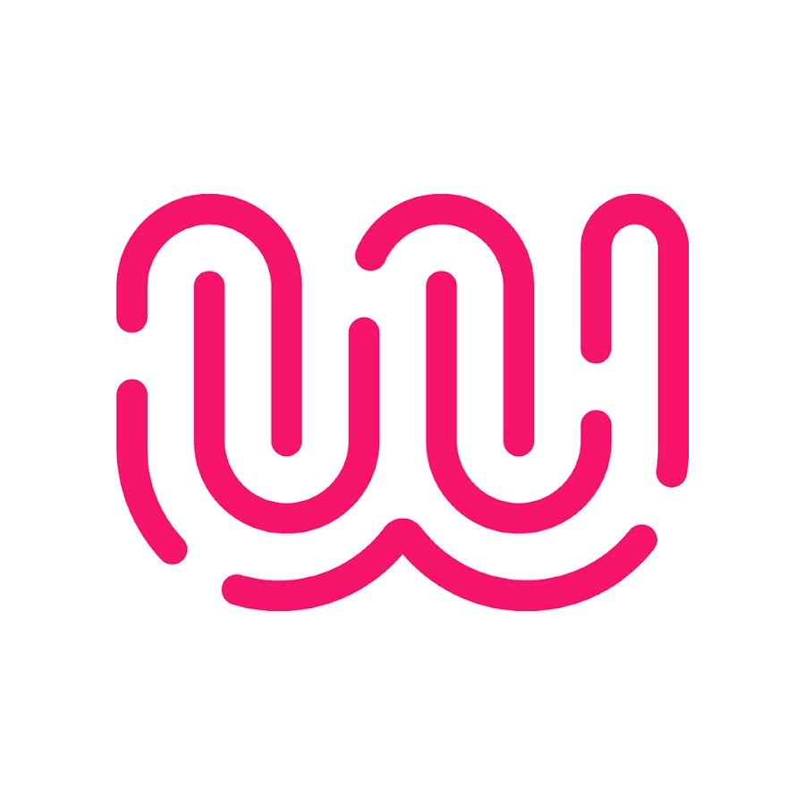 
  Wild Code School
</h2>

<br>
<br>
<br>

#### Présentation réalisée avec : **Slidev**

<div class="progress-container">
  <div
    class="progress-bar"
    :style="{ width: ((($page) / 45) * 100) + '%' }"
  ></div>
</div>
<div class="page abs-bl m-4 flex gap-2 text-m">
  <h5><SlideCurrentNo /> / <SlidesTotal /></h5>
</div>

<style>

.page {
  color: #F5F5F5;
  opacity:0.5;
  font-size: 10px;
}
.progress-container {
  border-top: 1px solid #F8E6CB;
  position: fixed;
  bottom: 0;
  left: 0;
  width: 100%;
  height: 8px;
  background-color: #F5F5F5;
  z-index: 100;
}

.progress-bar {
  border-radius: 0px 4px 4px 0px;
  height: 100%;
  background: linear-gradient(to right, #F8E6CB 0%, #E0C1A8 30%, #D8B192 60%);
  transition: width 0.3s ease-in-out;
}

  * {text-align: end;}
  h1 {
    color: #D8B192;
}
  h2, h3, h4 {
    color: #090A09;
}

.links {
display:grid;
  grid-template-columns: repeat(2, 1fr);
  justify-items: center;
  align-items: center; 
}

.link {
display: flex; 
align-items: center;
flex-direction: column;
}
</style>

<!--
Bonjour, <br>
Je m'appelle **Damien Goguet**, aujourd'hui je suis **développeur web full stack** après une **reconversion** professionnelle.<br>
Auparavant, j'ai été **technicien supérieur en systèmes et réseaux**. <br> 
J'ai suivi le **bootcamp** intensif à la **Wild Code School** qui a durée **5 mois** pour concrétiser ce nouveau parcours.<br>
Je suis ravi de vous **présenter** aujourd'hui l'un de mes projets que j'ai réalisé durant cette formation.<br>
-->

---
layout: dynamic-image
image: "./media/Pictures/Eclosion.png"
upperImage: "./media/Pictures/Eclosion.png"
equal: true
left: false
---

<div>
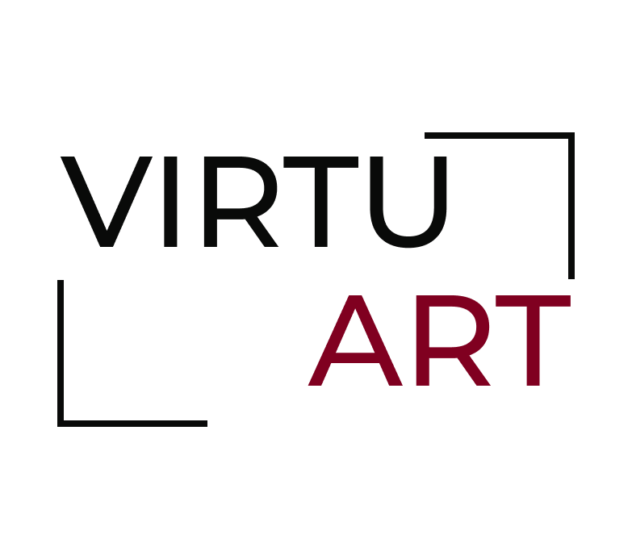
<p style="color:#D8B192;">L'art pour tous!</p>
</div>

<div class="absolute left-40% m--12 flex gap-2">
  <a href="https://github.com/dampherrr/P3-VirtuArt" target="_blank" alt="GitHub" title="GitHub: P3-VirtuArt"
    class="text-xl slidev-icon-btn !border-none !hover:text-black">
    <carbon-logo-github />
  </a>
</div>

<div class="progress-container">
  <div
    class="progress-bar"
    :style="{ width: ((($page) / 45) * 100) + '%' }"
  ></div>
</div>
<div class="page abs-bl m-4 flex gap-2 text-m">
  <h5><SlideCurrentNo /> / <SlidesTotal /></h5>
</div>

<style>
  .page {
    color: #090A09;
  opacity:0.5;
  font-size: 10px;
}
.progress-container {
  border-top: 1px solid #F8E6CB;
  position: fixed;
  bottom: 0;
  left: 0;
  width: 100%;
  height: 8px;
  background-color: #F5F5F5;
  z-index: 100;
}

.progress-bar {
  border-radius: 0px 4px 4px 0px;
  height: 100%;
  background: linear-gradient(to right, #F8E6CB 0%, #E0C1A8 30%, #D8B192 60%);
  transition: width 0.3s ease-in-out;
}
</style>

<!--
Le projet Virtuart est notre **troisième projet fil rouge**, réalisé en **full stack**. Il s'agit d'une **galerie interactive** dédiée à la peinture et aux œuvres numériques.
Le code source du projet est **hébergé sur GitHub**.
-->

---
transition: slide-up
---

# Membre de l'équipe sur le projet:

<div class="team-members">
  <a class="member" href="https://github.com/BaptisteFredj" target="_blank">
    Baptiste <br>
    
  </a>
  <a class="member" href="https://github.com/Agraheris" target="_blank">
    Clément <br>
    
  </a>
  <a class="member" href="https://github.com/dampherrr" target="_blank">
    Damien <br>
    
  </a>
  <a class="member" href="https://github.com/Ryokoh-974" target="_blank">
    Daniel <br>
    
  </a>
  <a class="member" href="https://github.com/monica-tech75" target="_blank">
    Monica <br>
    
  </a>
</div>

<div class="abs-br m-8 flex gap-2">

</div>

<div class="progress-container">
  <div
    class="progress-bar"
    :style="{ width: ((($page) / 45) * 100) + '%' }"
  ></div>
</div>
<div class="page abs-bl m-4 flex gap-2 text-m">
  <h5><SlideCurrentNo /> / <SlidesTotal /></h5>
</div>

<style>

.page {
  color: #090A09;
  opacity:0.5;
  font-size: 10px;
}
.progress-container {
  border-top: 1px solid #F8E6CB;
  position: fixed;
  bottom: 0;
  left: 0;
  width: 100%;
  height: 8px;
  background-color: #F5F5F5;
  z-index: 100;
}

.progress-bar {
  border-radius: 0px 4px 4px 0px;
  height: 100%;
  background: linear-gradient(to right, #F8E6CB 0%, #E0C1A8 30%, #D8B192 60%);
  transition: width 0.3s ease-in-out;
}

.team-members {
  display: flex;
  gap: 10px;
  flex-wrap: wrap;
  align-items: center;
  justify-content: center;
}

.member { 
  border-bottom: 4px solid #E0C1A8;
  border-radius: 8px;
  text-align: center;
  margin: 10px;  
  height: 10rem;
  width: 8rem;
  display: flex;
  align-items: center;
  justify-content: center;
  flex-direction: column;
}
.member:hover { 
  background-color: #E0C1A8;
  color: #090A09;
}
.team-members a img {   
border-radius: 8px;
}
</style>

<!--
Nous étions une équipe de 5 personnes pour concevoir ce projet. Nous avons adopté une approche collaborative en nous répartissant les rôles de manière tournante, ce qui a permis à chacun de participer à toutes les étapes de la réalisation.
-->

---
transition: slide-up
level: 2
---

# Demande du client:

<div class="client">
<div v-click class="rules" v-motion
  :initial="{ y: 80 }"
  :enter="{ x: 0, y: 0 }">
<p>- Galerie d'art</p>

</div>
<div v-click class="rules"   v-motion
  :initial="{ y: 80 }"
  :enter="{ x: 0, y: 0 }">
<p>- Interactif</p>

</div>
<div v-click class="rules"   v-motion
  :initial="{ y: 80 }"
  :enter="{ x: 0, y: 0 }">
<p>- Différents profils utilisateurs</p>

</div>
<div v-click class="rules"   v-motion
  :initial="{ y: 80 }"
  :enter="{ x: 0, y: 0 }">
<p>- Ajout des favoris</p>

</div>
<div v-click class="rules"   v-motion
  :initial="{ y: 80 }"
  :enter="{ x: 0, y: 0 }">
<p>- Responsive</p>

</div>
<div v-click class="rules"   v-motion
  :initial="{ y: 80 }"
  :enter="{ x: 0, y: 0 }">
<p>- Deadline</p>

</div>
</div>

<div class="abs-br m-8 flex gap-2">

</div>

<div class="progress-container">
  <div
    class="progress-bar"
    :style="{ width: ((($page) / 45) * 100) + '%' }"
  ></div>
</div>
<div class="page abs-bl m-4 flex gap-2 text-m">
  <h5><SlideCurrentNo /> / <SlidesTotal /></h5>
</div>

<style>

.page {
  color: #090A09;
  opacity:0.5;
  font-size: 10px;
}
.progress-container {
  border-top: 1px solid #F8E6CB;
  position: fixed;
  bottom: 0;
  left: 0;
  width: 100%;
  height: 8px;
  background-color: #F5F5F5;
  z-index: 100;
}

.progress-bar {
  border-radius: 0px 4px 4px 0px;
  height: 100%;
  background: linear-gradient(to right, #F8E6CB 0%, #E0C1A8 30%, #D8B192 60%);
  transition: width 0.3s ease-in-out;
}

h1 {
    color: #D8B192;
}

.client {

  display: grid;
  grid-template-columns: repeat(3, 1fr);
  justify-items: center;
  align-items: center; 
}

.rules {    
  border-bottom: 4px solid #E0C1A8;
  border-radius: 8px;
  display: flex;
  flex-direction: column;
  justify-content: center;
  align-items: center;
  text-align: center;
  padding: 10px;
  height: 100%; 
  width: 15rem;
}
.rules:hover { 
  background-color: #E0C1A8;
  color: #090A09;
}
</style>

<!--
Dans ce projet, nous avons travaillé à partir de **points précis** définis par un **client fictif**, tout en ayant une grande **liberté pour le reste**.  
CLICK<br>
1. L’un des points majeurs était la création d’une **galerie d’art accessible à tous**.  
CLICK<br>
2. Pour la version desktop, il souhaitait également intégrer une **visite interactive**.  
CLICK<br>
3. Le projet devait inclure la gestion de **trois niveaux d’utilisateurs** :  
   - Les **visiteurs**, qui peuvent consulter le site sans interactions.  
   - Les **utilisateurs connectés**, capables de publier et gérer leurs propres œuvres.  
   - Les **administrateurs**, responsables de la gestion des événements, comme les expositions.  
CLICK<br>
4. Une autre fonctionnalité demandée était de permettre aux utilisateurs connectés **d’ajouter des œuvres à leurs favoris** pour les retrouver facilement.  
CLICK<br>
5. Enfin, le site devait être **entièrement responsive**, sur mobile et sur desktop.  
CLICK<br>
6. Pour relever ce défi, nous disposions d’une **deadline d’un mois** pour concevoir et livrer l’ensemble du projet.  
-->

---
layout: dynamic-image
image: './media/Pictures/Vie_Urbaine.webp'
equal: true
left: false
transition: slide-up
---

# Sommaire

<div class="client">
<div v-click v-motion
  :initial="{ x: -80 }"
  :enter="{ x: 0 }">
<p>- Organisation et outils de projet</p>
</div>
<div v-click v-motion
  :initial="{ x: -80 }"
  :enter="{ x: 0 }">
<p>- Identité visuelle et design</p>
</div>
<div v-click v-motion
  :initial="{ x: -80 }"
  :enter="{ x: 0 }">
<p>- Architecture technique </p>
</div>
<div v-click v-motion
  :initial="{ x: -80 }"
  :enter="{ x: 0 }">
<p>- Modélisation des données</p>
</div>
<div v-click v-motion
  :initial="{ x: -80 }"
  :enter="{ x: 0 }">
<p>- Gestion serveur (Backend) </p>
</div>
<div v-click v-motion
  :initial="{ x: -80 }"
  :enter="{ x: 0 }">
<p>- Sécurité</p>
</div>
<div v-click v-motion
  :initial="{ x: -80 }"
  :enter="{ x: 0 }">
<p>- Gestion client (Frontend)</p>
</div>
<div v-click v-motion
  :initial="{ x: -80 }"
  :enter="{ x: 0 }">
<p>- Aperçu pratique</p>
</div>
<div v-click v-motion
  :initial="{ x: -80 }"
  :enter="{ x: 0 }">
<p>- Conclusion et perspectives</p>
</div>
</div>

<div class="abs-br m-8 flex gap-2">

</div>

<div class="progress-container">
  <div
    class="progress-bar"
    :style="{ width: ((($page) / 45) * 100) + '%' }"
  ></div>
</div>
<div class="page abs-bl m-4 flex gap-2 text-m">
  <h5><SlideCurrentNo /> / <SlidesTotal /></h5>
</div>

<style>

.page {
  color: #090A09;
  opacity:0.5;
  font-size: 10px;
}
.progress-container {
  border-top: 1px solid #F8E6CB;
  position: fixed;
  bottom: 0;
  left: 0;
  width: 100%;
  height: 8px;
  background-color: #F5F5F5;
  z-index: 100;
}

.progress-bar {
  border-radius: 0px 4px 4px 0px;
  height: 100%;
  background: linear-gradient(to right, #F8E6CB 0%, #E0C1A8 30%, #D8B192 60%);
  transition: width 0.3s ease-in-out;
}

h1 {
    color: #D8B192;
  margin-bottom: 5rem;
}

.team-members {
  display: flex;
  gap: 10px;
  flex-wrap: wrap;
  align-items: center;
  justify-content: center;
}

.member { 
  border-bottom: 4px solid #E0C1A8;
  border-radius: 8px;
  text-align: center;
  margin: 10px;
}
.member:hover { 
  background-color: #E0C1A8;
  color: #090A09;
}
.team-members a img {   
border-radius: 8px;
}
</style>

<!-- 
Dans cette présentation, je vais détailler les différentes étapes de la conception et de la réalisation de ce projet :

1. Nous commencerons par explorer les **outils de communication et de collaboration** qui ont structuré notre travail en équipe.  
CLICK<br>
1. Ensuite, nous nous pencherons sur **l’identité visuelle et le design**, avec les choix graphiques qui reflètent l’essence du projet, ainsi que les outils utilisés.  
CLICK<br>
1. Puis, je vous présenterai **l’architecture technique**, pour structurer le code de manière claire et maintenable.  
CLICK<br>
1. Nous poursuivrons avec **la modélisation des données**, en partant de la conceptualisation des besoin.
<br>CLICK<br>
1. Ensuite du coté de **la gestion serveur**.
<br>CLICK<br>
1. Mais aussi la **sécurité**, nous verrons les mesures mises en place.
<br>CLICK<br>  
1. Puis la **gestion client**.  
CLICK<br>
1. Une **démonstration pratique** pour voir le projet en action. 
<br>CLICK<br>
1. Enfin, je **conclurai** cette présentation par une synthèse des défis que nous avons relevés, et les pistes pour de futures améliorations.  
-->
---
layout: dynamic-image
image: "./media/Pictures/Chaos_Organisé.webp"
equal: false
left: false
transition: slide-left
---

# Organisation et <br>outils de projet

<div class="abs-br m-8 flex gap-2">

</div>

<div class="progress-container">
  <div
    class="progress-bar"
    :style="{ width: ((($page) / 45) * 100) + '%' }"
  ></div>
</div>
<div class="page abs-bl m-4 flex gap-2 text-m">
  <h5><SlideCurrentNo /> / <SlidesTotal /></h5>
</div>

<style>

.page {
  color: #090A09;
  opacity:0.5;
  font-size: 10px;
}
.progress-container {
  border-top: 1px solid #F8E6CB;
  position: fixed;
  bottom: 0;
  left: 0;
  width: 100%;
  height: 8px;
  background-color: #F5F5F5;
  z-index: 100;
}

.progress-bar {
  border-radius: 0px 4px 4px 0px;
  height: 100%;
  background: linear-gradient(to right, #F8E6CB 0%, #E0C1A8 30%, #D8B192 60%);
  transition: width 0.3s ease-in-out;
}

h1 {
    color: #D8B192;
}
</style>

<!--
Passons maintenant à la manière dont nous avons structuré notre travail. Je vais vous présenter les outils que nous avons utilisés pour collaborer efficacement en équipe et suivre l’avancement de ce projet.
-->

---
transition: slide-up
layout: two-cols
---

<div class="block" v-motion
  :initial="{ y: 80 }"
  :enter="{ x: 0, y: 0 }">
<h2>Méthodologie</h2>
<div class="method" v-click="1" v-motion
  :initial="{ y: 80 }"
  :enter="{ x: 0, y: 0 }">
<div class="element">
<p>- Agile (Scrum)</p>
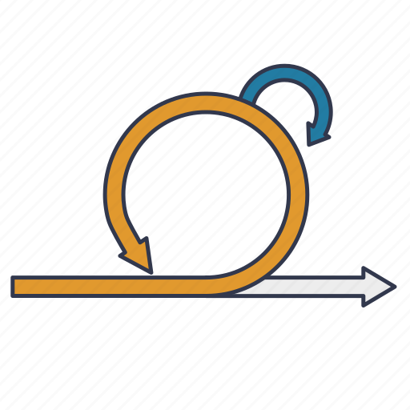
</div>
</div>
</div>

<br>

<div v-click="2" class="block" v-motion
  :initial="{ y: 80 }"
  :enter="{ x: 0, y: 0 }">
<h2>Organisation et communication</h2>
<div class="orga" v-click="3" v-motion
  :initial="{ y: 80 }"
  :enter="{ x: 0, y: 0 }">
<div class="element">
<p>- Discord</p>

</div>
<div class="element">
<p>- Google Sheet</p>
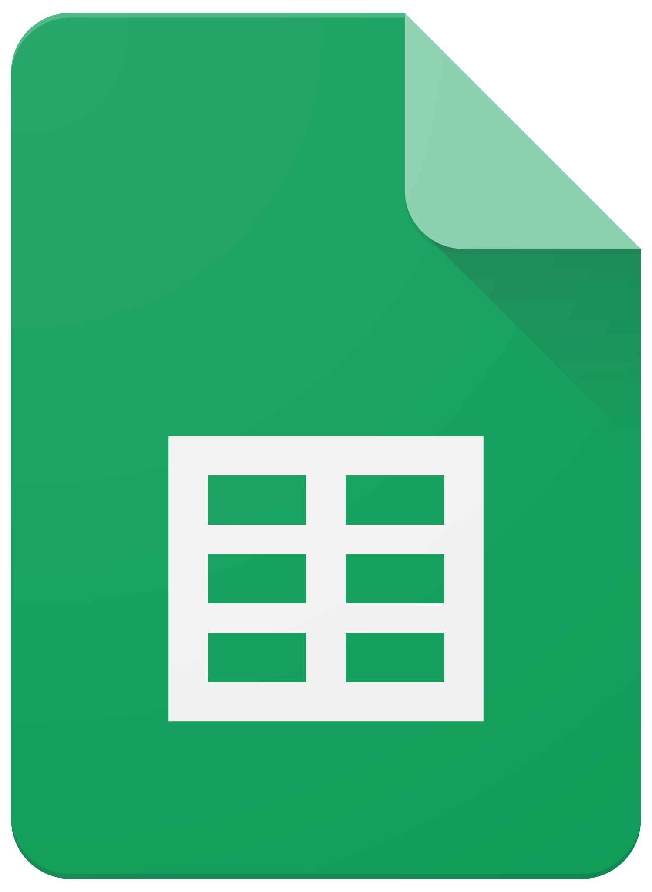
</div>
<div class="element">
<p>- FigJam</p>
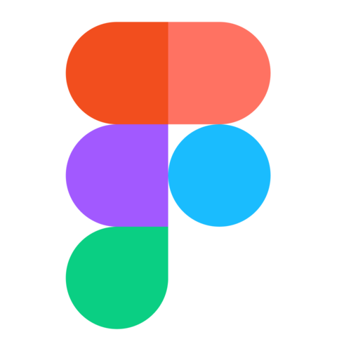
</div>
</div>
</div>

::right::
<div>
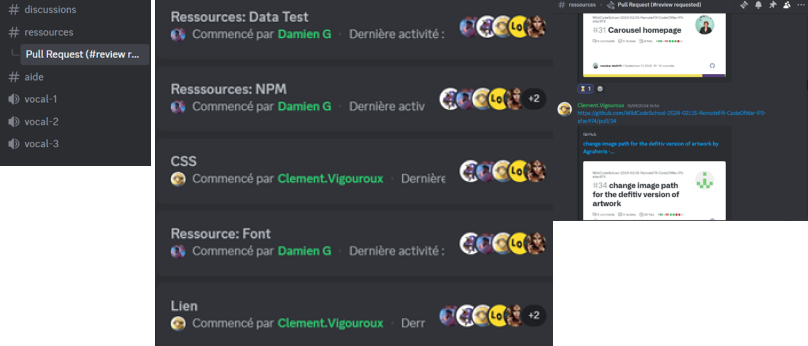

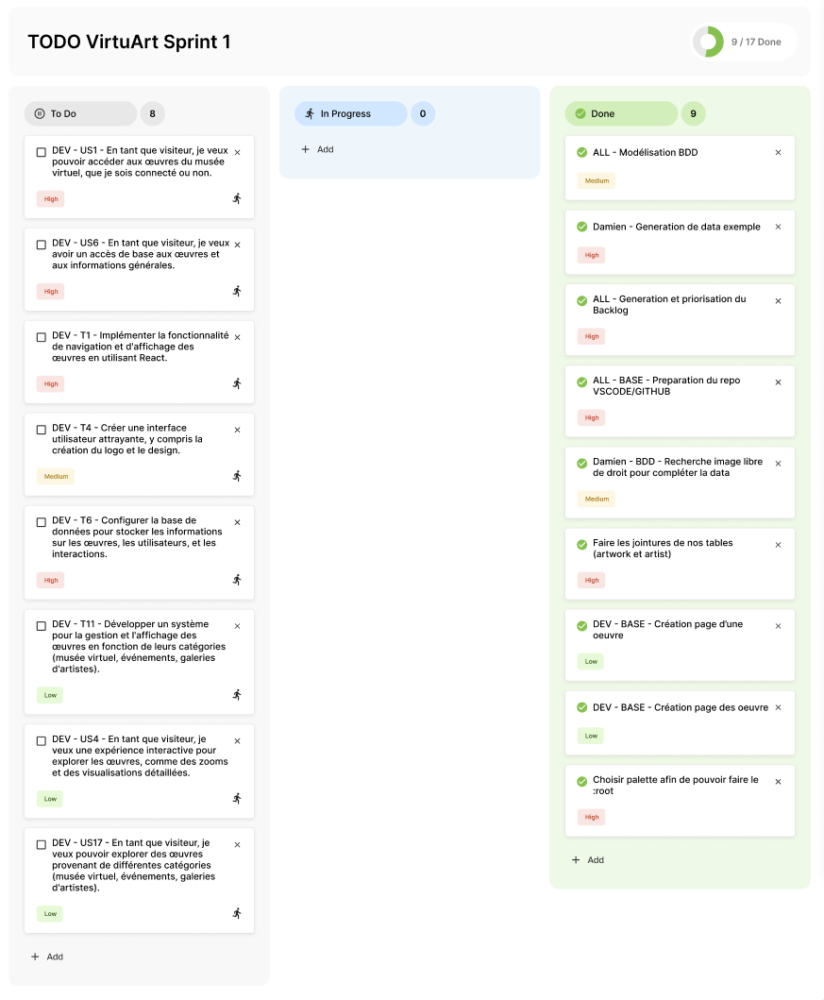
</div>
<div class="abs-br m-4 flex gap-2">

</div>

<div class="progress-container">
  <div
    class="progress-bar"
    :style="{ width: ((($page) / 45) * 100) + '%' }"
  ></div>
</div>
<div class="page abs-bl m-4 flex gap-2 text-m">
  <h5><SlideCurrentNo /> / <SlidesTotal /></h5>
</div>

<style>

.page {
  color: #090A09;
  opacity:0.5;
  font-size: 10px;
}
.progress-container {
  border-top: 1px solid #F8E6CB;
  position: fixed;
  bottom: 0;
  left: 0;
  width: 100%;
  height: 8px;
  background-color: #F5F5F5;
  z-index: 100;
}

.progress-bar {
  border-radius: 0px 4px 4px 0px;
  height: 100%;
  background: linear-gradient(to right, #F8E6CB 0%, #E0C1A8 30%, #D8B192 60%);
  transition: width 0.3s ease-in-out;
}

h1 {
    color: #D8B192;
}
.block {
  display: flex;
  flex-direction: column;
  }
.orga, .method {
  display: grid;
  grid-template-columns: repeat(3, 1fr);
  justify-items: center;
  align-items: center; 
}
.element{
  margin: 1rem;
  border-bottom: 4px solid #E0C1A8;
  border-radius: 8px;
  display: flex;
  flex-direction: column;
  justify-content: center;
  align-items: center;
  text-align: center;
  width: 10rem;
    height: 10rem;

}
  .element:hover { 
    background-color: #E0C1A8;
    color: #090A09;
  }
</style>

<!-- 
Pour **structurer** notre travail, 
<br>CLICK<br>
nous avons opté pour une **méthodologie Agile basée sur Scrum**.

Grâce à des **sprints hebdomadaires**, nous avons fixé des **objectifs clairs** et ajusté les **priorités** tout au long du projet.

CLICK<br>

B- Pour rester organisés, nous avons utilisé trois outils principaux :
<br>CLICK<br>

<br>CLICK<br>
1- Nous avons **centralisé nos échanges** sur **Discord** avec des fils thématiques dédiés, comme pour le CSS ou les pull requests. Cela nous a permis de collaborer efficacement au quotidien, notamment pour valider les PR.<br>
<br>CLICK<br>
2- **Google Sheets** pour gérer le backlog, nous avons listé toutes les user stories et tâches, en les classant par ordre de priorité.<br>
<br>CLICK<br>
3- Puis nous avons utilisé FigJam pour **collaborer en temps réel**, notamment pour les brainstormings et la gestion des to-do lists hebdomadaires. Chaque sprint avait une colonne **'À faire'**, **'En cours'**, et **'Terminé'**.<br>
-->
---
layout: two-cols
transition: slide-left
---

<div class="block" v-motion
  :initial="{ y: 80 }"
  :enter="{ x: 0, y: 0 }">
<h2>Template</h2>
<div class="method" v-click="1" v-motion
  :initial="{ y: 80 }"
  :enter="{ x: 0, y: 0 }">
<div class="element">
<p>- Harmonia</p>

</div>
</div>
</div>

<br>

<div class="block" v-click="2" v-motion
  :initial="{ y: 80 }"
  :enter="{ x: 0, y: 0 }">
<h2>Génération des données</h2>
<div class="method" v-click="3" v-motion
  :initial="{ y: 80 }"
  :enter="{ x: 0, y: 0 }">
<div class="element">
<p>- ChatGPT</p>

</div>
</div>
</div>

::right::
<div v-click="4" class="block" v-motion
  :initial="{ y: 80 }"
  :enter="{ x: 0, y: 0 }">
<h2>Outils de développement</h2>
<div class="orga" v-click="5" v-motion
  :initial="{ y: 80 }"
  :enter="{ x: 0, y: 0 }">
<div class="element">
<p>- VS Code</p>

</div>
<div class="element">
<p>- Node.js</p>

</div>
<div class="element">
<p>- Git</p>

</div>
<div class="element">
<p>- Github</p>

</div>
<div class="element">
<p>- Jest</p>

</div>
<div class="element">
<p>- Postman</p>

</div>
</div>
</div>

<div class="abs-br m-4 flex gap-2">

</div>

<div class="progress-container">
  <div
    class="progress-bar"
    :style="{ width: ((($page) / 45) * 100) + '%' }"
  ></div>
</div>
<div class="page abs-bl m-4 flex gap-2 text-m">
  <h5><SlideCurrentNo /> / <SlidesTotal /></h5>
</div>

<style>

.page {
  color: #090A09;
  opacity:0.5;
  font-size: 10px;
}
.progress-container {
  border-top: 1px solid #F8E6CB;
  position: fixed;
  bottom: 0;
  left: 0;
  width: 100%;
  height: 8px;
  background-color: #F5F5F5;
  z-index: 100;
}

.progress-bar {
  border-radius: 0px 4px 4px 0px;
  height: 100%;
  background: linear-gradient(to right, #F8E6CB 0%, #E0C1A8 30%, #D8B192 60%);
  transition: width 0.3s ease-in-out;
}

h1 {
    color: #D8B192;
}
.block {
  display: flex;
  flex-direction: column;
  }
.orga, .method {
  display: grid;
  grid-template-columns: repeat(2, 1fr);
  justify-items: center;
  align-items: center; 
  
}
.element{
  border-bottom: 4px solid #E0C1A8;
  border-radius: 8px;
  display: flex;
  flex-direction: column;
  justify-content: center;
  align-items: center;
  text-align: center;
  width: 10rem;
    height: 8rem;

}
  .element:hover { 
    background-color: #E0C1A8;
    color: #090A09;
  }
</style>

<!-- 
Pour commencer,<br>CLICK<br> nous avons utilisé un template appelé **Harmonia**, fourni par la Wild Code School.

Ce template pédagogique a servi de point de départ pour structurer notre projet et poser les bases de notre développement.
<br>CLICK<br>

Pour alimenter rapidement notre base de données et créer un contenu de test réaliste, 
<br>CLICK<br>nous avons utilisé ChatGPT.

Cet outil nous a permis de générer de la data que ce soit des noms fictifs ou des images en quelques minutes, ce qui a été un gain de temps considérable.
<br>CLICK<br>

Nous avons utilisé plusieurs outils techniques pour le développement et le suivi du projet :
<br>CLICK<br>
**VS Code** : L’éditeur de code principal.<br>
**Node.js** : Pour exécuter notre code.<br>
**Git** : Pour le versionnement et la gestion des contributions de l’équipe.<br>
**GitHub** : Pour l’hébergement et le partage de notre dépôt.<br>
**Jest** : Pour les tests unitaires.<br>
**Postman** : Indispensable pour tester les API.<br>
 -->

---
transition: slide-up
---

<div class="block" v-motion
  :initial="{ y: 80 }"
  :enter="{ x: 0, y: 0 }">
<h2>Qualité du code</h2>
<div class="orga" v-click="1" v-motion
  :initial="{ y: 80 }"
  :enter="{ x: 0, y: 0 }">
<div class="element">
<p>- EsLint</p>
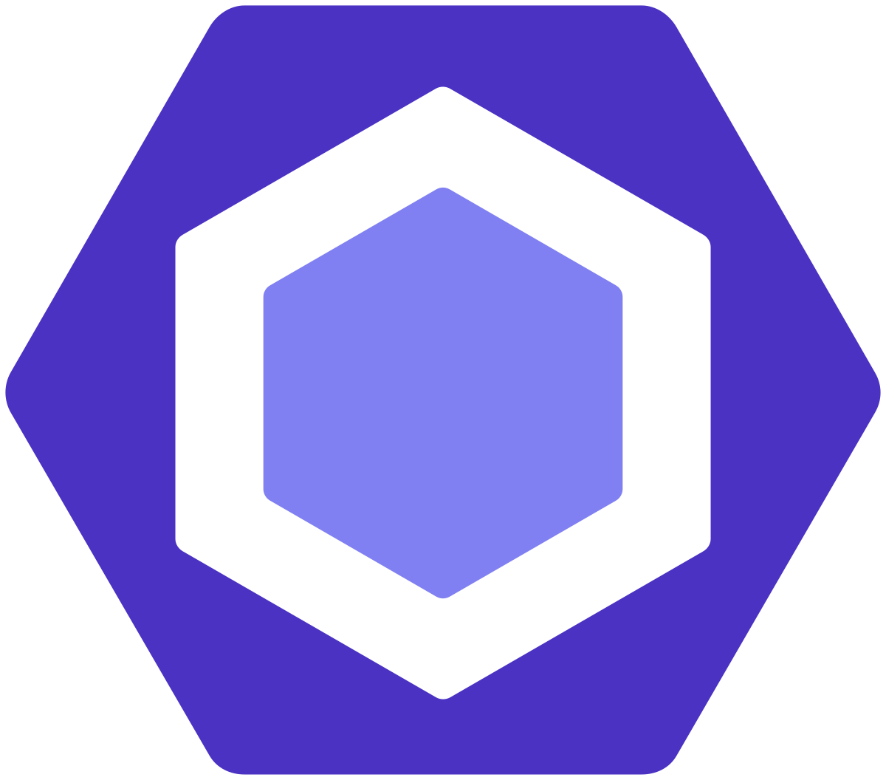
</div>
<div class="element">
<p>- Prettier</p>

</div>
<div class="element">
<p>- Husky</p>

</div>
<div class="element">
<p>- Lint-Staged</p>
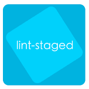
</div>
<div class="element">
<p>- Vite</p>

</div>
</div>
</div>

<div class="abs-br m-4 flex gap-2">

</div>

<div class="progress-container">
  <div
    class="progress-bar"
    :style="{ width: ((($page) / 45) * 100) + '%' }"
  ></div>
</div>
<div class="page abs-bl m-4 flex gap-2 text-m">
  <h5><SlideCurrentNo /> / <SlidesTotal /></h5>
</div>

<style>

.page {
  color: #090A09;
  opacity:0.5;
  font-size: 10px;
}
.progress-container {
  border-top: 1px solid #F8E6CB;
  position: fixed;
  bottom: 0;
  left: 0;
  width: 100%;
  height: 8px;
  background-color: #F5F5F5;
  z-index: 100;
}

.progress-bar {
  border-radius: 0px 4px 4px 0px;
  height: 100%;
  background: linear-gradient(to right, #F8E6CB 0%, #E0C1A8 30%, #D8B192 60%);
  transition: width 0.3s ease-in-out;
}

h1 {
    color: #D8B192;
}
.block {
  display: flex;
  flex-direction: column;
  }
.orga, .method {
  display: grid;
  grid-template-columns: repeat(3, 1fr);
  justify-items: center;
  align-items: center; 
  
}
.element{
  border-bottom: 4px solid #E0C1A8;
  border-radius: 8px;
  display: flex;
  flex-direction: column;
  justify-content: center;
  align-items: center;
  text-align: center;
  width: 10rem;
    height: 10rem;

}
  .element:hover { 
    background-color: #E0C1A8;
    color: #090A09;
  }
</style>
<!-- 
Pour assurer la qualité de notre code et garantir qu’il soit maintenable et performant, nous avons utilisé plusieurs outils directement fournis par le template **Harmonia**.
<br>CLICK<br>
1- **ESLint** a permis de détecter rapidement les erreurs et d’assurer le respect des bonnes pratiques JavaScript.  
2- **Prettier** a harmonisé automatiquement le style de code, évitant toute divergence entre les membres de l’équipe.  
3- Avec **Husky**, des hooks Git ont été déclenchés avant chaque commit pour prévenir l’introduction d’erreurs.  
4- **Lint-Staged** a limité l’analyse et la correction aux fichiers modifiés, rendant le processus plus rapide.  
5- **Vite** a offert une compilation rapide pendant le développement et une mise en production optimisée.  

Ces outils ont assuré un workflow efficace, fiable et conforme aux standards professionnels.
-->
---
layout: dynamic-image 
image: "./media/Pictures/Connexion.webp"
equal: false
left: false
transition: slide-left
---

# Identité visuelle et design

<div class="abs-br m-8 flex gap-2">

</div>

<div class="progress-container">
  <div
    class="progress-bar"
    :style="{ width: ((($page) / 45) * 100) + '%' }"
  ></div>
</div>
<div class="page abs-bl m-4 flex gap-2 text-m">
  <h5><SlideCurrentNo /> / <SlidesTotal /></h5>
</div>

<style>

.page {
  color: #090A09;
  opacity:0.5;
  font-size: 10px;
}
.progress-container {
  border-top: 1px solid #F8E6CB;
  position: fixed;
  bottom: 0;
  left: 0;
  width: 100%;
  height: 8px;
  background-color: #F5F5F5;
  z-index: 100;
}

.progress-bar {
  border-radius: 0px 4px 4px 0px;
  height: 100%;
  background: linear-gradient(to right, #F8E6CB 0%, #E0C1A8 30%, #D8B192 60%);
  transition: width 0.3s ease-in-out;
}

h1 {
    color: #D8B192;
}
</style>

<!-- Une fois l'organisation en place, nous avons défini une **identité visuelle** pour le projet. 
Je vais vous expliquer les **choix graphiques** que nous avons faits et les outils que nous avons **utilisés pour la conception**. -->
---
layout: two-cols
transition: slide-left
---

<div v-motion
  :initial="{ x: -80 }"
  :enter="{ x: 0, y: 0 }">
<h2>Recherche et inspiration</h2>

  <a href="https://www.carredartistes.com/fr-fr/" target="_blank">
    Carré d'artistes<br>
    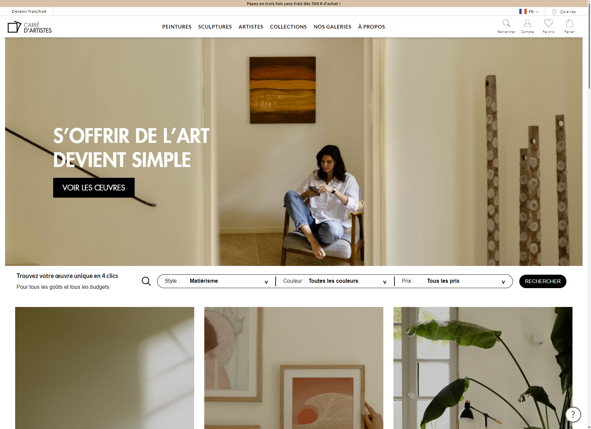
  </a>
</div>
::right::
<div v-click v-motion
  :initial="{ y: -80 }"
  :enter="{ x: 0, y: 0 }">
<h2>Charte graphique</h2>
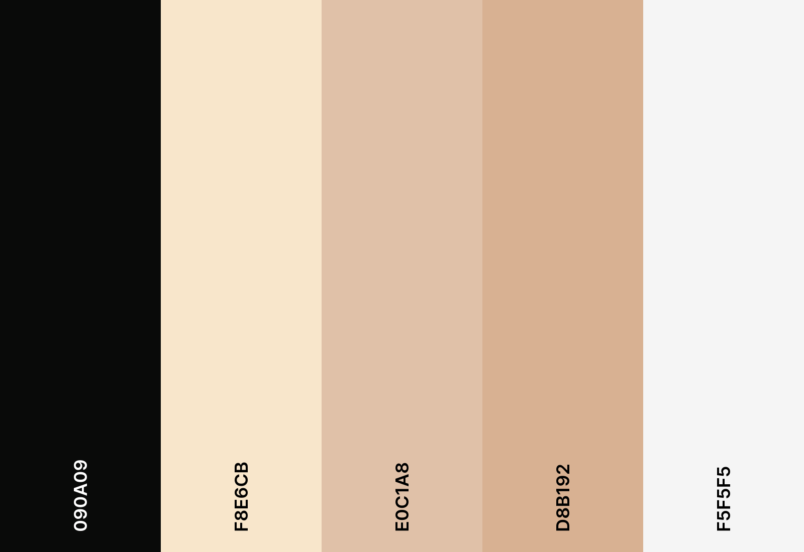
<br>
</div>
<div v-click v-motion
  :initial="{ y: 80 }"
  :enter="{ x: 0, y: 0 }">
<h2>Typographie</h2>
<p>Monserrat</p>
</div>

<div class="abs-br m-8 flex gap-2">

</div>

<div class="progress-container">
  <div
    class="progress-bar"
    :style="{ width: ((($page) / 45) * 100) + '%' }"
  ></div>
</div>
<div class="page abs-bl m-4 flex gap-2 text-m">
  <h5><SlideCurrentNo /> / <SlidesTotal /></h5>
</div>

<style>

.page {
  color: #090A09;
  opacity:0.5;
  font-size: 10px;
}
.progress-container {
  border-top: 1px solid #F8E6CB;
  position: fixed;
  bottom: 0;
  left: 0;
  width: 100%;
  height: 8px;
  background-color: #F5F5F5;
  z-index: 100;
}

.progress-bar {
  border-radius: 0px 4px 4px 0px;
  height: 100%;
  background: linear-gradient(to right, #F8E6CB 0%, #E0C1A8 30%, #D8B192 60%);
  transition: width 0.3s ease-in-out;
}

h1 {
    color: #D8B192;
}
</style>

<!-- 
Pour concevoir notre projet, nous avons cherché des sources d'inspiration dans le domaine des galeries d'art en ligne. **Le site Carré d'artistes** nous a particulièrement influencés grâce à son design élégant et sa simplicité d'accès. Cela nous a aidés à définir l'expérience utilisateur souhaitée.
<br>CLICK<br>
Pour donner une **identité visuelle** cohérente et esthétique à notre site, nous avons choisi une palette de couleurs sobres et élégantes, en harmonie avec l’univers de l’art.
<br>CLICK<br>
Enfin pour la typographie nous avons opté pour la police Montserrat, qui combine modernité et lisibilité, renforçant ainsi l’aspect professionnel et épuré du site. -->

---
layout: two-cols
transition: slide-up
---


<div class="method">
<h2>Maquettage</h2>

<div class="element">
<p>- Figma</p>

</div>
</div>

::right::

<br>
<br>
<br>
<div>
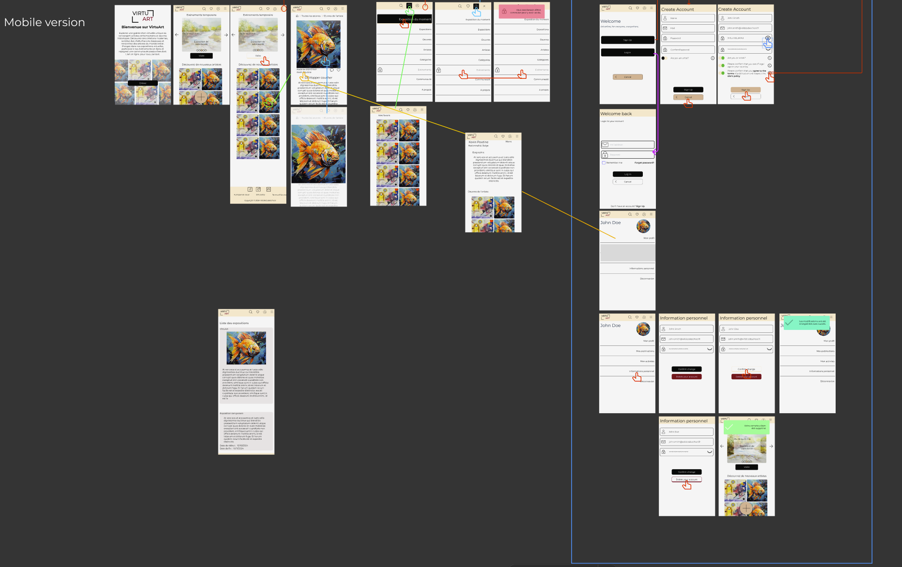
</div>

<div class="abs-br m-4 flex gap-2">

</div>

<div class="progress-container">
  <div
    class="progress-bar"
    :style="{ width: ((($page) / 45) * 100) + '%' }"
  ></div>
</div>
<div class="page abs-bl m-4 flex gap-2 text-m">
  <h5><SlideCurrentNo /> / <SlidesTotal /></h5>
</div>

<style>

.page {
  color: #090A09;
  opacity:0.5;
  font-size: 10px;
}
.progress-container {
  border-top: 1px solid #F8E6CB;
  position: fixed;
  bottom: 0;
  left: 0;
  width: 100%;
  height: 8px;
  background-color: #F5F5F5;
  z-index: 100;
}

.progress-bar {
  border-radius: 0px 4px 4px 0px;
  height: 100%;
  background: linear-gradient(to right, #F8E6CB 0%, #E0C1A8 30%, #D8B192 60%);
  transition: width 0.3s ease-in-out;
}

h1 {
    color: #D8B192;
}

.method {
  display: flex;
  flex-direction: column;
  justify-content: center;
  align-items: center;
  height: 100%;

}
.element{
  border-bottom: 4px solid #E0C1A8;
  border-radius: 8px;
  display: flex;
  flex-direction: column;
  justify-content: center;
  align-items: center;
  text-align: center;
  width: 10rem;
    height: 10rem;

}
  .element:hover { 
    background-color: #E0C1A8;
    color: #090A09;
  }
</style>

<!-- 
Pour le **maquettage**, nous avons utilisé Figma pour concevoir une maquette interactive, ajuster le design en équipe et valider l’ergonomie avant le développement. Voici une **capture d’écran** illustrant la structure et le design du site. -->
---
layout: dynamic-image 
image: "./media/Pictures/Douce_Mélancolie.webp"
equal: false
left: false
transition: slide-left
---

# Architecture technique

<div class="abs-br m-8 flex gap-2">

</div>

<div class="progress-container">
  <div
    class="progress-bar"
    :style="{ width: ((($page) / 45) * 100) + '%' }"
  ></div>
</div>
<div class="page abs-bl m-4 flex gap-2 text-m">
  <h5><SlideCurrentNo /> / <SlidesTotal /></h5>
</div>

<style>

.page {
  color: #090A09;
  opacity:0.5;
  font-size: 10px;
}
.progress-container {
  border-top: 1px solid #F8E6CB;
  position: fixed;
  bottom: 0;
  left: 0;
  width: 100%;
  height: 8px;
  background-color: #F5F5F5;
  z-index: 100;
}

.progress-bar {
  border-radius: 0px 4px 4px 0px;
  height: 100%;
  background: linear-gradient(to right, #F8E6CB 0%, #E0C1A8 30%, #D8B192 60%);
  transition: width 0.3s ease-in-out;
}

h1 {
    color: #D8B192;
}
</style>

<!-- Maintenant que nous avons une idée claire du design, nous allons aborder la structure technique du projet. Je vais vous présenter l’architecture que nous avons adoptée pour garantir un code clair, maintenable et évolutif. -->

---
layout: two-cols
transition: slide-left
---
<br>
<br>
<br>
<br>
<br>
<div v-click v-motion
  :initial="{ x: -80 }"
  :enter="{ x: 0, y: 0 }">
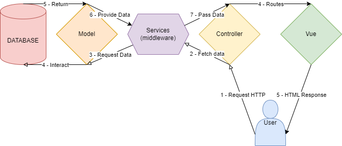
</div>

::right::

<br>
<br>
<br>
<br>
<br>
<br>
<br>

<div class="text">
  <h2 v-click.hide="1">
    <strong>M V C</strong>
  </h2>

  <h2 v-click="1" v-motion
      :initial="{ x: 80 }"
      :enter="{ x: 0 }">
    <strong> M</strong><span>odel</span>
    <strong> V</strong><span>iew</span>
    <strong> C</strong><span>ontroller</span>
  </h2>
</div>

<div class="abs-br m-8 flex gap-2">
  
</div>

<div class="progress-container">
  <div
    class="progress-bar"
    :style="{ width: ((($page) / 45) * 100) + '%' }"
  ></div>
</div>
<div class="page abs-bl m-4 flex gap-2 text-m">
  <h5><SlideCurrentNo /> / <SlidesTotal /></h5>
</div>

<style>

.page {
  color: #090A09;
  opacity:0.5;
  font-size: 10px;
}
.progress-container {
  border-top: 1px solid #F8E6CB;
  position: fixed;
  bottom: 0;
  left: 0;
  width: 100%;
  height: 8px;
  background-color: #F5F5F5;
  z-index: 100;
}

.progress-bar {
  border-radius: 0px 4px 4px 0px;
  height: 100%;
  background: linear-gradient(to right, #F8E6CB 0%, #E0C1A8 30%, #D8B192 60%);
  transition: width 0.3s ease-in-out;
}

h1 {
    color: #D8B192;
}
.text {
  position: relative;
  width: 100%;
  max-width: 1000px;
}

.text h2 {
  position: absolute;
  top: 0;
  left: 0;
  width: 100%;
  height: auto;
}
</style>
<!-- 
Pour organiser le projet de manière claire et maintenable, nous avons adopté l'architecture **MVC**, qui repose sur la séparation des responsabilités.
<br>CLICK<br>
Ce schéma illustre le fonctionnement du modèle **Model View Controller** dans notre projet. Je vais vous expliquer chaque étape représentée ici.

1. **L'utilisateur** interagit avec le site, envoyant une requête HTTP.  
2. Le **Controller** gère la requête en orchestrant les appels aux **services** (ou middleware) pour récupérer les données nécessaires.
3. Les **services** transmettent la requête au **Model**, qui interagit directement avec la **base de données**.  
4. Une fois les données récupérées, le **Model** les renvoie au **Controller** via les services.  
5. Le **Controller** passe ensuite les données à la **Vue**, qui les formate en HTML pour les afficher à l'utilisateur.  
6. Enfin, l'utilisateur reçoit une **réponse HTTP** contenant la page générée.

L'architecture MVC organise et simplifie la **gestion des interactions** entre utilisateurs, données et interface.
 -->
---
layout: two-cols
transition: slide-left
level: 3
equal: true
left: false
---

## Exemple de **"Model"**
### ArtworkRepository.js

````md magic-move {lines: true}
```js {*|6-14} 
class ArtworkRepository extends AbstractRepository {
  constructor() {
    super({ table: "artwork" });
  }

  async readAll() {
    const [rows] = await this.database.query(
      `select artwork.*,
      DATE_FORMAT(date, '%d/%m/%Y') AS formatedDate, 
      user.pseudo user_name FROM ${this.table} 
      INNER JOIN user on artwork.user_id = user.id`
    );
    return rows;
  }
} 

module.exports = ArtworkRepository;
```
```js {6-16} 
class ArtworkRepository extends AbstractRepository {
  constructor() {
    super({ table: "artwork" });
  }

  async read(id) {
    const [rows] = await this.database.query(
      `select artwork.*,
      DATE_FORMAT(date, '%d/%m/%Y') AS formatedDate, 
      user.pseudo user_name from ${this.table}  
      INNER JOIN user ON artwork.user_id = user.id 
      WHERE artwork.id = ? `,
      [id]
    );
    return rows[0];
  }
} 

module.exports = ArtworkRepository;
```
````
::right::
<div class="element" v-click="3" v-motion
  :initial="{ x: 80 }"
  :enter="{ x: 0, y: 0 }">
  
## Exemple de **"View"**

<div v-click>
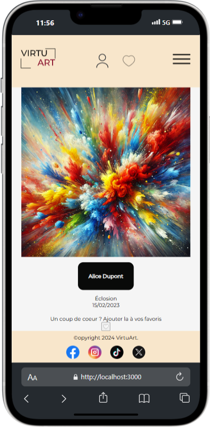
</div>
</div>

<div class="abs-br m-8 flex gap-2">

</div>
<div class="progress-container">
  <div
    class="progress-bar"
    :style="{ width: ((($page) / 45) * 100) + '%' }"
  ></div>
</div>
<div class="page abs-bl m-4 flex gap-2 text-m">
  <h5><SlideCurrentNo /> / <SlidesTotal /></h5>
</div>

<style>
  
  .page {
    color: #090A09;
  opacity:0.5;
  font-size: 10px;
}
.progress-container {
  border-top: 1px solid #F8E6CB;
  position: fixed;
  bottom: 0;
  left: 0;
  width: 100%;
  height: 8px;
  background-color: #F5F5F5;
  z-index: 100;
}

.progress-bar {
  border-radius: 0px 4px 4px 0px;
  height: 100%;
  background: linear-gradient(to right, #F8E6CB 0%, #E0C1A8 30%, #D8B192 60%);
  transition: width 0.3s ease-in-out;
}
</style>

<!-- 
Voici un exemple de **Model** avec le fichier `ArtworkRepository.js`. 

C’est dans cette classe que nous définissons la logique pour interagir avec la base de données.

CLICK<br>

Nous avons ici la méthode `readAll`, qui permet de récupérer toutes les œuvres d’art depuis la table `artwork`. 

Nous utilisons une jointure avec la table `user` pour inclure le nom de l’artiste. De plus, nous formatons la date pour qu’elle soit plus lisible dans le front.

CLICK<br>

La méthode `read` fonctionne de manière similaire, mais elle est conçue pour récupérer une œuvre spécifique grâce à son ID. Cette méthode est utile, par exemple, pour afficher les détails d’une œuvre sur une page dédiée.

CLICK<br>

Enfin, voici un exemple de **View**, avec la page coté front d’une œuvre. Cette page utilise les données récupérées par notre modèle et les affiche.
 -->
---
transition: slide-up
level: 3
---

## Exemple de **"Controller"**
### artworkActions.js
````md magic-move {lines: true}
```js {*} 
const tables = require("../../database/tables");

const browse = async (req, res, next) => {
  try {
    const artworks = await tables.artwork.readAll();
    res.json(artworks);
  } catch (error) {
    next(error);
  }
};
module.exports = { browse, read, add, edit, destroy};
```
```js {*|15} 
const tables = require("../../database/tables");

const read = async (req, res, next) => {
  try {
    const artwork = await tables.artwork.read(req.params.id);
    if (artwork == null) {
      res.sendStatus(404);
    } else {
      res.json(artwork);
    }
  } catch (error) {
    next(error);
  }
};
module.exports = { browse, read, add, edit, destroy};
```
````
<div class="abs-br m-8 flex gap-2">

</div>

<div class="progress-container">
  <div
    class="progress-bar"
    :style="{ width: ((($page) / 45) * 100) + '%' }"
  ></div>
</div>
<div class="page abs-bl m-4 flex gap-2 text-m">
  <h5><SlideCurrentNo /> / <SlidesTotal /></h5>
</div>

<style>
  
  .page {
    color: #090A09;
  opacity:0.5;
  font-size: 10px;
}
.progress-container {
  border-top: 1px solid #F8E6CB;
  position: fixed;
  bottom: 0;
  left: 0;
  width: 100%;
  height: 8px;
  background-color: #F5F5F5;
  z-index: 100;
}

.progress-bar {
  border-radius: 0px 4px 4px 0px;
  height: 100%;
  background: linear-gradient(to right, #F8E6CB 0%, #E0C1A8 30%, #D8B192 60%);
  transition: width 0.3s ease-in-out;
}
</style>
<!-- 
Passons maintenant à l’exemple de Controller avec le fichier `artworkActions.js`. 

Ici, nous gérons la logique de traitement des requêtes HTTP et la communication avec le Model.<br>
  
Voici la méthode `browse`. Elle utilise la fonction `readAll` du modèle pour récupérer toutes les œuvres, puis renvoie ces données au format JSON pour le frontend.

CLICK

Ici, la méthode `read` permet de récupérer une œuvre précise via son ID. 

Si l’œuvre n’est pas trouvée, elle renvoie un statut HTTP `404`. Ce genre de validation assure la fiabilité et la robustesse de notre API.

CLICK

Enfin, nous avons intégré d'autres méthodes essentielles pour la gestion des œuvres, telles que `add` pour l'ajout, `edit` pour la modifier, et `destroy` pour la supprimer.
 -->

---
layout: dynamic-image 
image: "./media/Pictures/Joie_Ephémère.webp"
equal: false
left: false
transition: slide-left
---

# Modélisation des données

<div class="abs-br m-8 flex gap-2">

</div>

<div class="progress-container">
  <div
    class="progress-bar"
    :style="{ width: ((($page) / 45) * 100) + '%' }"
  ></div>
</div>
<div class="page abs-bl m-4 flex gap-2 text-m">
  <h5><SlideCurrentNo /> / <SlidesTotal /></h5>
</div>

<style>

.page {
  color: #090A09;
  opacity:0.5;
  font-size: 10px;
}
.progress-container {
  border-top: 1px solid #F8E6CB;
  position: fixed;
  bottom: 0;
  left: 0;
  width: 100%;
  height: 8px;
  background-color: #F5F5F5;
  z-index: 100;
}

.progress-bar {
  border-radius: 0px 4px 4px 0px;
  height: 100%;
  background: linear-gradient(to right, #F8E6CB 0%, #E0C1A8 30%, #D8B192 60%);
  transition: width 0.3s ease-in-out;
}

h1 {
    color: #D8B192;
}
</style>

<!-- Pour structurer les données du projet, je vais vous présenter la conception de la base de données à travers ses différentes étapes.-->


---
transition: slide-left
---

## Outil et méthode

<div class="client">
<div class="element" v-click v-motion
  :initial="{ y: 80 }"
  :enter="{ x: 0, y: 0 }">
<h3>Modélisation</h3>
<p>- Draw.io</p>

</div>
<div class="element" v-click v-motion
  :initial="{ y: 80 }"
  :enter="{ x: 0, y: 0 }">
<h3>Méthodologie</h3>
<p>- Méthode Merise</p>
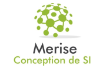
</div>
</div>

<div class="abs-br m-8 flex gap-2">

</div>

<div class="progress-container">
  <div
    class="progress-bar"
    :style="{ width: ((($page) / 45) * 100) + '%' }"
  ></div>
</div>
<div class="page abs-bl m-4 flex gap-2 text-m">
  <h5><SlideCurrentNo /> / <SlidesTotal /></h5>
</div>

<style>

.page {
  color: #090A09;
  opacity:0.5;
  font-size: 10px;
}
.progress-container {
  border-top: 1px solid #F8E6CB;
  position: fixed;
  bottom: 0;
  left: 0;
  width: 100%;
  height: 8px;
  background-color: #F5F5F5;
  z-index: 100;
}

.progress-bar {
  border-radius: 0px 4px 4px 0px;
  height: 100%;
  background: linear-gradient(to right, #F8E6CB 0%, #E0C1A8 30%, #D8B192 60%);
  transition: width 0.3s ease-in-out;
}

h1 {
    color: #D8B192;
}
.element{
  border-bottom: 4px solid #E0C1A8;
  border-radius: 8px;
  display: flex;
  flex-direction: column;
  justify-content: center;
  align-items: center;
  text-align: center;
  width: 10rem;
    height: 10rem;

}
  .element:hover { 
    background-color: #E0C1A8;
    color: #090A09;
  }
.client {
  padding-top: 5rem;
  display: grid;
  grid-template-columns: repeat(2, 1fr);
  justify-items: center;
  align-items: center; 
}

.client a {
  text-decoration: none;
  display: flex;
  flex-direction: column;
  justify-content: center;
  align-items: center;
  text-align: center;
  padding: 10px;
  height: 100%; 
}
</style>

<!-- 
Pour la modélisation des données et la conception de notre base, nous avons utilisé deux outils clés :

CLICK

Nous avons utilisé **Draw.io** pour concevoir les différents schémas de modélisation de notre base de données.

CLICK

Nous avons également suivi la **méthode Merise**, qui nous a guidés étape par étape, du modèle conceptuel au modèle physique, pour structurer efficacement notre base de données.
 -->
---
layout: two-cols
transition: slide-left
---
<br>
<br>
<br>
<br>
<br>
<br>
<br>
<div class="text">
  <h2 v-click.hide="1">
    <strong>M C D</strong>
  </h2>

  <h2 v-click="1" v-motion
      :initial="{ x: -80 }"
      :enter="{ x: 0 }">
    <strong>M</strong><span>odèle</span>
    <br>
    <strong> C</strong><span>onceptuelle de </span>
    <br>
    <strong> D</strong><span>onnées</span>
  </h2>
</div>

::right::

<br>
<div v-click v-motion
  :initial="{ x: 80 }"
  :enter="{ x: 0, y: 0 }">
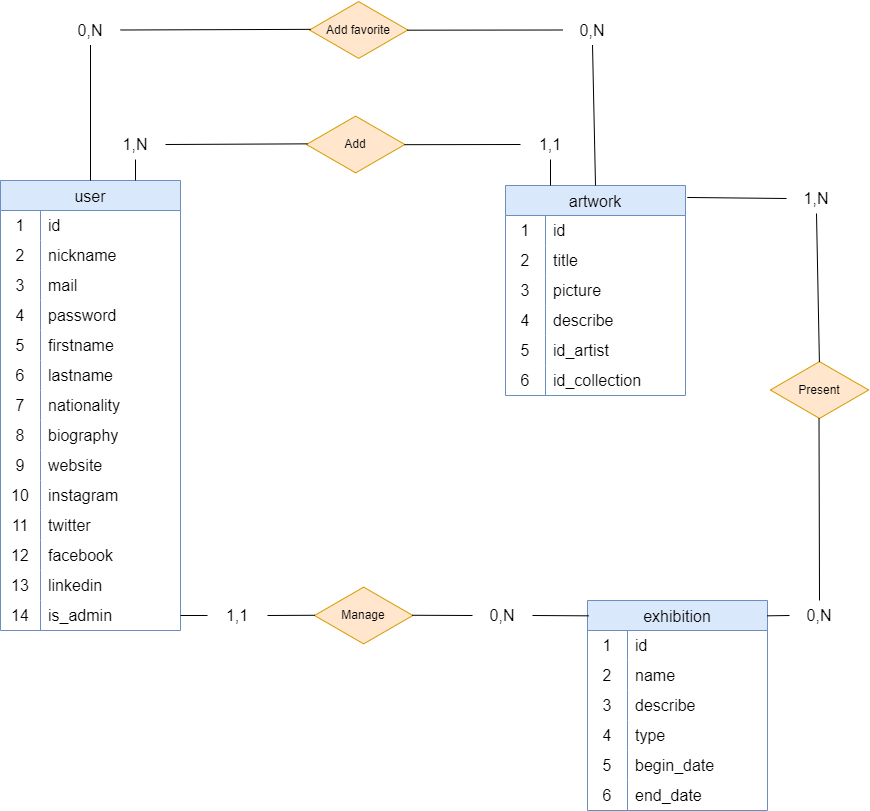
</div>

<div class="abs-br m-8 flex gap-2">

</div>

<div class="progress-container">
  <div
    class="progress-bar"
    :style="{ width: ((($page) / 45) * 100) + '%' }"
  ></div>
</div>
<div class="page abs-bl m-4 flex gap-2 text-m">
  <h5><SlideCurrentNo /> / <SlidesTotal /></h5>
</div>

<Arrow v-click="[2,3]" x1="300" y1="250" x2="550" y2="150" />
<Arrow v-click="[2,3]" x1="300" y1="250" x2="750" y2="150" />
<Arrow v-click="[3,4]" x1="300" y1="250" x2="550" y2="80" />
<Arrow v-click="[3,4]" x1="300" y1="250" x2="780" y2="80" />
<Arrow v-click="[4,5]" x1="300" y1="250" x2="750" y2="180" />
<Arrow v-click="[4,5]" x1="300" y1="250" x2="800" y2="380" />
<Arrow v-click="[5,6]" x1="300" y1="250" x2="500" y2="380" />
<Arrow v-click="[5,6]" x1="300" y1="250" x2="800" y2="380" />

<style>

.page {
  color: #090A09;
  opacity:0.5;
  font-size: 10px;
}
.progress-container {
  border-top: 1px solid #F8E6CB;
  position: fixed;
  bottom: 0;
  left: 0;
  width: 100%;
  height: 8px;
  background-color: #F5F5F5;
  z-index: 100;
}

.progress-bar {
  border-radius: 0px 4px 4px 0px;
  height: 100%;
  background: linear-gradient(to right, #F8E6CB 0%, #E0C1A8 30%, #D8B192 60%);
  transition: width 0.3s ease-in-out;
}

.text {
  position: relative;
  width: 100%;
  max-width: 1000px;
}

.text h2 {
  position: absolute;
  top: 0;
  left: 0;
  width: 100%;
  height: auto;
}
</style>
<!-- 
Nous allons commencer par le **MCD**.

CLICK

Le **Modèle Conceptuel de Données** est la première étape qui permet de représenter les entités principales et les relations entre elles, sans se préoccuper encore de leur implémentation technique.
Dans notre projet :
CLICK
- Un utilisateur peut ajouter plusieurs œuvres, mais chaque œuvre appartient à un seul utilisateur.  
CLICK
- Un utilisateur peut ajouter des œuvres en favoris, et une œuvre peut être ajoutée aux favoris de plusieurs utilisateurs.  
CLICK
- Une œuvre peut être présentée dans plusieurs expositions, et une exposition peut contenir plusieurs œuvres.  
CLICK
- Un administrateur gère une ou plusieurs expositions, mais chaque exposition est gérée par un seul administrateur.   -->

---
layout: two-cols
transition: slide-left
---
<br>
<div v-click v-motion
  :initial="{ x: -80 }"
  :enter="{ x: 0, y: 0 }">
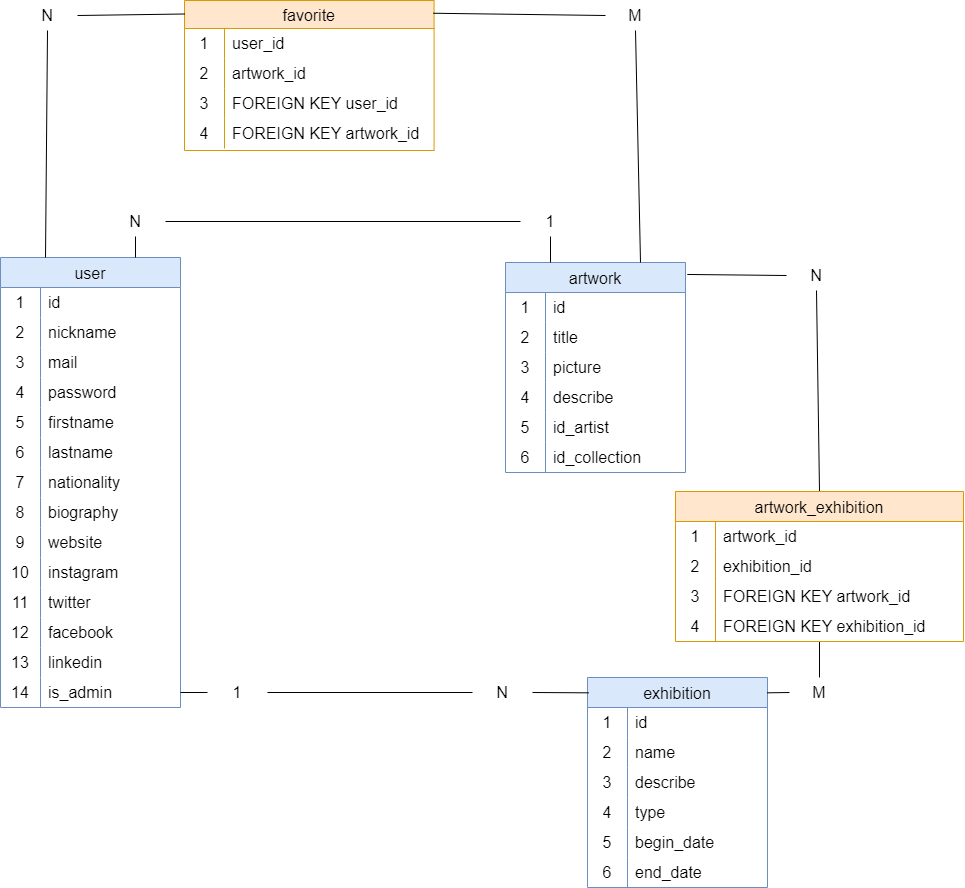
</div>

::right::
<br>
<br>
<br>
<br>
<br>
<br>
<br>
<div class="text">
  <h2 v-click.hide="1">
    <strong>M L D</strong>
  </h2>

  <h2 v-click="1" v-motion
      :initial="{ x: 80 }"
      :enter="{ x: 0 }">
    <strong>M</strong><span>odèle</span>
    <br>
    <strong> L</strong><span>ogique de </span>
    <br>
    <strong> D</strong><span>onnées</span>
  </h2>
</div>

<Arrow v-click="[2,3]" x1="500" y1="280" x2="150" y2="190" />
<Arrow v-click="[2,3]" x1="500" y1="280" x2="300" y2="190" />
<Arrow v-click="[3,4]" x1="500" y1="280" x2="80" y2="190" />
<Arrow v-click="[3,4]" x1="500" y1="280" x2="350" y2="190" />
<Arrow v-click="[3,4]" x1="500" y1="280" x2="200" y2="80" />
<Arrow v-click="[4,5]" x1="500" y1="280" x2="750" y2="180" />
<Arrow v-click="[4,5]" x1="500" y1="280" x2="800" y2="380" />
<Arrow v-click="[5,6]" x1="500" y1="280" x2="500" y2="380" />
<Arrow v-click="[5,6]" x1="500" y1="280" x2="800" y2="380" />


<div class="abs-br m-8 flex gap-2">

</div>

<div class="progress-container">
  <div
    class="progress-bar"
    :style="{ width: ((($page) / 45) * 100) + '%' }"
  ></div>
</div>
<div class="page abs-bl m-4 flex gap-2 text-m">
  <h5><SlideCurrentNo /> / <SlidesTotal /></h5>
</div>

<style>

.page {
  color: #090A09;
  opacity:0.5;
  font-size: 10px;
}
.progress-container {
  border-top: 1px solid #F8E6CB;
  position: fixed;
  bottom: 0;
  left: 0;
  width: 100%;
  height: 8px;
  background-color: #F5F5F5;
  z-index: 100;
}

.progress-bar {
  border-radius: 0px 4px 4px 0px;
  height: 100%;
  background: linear-gradient(to right, #F8E6CB 0%, #E0C1A8 30%, #D8B192 60%);
  transition: width 0.3s ease-in-out;
}
.text {
  position: relative;
  width: 100%;
  max-width: 1000px;
}

.text h2 {
  position: absolute;
  top: 0;
  left: 0;
  width: 100%;
  height: auto;
  padding-left:2rem;
}
</style>
<!-- Après la validation du MCD, nous avons élaboré le **MLD (Modèle Logique de Données)**. 
Cette étape traduit les entités conceptuelles en relations adaptées à une base de données relationnelle, en intégrant les cardinalités définies. 

- Pour l'**Utilisateur et les œuvres** :  
  La relation est de type **one-to-many** (*1:N*). Chaque utilisateur peut créer plusieurs œuvres (`N`), mais chaque œuvre est liée à un seul utilisateur (`1`). Cela reflète le lien entre un artiste et ses créations.  

- Pour gérer les favoris, une table intermédiaire `favorite` permet une relation **many-to-many** (*N:M*) entre les utilisateurs et les œuvres. Par exemple, un utilisateur peut ajouter plusieurs œuvres en favoris, et chaque œuvre peut être dans les favoris de plusieurs utilisateurs.  

- Pareil pour les **Œuvres et les expositions** :  
  Une relation **many-to-many** (*N:M*) est gérée par la table `artwork_exhibition`. Cela permet qu’une œuvre soit exposée dans plusieurs expositions, et qu’une exposition regroupe plusieurs œuvres. Cette structure reflète la flexibilité nécessaire pour une galerie d’art.  

- Et enfin pour l'**Utilisateur et les expositions** :  
  Ici, nous avons une relation **one-to-many** (*1:N*). Un administrateur peut gérer plusieurs expositions (`N`), mais chaque exposition est supervisée par un seul administrateur (`1`). Cela garantit une gestion centralisée des événements.  

En résumé, le **MLD** prépare la base de données en organisant clairement les relations *one-to-many* et *many-to-many*, tout en restant aligné sur les besoins identifiés dans le MCD.   -->

---
layout: two-cols
transition: slide-up
---
<br>
<br>
<br>
<br>
<br>
<br>
<br>
<div class="text">
  <h2 v-click.hide="1">
    <strong>M P D</strong>
  </h2>

  <h2 v-click="1" v-motion
      :initial="{ x: -80 }"
      :enter="{ x: 0 }">
    <strong>M</strong><span>odèle</span>
    <br>
    <strong> P</strong><span>hysique de </span>
    <br>
    <strong> D</strong><span>onnées</span>
  </h2>
</div>

::right::

<div class="img" v-click v-motion
  :initial="{ x: 80 }"
  :enter="{ x: 0, y: 0 }">

</div>

<div class="abs-br m-8 flex gap-2">

</div>

<div class="progress-container">
  <div
    class="progress-bar"
    :style="{ width: ((($page) / 45) * 100) + '%' }"
  ></div>
</div>
<div class="page abs-bl m-4 flex gap-2 text-m">
  <h5><SlideCurrentNo /> / <SlidesTotal /></h5>
</div>

<style>

.page {
  color: #090A09;
  opacity:0.5;
  font-size: 10px;
}
.progress-container {
  border-top: 1px solid #F8E6CB;
  position: fixed;
  bottom: 0;
  left: 0;
  width: 100%;
  height: 8px;
  background-color: #F5F5F5;
  z-index: 100;
}

.progress-bar {
  border-radius: 0px 4px 4px 0px;
  height: 100%;
  background: linear-gradient(to right, #F8E6CB 0%, #E0C1A8 30%, #D8B192 60%);
  transition: width 0.3s ease-in-out;
}
.text {
  position: relative;
  width: 100%;
  max-width: 1000px;
}

.text h2 {
  position: absolute;
  top: 0;
  left: 0;
  width: 100%;
  height: auto;
}
.img{
 position: absolute;
 left: 17rem;
 height: 100%;
 width: 100%;
}
.img img{
 height: 70%;
 width: 70%;
}
</style>
<!-- 
Nous arrivons maintenant au **MPD (Modèle Physique de Données)**, la dernière étape de la modélisation, où les concepts se traduisent en une base de données opérationnelle avec des détails techniques comme les types de colonnes, les clés, et les contraintes.
Voici une version reformulée pour rendre la présentation plus fluide et concise :  

- Prenons l’exemple de la table `user`. Elle contient des colonnes comme `id`, définie en clé primaire, `email` typée `VARCHAR(255)` avec les contraintes `NOT NULL` et `UNIQUE`, ce qui garantit qu’un email est obligatoire et ne peut pas être dupliqué. De même, la colonne `password` est aussi typée `VARCHAR(255)` et marquée `NOT NULL`, assurant la présence d’un mot de passe pour chaque utilisateur.  

- Les relations qui ont étaient définies dans le MLD se traduisent ici par des clés étrangères. <br>Par exemple, la colonne `user_id` dans la table `artwork` est une clé étrangère qui pointe vers la colonne `id` de la table `user`. Cela garantit qu’une œuvre est toujours associée à un utilisateur existant.  

- Les contraintes comme `NOT NULL` empêchent les données essentielles d’être laissées vides, et `UNIQUE` garantit l’unicité des informations sensibles, comme les emails.  

Le **MPD** est donc une version prête à être déployée dans un **système de gestion de base de données (SGBD)**, comme MySQL.<br> 
C’est la traduction concrète des concepts et relations définis dans le MCD et le MLD, aboutissant à une base structurée, robuste et cohérente.  

Ces trois étapes – MCD, MLD, MPD – assurent une transition fluide entre la vision conceptuelle et la mise en œuvre technique, tout en respectant les besoins fonctionnels et relationnels du projet.  
-->

---
layout: dynamic-image 
image: "./media/Pictures/Lumière_dans_Obscurité.webp"
equal: false
left: false
transition: slide-left
---

# Gestion serveur (Backend)

<div class="abs-br m-8 flex gap-2">

</div>

<div class="progress-container">
  <div
    class="progress-bar"
    :style="{ width: ((($page) / 45) * 100) + '%' }"
  ></div>
</div>
<div class="page abs-bl m-4 flex gap-2 text-m">
  <h5><SlideCurrentNo /> / <SlidesTotal /></h5>
</div>

<style>

.page {
  color: #090A09;
  opacity:0.5;
  font-size: 10px;
}
.progress-container {
  border-top: 1px solid #F8E6CB;
  position: fixed;
  bottom: 0;
  left: 0;
  width: 100%;
  height: 8px;
  background-color: #F5F5F5;
  z-index: 100;
}

.progress-bar {
  border-radius: 0px 4px 4px 0px;
  height: 100%;
  background: linear-gradient(to right, #F8E6CB 0%, #E0C1A8 30%, #D8B192 60%);
  transition: width 0.3s ease-in-out;
}

h1 {
    color: #D8B192;
}
</style>

<!-- Passons maintenant à la partie serveur, où je vais vous montrer les technologies utilisées, des exemples de tables, et la logique mise en place pour traiter et fournir les données au reste du projet. -->

---
transition: slide-left
---

## Les technos utilisées

<br>

<div class="client">

<div class="element" v-click v-motion
  :initial="{ y: 80 }"
  :enter="{ x: 0, y: 0 }">
  <p>- MySQL</p>

</div>

<div class="element" v-click v-motion
  :initial="{ y: 80 }"
  :enter="{ x: 0, y: 0 }">
  <p>- Express</p>

</div>

</div>

<div class="abs-br m-8 flex gap-2">

</div>

<div class="progress-container">
  <div
    class="progress-bar"
    :style="{ width: ((($page) / 45) * 100) + '%' }"
  ></div>
</div>
<div class="page abs-bl m-4 flex gap-2 text-m">
  <h5><SlideCurrentNo /> / <SlidesTotal /></h5>
</div>

<style>

.page {
  color: #090A09;
  opacity:0.5;
  font-size: 10px;
}
.progress-container {
  border-top: 1px solid #F8E6CB;
  position: fixed;
  bottom: 0;
  left: 0;
  width: 100%;
  height: 8px;
  background-color: #F5F5F5;
  z-index: 100;
}

.progress-bar {
  border-radius: 0px 4px 4px 0px;
  height: 100%;
  background: linear-gradient(to right, #F8E6CB 0%, #E0C1A8 30%, #D8B192 60%);
  transition: width 0.3s ease-in-out;
}

h1 {
    color: #D8B192;
}
.element{
  border-bottom: 4px solid #E0C1A8;
  border-radius: 8px;
  display: flex;
  flex-direction: column;
  justify-content: center;
  align-items: center;
  text-align: center;
  width: 10rem;
    height: 10rem;

}
.element:hover { 
  background-color: #E0C1A8;
  color: #090A09;
}

.client {
  padding-top: 5rem;
  display: grid;
  grid-template-columns: repeat(2, 1fr);
  justify-items: center;
  align-items: center; 
}

.client a {
  text-decoration: none;
  display: flex;
  flex-direction: column;
  justify-content: center;
  align-items: center;
  text-align: center;
  padding: 10px;
  height: 100%; 
}
</style>
<!-- 
Pour notre projet, nous avons utilisé deux technologies principales pour gérer le backend :  

- Nous avons choisi MySQL comme **Système de Gestion de Base de Données relationnel**. Il nous a permis de structurer et de gérer efficacement nos données grâce à ses performances robustes et sa capacité à supporter des requêtes complexes.  

- Côté serveur, nous avons utilisé Express, un framework léger et rapide pour Node.js. Il nous a permis de créer et de gérer nos API, en facilitant le routage et la gestion des requêtes HTTP.  

Ces deux technologies, combinées, nous ont permis d’assurer un backend performant, fiable, et adapté aux besoins fonctionnels du projet.   
-->

---
transition: slide-left
level: 3
---

## Base de données
### Exemple de la table 'artwork':

````md magic-move {lines: true}
```sql {*|3|4-5|5|9}
// Étape 1
create table artwork (
    id INT UNSIGNED PRIMARY KEY AUTO_INCREMENT NOT NULL,
    title VARCHAR(100) NOT NULL,
    image_url VARCHAR(255) DEFAULT "/assets/avatar_user/default.png",
    description TEXT,
    user_id INT unsigned,
    collection_id INT unsigned,
    FOREIGN KEY (user_id) REFERENCES user (id) ON DELETE CASCADE
);
```
```sql {*|11-17|7-8,16-17|*}
// Étape 2
INSERT INTO
    artwork (
        title,
        image_url,
        description,
        user_id
        collection_id
    )
VALUES (
        'Éclosion',
        '/assets/images/PicturesTest/Eclosion.webp',
        'Une peinture abstraite représentant une explosion de couleurs vives.',
        'Peinture à l\'huile',
        '2023-02-15',
        3,
        1
    );
```
````

<div class="abs-br m-8 flex gap-2">

</div>
<div class="progress-container">
  <div
    class="progress-bar"
    :style="{ width: ((($page) / 45) * 100) + '%' }"
  ></div>
</div>
<div class="page abs-bl m-4 flex gap-2 text-m">
  <h5><SlideCurrentNo /> / <SlidesTotal /></h5>
</div>

<style>
  
  .page {
    color: #090A09;
  opacity:0.5;
  font-size: 10px;
}
.progress-container {
  border-top: 1px solid #F8E6CB;
  position: fixed;
  bottom: 0;
  left: 0;
  width: 100%;
  height: 8px;
  background-color: #F5F5F5;
  z-index: 100;
}

.progress-bar {
  border-radius: 0px 4px 4px 0px;
  height: 100%;
  background: linear-gradient(to right, #F8E6CB 0%, #E0C1A8 30%, #D8B192 60%);
  transition: width 0.3s ease-in-out;
}
</style>

<!-- Dans cette slide, je vais vous présenter un exemple concret issu de la base de données, avec la table `artwork`, qui représente les œuvres d’art dans notre projet.

- Dans la structure SQL de la table, nous avons défini une **clé primaire** `id` de type entier non signé, qui s’incrémente automatiquement.  
- Les colonnes comme `title` et `image_url` permettent de stocker respectivement le titre et l’image associée à une œuvre. 
- La colonne `image_url` inclut une **valeur par défaut** au cas où aucune image ne serait fournie.  
- Une colonne `user_id` est une **clé étrangère** qui fait référence à l’utilisateur ayant créé l’œuvre. La contrainte `ON DELETE CASCADE` garantit que si un utilisateur est supprimé, ses œuvres le seront également.  

Voici un exemple d’insertion dans la table `artwork` :  
- Nous ajoutons une œuvre intitulée "Éclosion", avec une image et une description.  
- Les colonnes `user_id` et `collection_id` permettent d'associer l’œuvre à un utilisateur et à une collection spécifique.  

Cette structure permet de gérer efficacement les œuvres tout en garantissant leur intégrité et leur association avec les utilisateurs et collections.
-->


---
transition: slide-left
level: 3
---

<div class="text">
  <h2 v-click.hide="1">
    <strong>C R U D</strong>
  </h2>

  <h2 v-click="1" v-motion
      :initial="{ x: -80 }"
      :enter="{ x: 0 }">
    <strong> C</strong><span>reate</span>
    <strong> R</strong><span>ead</span>
    <strong> U</strong><span>pdate</span>
    <strong> D</strong><span>elete</span>
  </h2>
</div>

<br>
<br>

<div class="content" v-click="[2, 3]" v-motion
      :initial="{ x: -80 }"
      :enter="{ x: 0 }"
      :leave="{ x: -80 }">
      
<h3>Exemple <strong>Create</strong> de la table 'artwork': </h3>

````md magic-move {lines: true}
```js {*}
  async create(artwork) {
    const [result] = await this.database.query(
      `INSERT INTO artwork (title,image_url, description, technique, date, user_id) VALUES(?, ?, ?, ?, CURDATE(), ?)`,
      [
        artwork.title,
        artwork.image_url,
        artwork.description,
        artwork.technique,
        artwork.user_id,
      ]
    );
    return result;
  }
```
````
</div>

<div class="content" v-click="[3, 5]" v-motion
      :initial="{ x: -80 }"
      :enter="{ x: 0 }"
      :leave="{ x: -80 }">
<h3>Exemple <strong>Read</strong> de la table 'artwork': </h3>

````md magic-move {lines: true}
```js {*|*|*|*}
  async readAll() {
    const [rows] = await this.database.query(
      `select artwork.*,DATE_FORMAT(date, '%d/%m/%Y') as formatedDate, 
      user.pseudo user_name from ${this.table} 
      INNER JOIN user on artwork.user_id = user.id`
    );
    return rows;
  }
```
```js {*}
  async read(id) {
    const [rows] = await this.database.query(
      `select artwork.*,DATE_FORMAT(date, '%d/%m/%Y') as formatedDate, 
      user.pseudo user_name from ${this.table}  
      INNER JOIN user on artwork.user_id = user.id WHERE artwork.id = ? `,
      [id]
    );
    return rows[0];
  }
```
````
</div>

<div class="content" v-click="[5, 6]" v-motion
      :initial="{ x: -80 }"
      :enter="{ x: 0 }"
      :leave="{ x: -80 }">
<h3>Exemple <strong>Update</strong> de la table 'artwork': </h3>

````md magic-move {lines: true}
```js {*}
  async update(artwork) {
    const [result] = await this.database.query(
      `UPDATE ${this.table} SET title = ?, image_url = ?, description = ?, technique = ?, date = ? WHERE id = ?`,
      [
        artwork.title,
        artwork.image_url,
        artwork.description,
        artwork.technique,
        artwork.date,
        artwork.id,
      ]
    );
    return result.affectedRows;
  }
```
````
</div>

<div class="content" v-click="6" v-motion
      :initial="{ x: -80 }"
      :enter="{ x: 0 }"
      :leave="{ x: -80 }">
<h3>Exemple <strong>Delete</strong> de la table 'artwork': </h3>

````md magic-move {lines: true}
```js {*}
  async delete(id) {
    const [result] = await this.database.query(
      `DELETE FROM ${this.table} WHERE id = ?`,
      [id]
    );
    return result.affectedRows;
  }
```
````
</div>

<div class="abs-br m-8 flex gap-2">

</div>

<div class="progress-container">
  <div
    class="progress-bar"
    :style="{ width: ((($page) / 45) * 100) + '%' }"
  ></div>
</div>
<div class="page abs-bl m-4 flex gap-2 text-m">
  <h5><SlideCurrentNo /> / <SlidesTotal /></h5>
</div>

<style>

.page {
  color: #090A09;
  opacity:0.5;
  font-size: 10px;
}
.progress-container {
  border-top: 1px solid #F8E6CB;
  position: fixed;
  bottom: 0;
  left: 0;
  width: 100%;
  height: 8px;
  background-color: #F5F5F5;
  z-index: 100;
}

.progress-bar {
  border-radius: 0px 4px 4px 0px;
  height: 100%;
  background: linear-gradient(to right, #F8E6CB 0%, #E0C1A8 30%, #D8B192 60%);
  transition: width 0.3s ease-in-out;
}
.text {
  position: relative;
  width: 100%;
  max-width: 1000px;
}

.text h2 {
  position: absolute;
  top: 0;
  left: 0;
  width: 100%;
  height: auto;
}

.content{
    position: absolute;

}
</style>

<!-- 
Le **CRUD** représente les quatre actions essentielles pour manipuler les données : **Create**, **Read**, **Update**, et **Delete**.

- Commençon pas la méthode **Create** qui permet d'ajouter une nouvelle œuvre dans la base de données.  
  Par exemple, ici, on insère les informations d'une œuvre (titre, image, description, etc.) via une requête SQL `INSERT INTO`.  
  C'est la base pour créer du contenu côté utilisateur.

- La méthode **Read** est utilisée pour récupérer des données.  
  - **`readAll`** : Elle retourne toutes les œuvres, avec des détails comme l'utilisateur qui les a publiées, grâce à une jointure SQL.  
  - **`read`** : Elle permet de lire une œuvre spécifique selon son identifiant.  
  Ces méthodes servent à afficher les œuvres sur le site.

- La méthode **Update** modifie une œuvre existante.  
  Par exemple, on peut changer le titre ou l'image d'une œuvre en mettant à jour les colonnes concernées grâce à une requête SQL `UPDATE`.

- Enfin, la méthode **Delete** permet de supprimer une œuvre de la base de données avec une requête SQL `DELETE`.  

Ces quatre opérations garantissent la gestion complète des œuvres dans le projet et assurent que les données restent synchronisées entre le backend et l'interface utilisateur. 
-->

---
layout: two-cols
equals: false
transition: slide-up
---

## Routes de l’application

### Router.js

````md magic-move {lines: true}
```js {*|1-2|4|7|8|6-11|*} 
const express = require("express");
const router = express.Router();

const artworks = require("./controllers/artworkActions");

// ARTWORK
router.get("/artworks", artworks.browse);
router.get("/artworks/:id", artworks.read);
router.post("/artworks", middleware.uploadImg, verifyToken, artworks.add);
router.delete("/artworks/:id", artworks.destroy);
router.put("/artworks/:id", artworks.edit);
```
````
::right::

<div v-click="[3, 5]" v-motion
  :initial="{ y: -80 }"
  :enter="{ x: 0 , y: 0}" 
  :leave="{ y: -80 }"
style="display: flex; align-items: center;">
  
  Test des routes sur Postman
</div>

<div class="image" >
  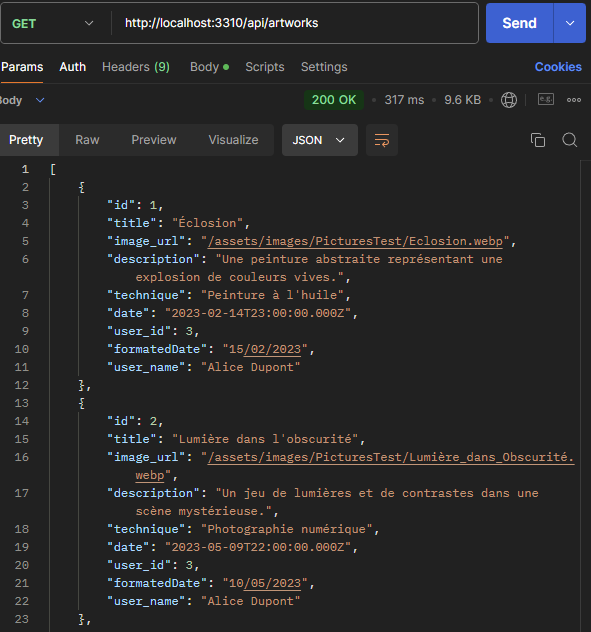
  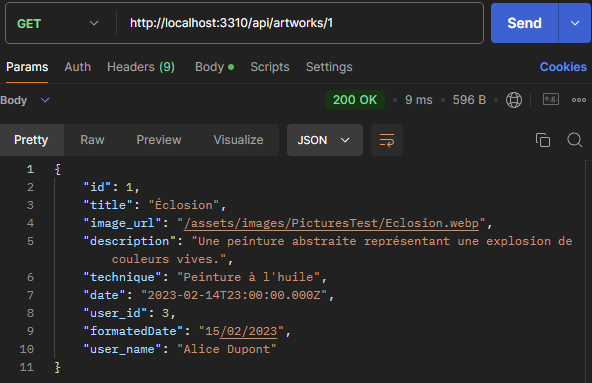
</div>

<div class="abs-br m-8 flex gap-2">
  
</div>

<div class="progress-container">
  <div
    class="progress-bar"
    :style="{ width: ((($page) / 45) * 100) + '%' }"
  ></div>
</div>
<div class="page abs-bl m-4 flex gap-2 text-m">
  <h5><SlideCurrentNo /> / <SlidesTotal /></h5>
</div>

<style>

.page {
  color: #090A09;
  opacity:0.5;
  font-size: 10px;
}
.progress-container {
  border-top: 1px solid #F8E6CB;
  position: fixed;
  bottom: 0;
  left: 0;
  width: 100%;
  height: 8px;
  background-color: #F5F5F5;
  z-index: 100;
}

.progress-bar {
  border-radius: 0px 4px 4px 0px;
  height: 100%;
  background: linear-gradient(to right, #F8E6CB 0%, #E0C1A8 30%, #D8B192 60%);
  transition: width 0.3s ease-in-out;
}
.image {
  position: relative;
  width: 100%;
  max-width: 1000px;
}

.image img {
  position: absolute;
  top: 0;
  left: 0;
  width: 80%;
  height: auto;
}
</style>
<!-- 
Sur cette slide, je vais vous présenter les **routes de l'application**, définies dans le fichier `Router.js`.<br>
*CLICK*<br>
Nous commençons par l’importation des modules nécessaires avec :
- `express`, qui est essentiel pour la configuration du serveur.  
- `router`, une instance d’Express utilisée pour définir les chemins de l'application.<br>
*CLICK*<br>
Ensuite, nous importons les contrôleurs depuis le fichier `artworkActions`, grâce à la ligne `const artworks`. Ces contrôleurs gèrent les actions comme la récupération, l’ajout, la modification ou la suppression des œuvres.<br>
*CLICK*<br>
Passons maintenant aux exemples de routes :  
- La première route, `GET /artworks`, utilise la méthode `browse` pour récupérer toutes les œuvres. Voici un exemple testé sur Postman : comme vous pouvez le voir, cette requête retourne l'ensemble des œuvres stockées dans la base de données.  <br>
*CLICK*<br>
- Une autre route, `GET /artworks/:id`, utilise la méthode `read`. Elle permet de récupérer une œuvre spécifique en fonction de son identifiant. Sur cette capture Postman, vous voyez qu’une seule œuvre correspondant à l’`id` demandé est renvoyée.<br>
*CLICK*<br>
- Enfin, nous avons également des routes pour **Ajouter** une œuvre via `POST /artworks`, avec un middleware pour gérer les images et vérifier les autorisations.  
- Nous pouvons aussi **Modifier** une œuvre via `PUT /artworks/:id`.  
- Et **Supprimer** une œuvre avec `DELETE /artworks/:id`.<br>
*CLICK*<br>
Ces routes permettent de couvrir l'ensemble des opérations CRUD pour la gestion des œuvres dans l’application.<br> Tous les chemins ont été testés et validés avec Postman pour garantir leur bon fonctionnement.
-->

---
layout: dynamic-image 
image: "./media/Pictures/Harmonie.webp"
equal: false
left: false
transition: slide-left
---

# Sécurité de l'application

<div class="abs-br m-8 flex gap-2">

</div>

<div class="progress-container">
  <div
    class="progress-bar"
    :style="{ width: ((($page) / 45) * 100) + '%' }"
  ></div>
</div>
<div class="page abs-bl m-4 flex gap-2 text-m">
  <h5><SlideCurrentNo /> / <SlidesTotal /></h5>
</div>

<style>

.page {
  color: #090A09;
  opacity:0.5;
  font-size: 10px;
}
.progress-container {
  border-top: 1px solid #F8E6CB;
  position: fixed;
  bottom: 0;
  left: 0;
  width: 100%;
  height: 8px;
  background-color: #F5F5F5;
  z-index: 100;
}

.progress-bar {
  border-radius: 0px 4px 4px 0px;
  height: 100%;
  background: linear-gradient(to right, #F8E6CB 0%, #E0C1A8 30%, #D8B192 60%);
  transition: width 0.3s ease-in-out;
}

h1 {
    color: #D8B192;
}
</style>

<!-- Un projet comme celui-ci nécessite une attention particulière à la sécurité. Je vais maintenant vous expliquer les mesures que nous avons prises pour protéger les informations et garantir la fiabilité des fonctionnalités. -->

---
layout: two-cols
transition: slide-left
---

## Hashage de mot de passe
<br>
<div class="client">
<div class="element" v-click v-motion
  :initial="{ y: 80 }"
  :enter="{ x: 0, y: 0 }">
  <p>- Argon2</p>

</div>
</div>

::right::
<div v-click="2" v-motion
  :initial="{ x: 80 }"
  :enter="{ x: 0, y: 0 }">

### Middleware: auth.js

````md magic-move {lines: true}
```js {*|*|2-7|8-22} 
const argon2 = require("argon2");
const hashingOptions = {
  type: argon2.argon2id,
  memoryCost: 19 * 2 ** 10,
  timeCost: 2,
  parallelism: 1,
};
const hashPassword = async (req, res, next) => {
  try {
    const { password } = req.body;
    const hashedPassword = await argon2.hash(password,
     hashingOptions);

    req.body.hashedPassword = hashedPassword;

    delete req.body.password;

    next();
  } catch (err) {
    next(err);
  }
};
module.exports = {hashPassword};
```
````
</div>

<div class="abs-br m-8 flex gap-2">

</div>

<div class="progress-container">
  <div
    class="progress-bar"
    :style="{ width: ((($page) / 45) * 100) + '%' }"
  ></div>
</div>
<div class="page abs-bl m-4 flex gap-2 text-m">
  <h5><SlideCurrentNo /> / <SlidesTotal /></h5>
</div>

<style>

.page {
  color: #090A09;
  opacity:0.5;
  font-size: 10px;
}
.progress-container {
  border-top: 1px solid #F8E6CB;
  position: fixed;
  bottom: 0;
  left: 0;
  width: 100%;
  height: 8px;
  background-color: #F5F5F5;
  z-index: 100;
}

.progress-bar {
  border-radius: 0px 4px 4px 0px;
  height: 100%;
  background: linear-gradient(to right, #F8E6CB 0%, #E0C1A8 30%, #D8B192 60%);
  transition: width 0.3s ease-in-out;
}

h1 {
    color: #D8B192;
}
.client {
  display: grid;
  grid-template-columns: repeat(5, 1fr);
  justify-items: center;
  align-items: center;   
}

.client a {
  width: 10rem;
  min-height: 10rem;
  text-decoration: none;
  display: flex;
  flex-direction: column;
  justify-content: center;
  align-items: center;
  text-align: center;
  padding-bottom: 10px;
  margin-bottom:10px;
  height: 100%; 
}
.element{
  border-bottom: 4px solid #E0C1A8;
  border-radius: 8px;
  display: flex;
  flex-direction: column;
  justify-content: center;
  align-items: center;
  text-align: center;
  width: 10rem;
    height: 10rem;

}
  .element:hover { 
    background-color: #E0C1A8;
    color: #090A09;
  }
</style>

<!-- 
La gestion sécurisée des mots de passe est une priorité dans ce projet. Pour cela, nous avons utilisé **Argon2**, un algorithme de hashage reconnu pour sa robustesse et sa résistance aux attaques par force brute.  

Dans notre code, Argon2 est intégré via un middleware défini dans le fichier `auth.js`.  

- Nous avons configuré Argon2 avec des paramètres spécifiques comme `memoryCost`, `timeCost` et `parallelism`, pour garantir un bon équilibre entre sécurité et performances.  
- Elle prend le mot de passe en clair fourni par l'utilisateur, le crypte avec Argon2 et remplace ce mot de passe par sa version hashée dans `req.body`.  
- Enfin, le mot de passe en clair est supprimé pour éviter toute fuite accidentelle.  

Ce middleware est exécuté automatiquement avant toute opération impliquant des mots de passe, comme la création d’un compte ou la modification de l’identifiant d’un utilisateur. Grâce à cette mise en œuvre, les mots de passe stockés dans la base de données ne sont jamais exposés sous leur forme d'origine, renforçant ainsi la sécurité globale de l'application. 

-.-.-.-.-.-.-.-.-.-.-.-.-.-.-.-.-.-.-.-.-.-.-<br>
**P.B**:<br>
**memoryCost** : Définit la quantité de mémoire utilisée pendant le hashage. Plus cette valeur est élevée, plus il est difficile pour un attaquant de tester plusieurs mots de passe en même temps.

**timeCost** : Indique le nombre d'itérations nécessaires pour créer le hash. Une valeur plus haute ralentit le processus, rendant les attaques par force brute plus longues.

**parallelism** : Détermine le nombre de threads ou de processeurs utilisés pour le hashage. Cela peut améliorer les performances sur des systèmes multicœurs.-->

---
layout: two-cols
transition: fade
---

## Authentification
<br>
<div class="client">
<div class="element" v-click="1" v-motion
  :initial="{ y: 80 }"
  :enter="{ x: 0, y: 0 }">
<p>- JWT (JSON Web Token)</p>
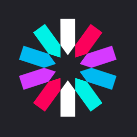
</div>
</div>

::right::
<div v-click="1" v-motion
  :initial="{ x: 80 }"
  :enter="{ x: 0, y: 0 }">

### Controller: authActions.js

````md magic-move {lines: true}
```js{*|*|6-9|10-12|13-18|19-20}
const argon2 = require("argon2");
const jwt = require("jsonwebtoken");
const tables = require("../../database/tables");
const login = async (req, res, next) => {
  try {
    const user = await tables.user.readByEmailWithPassword(req.body.email);
    if (user == null) {
      res.sendStatus(422);
      return;}
    const verified = await argon2.verify(
      user.hashed_password,
      req.body.password);
    if (verified) {
      delete user.hashed_password;
      const token = await jwt.sign(
        { sub: user.id, isAdmin: user.is_admin },
        process.env.APP_SECRET,
        {expiresIn: "1h",});
      res.cookie("auth", token).json({
        token, user,});
    } else {res.sendStatus(422);}
  } catch (err) {next(err);}
};
const admin = async (req, res, next) => {
  try {
    res.sendStatus(200);
  } catch (error) {
    next(error);
  }
};
module.exports = {login, admin,};
```
````
</div>

<div class="abs-br m-8 flex gap-2">

</div>

<div class="progress-container">
  <div
    class="progress-bar"
    :style="{ width: ((($page) / 45) * 100) + '%' }"
  ></div>
</div>
<div class="page abs-bl m-4 flex gap-2 text-m">
  <h5><SlideCurrentNo /> / <SlidesTotal /></h5>
</div>

<style>

.page {
  color: #090A09;
  opacity:0.5;
  font-size: 10px;
}
.progress-container {
  border-top: 1px solid #F8E6CB;
  position: fixed;
  bottom: 0;
  left: 0;
  width: 100%;
  height: 8px;
  background-color: #F5F5F5;
  z-index: 100;
}

.progress-bar {
  border-radius: 0px 4px 4px 0px;
  height: 100%;
  background: linear-gradient(to right, #F8E6CB 0%, #E0C1A8 30%, #D8B192 60%);
  transition: width 0.3s ease-in-out;
}

h1 {
    color: #D8B192;
}
.client {
  display: grid;
  grid-template-columns: repeat(5, 1fr);
  justify-items: center;
  align-items: center;   
}

.client a {
  width: 10rem;
  min-height: 10rem;
  text-decoration: none;
  display: flex;
  flex-direction: column;
  justify-content: center;
  align-items: center;
  text-align: center;
  padding-bottom: 10px;
  margin-bottom:10px;
  height: 100%; 
}
.element{
  border-bottom: 4px solid #E0C1A8;
  border-radius: 8px;
  display: flex;
  flex-direction: column;
  justify-content: center;
  align-items: center;
  text-align: center;
  width: 10rem;
    height: 10rem;

}
  .element:hover { 
    background-color: #E0C1A8;
    color: #090A09;
  }
</style>
<!-- 
Pour l’authentification, nous avons utilisé **JWT** (JSON Web Token), une technologie qui permet de sécuriser les sessions utilisateur en générant un token unique.

Dans ce code extrait de **authActions.js**, on peut observer les étapes suivantes :

- **Lecture des données utilisateur** :  
  Nous commençons par récupérer l’utilisateur en base de données grâce à son email, incluant son mot de passe haché.

- **Vérification du mot de passe** :  
  Ensuite, à l’aide de la bibliothèque **argon2**, nous comparons le mot de passe saisi avec celui stocké.  

- **Génération du token JWT** :  
  Si la vérification est réussie, un token JWT est créé. Ce token contient l’ID de l’utilisateur ainsi qu’un éventuel rôle d’administrateur, et est configuré pour expirer après une heure.  

- **Envoi du cookie** :  
  Enfin, le token est renvoyé au client sous forme de **cookie sécurisé**, accompagné des informations utilisateur pour une gestion côté frontend.  

Ce système garantit une authentification sécurisée et permet de personnaliser l’expérience utilisateur en fonction de son rôle.   -->

---
layout: two-cols
transition: slide-left
---

## Vérification des Tokens
<br>
<div class="client">
<div class="element">
<p>- JWT (JSON Web Token)</p>

</div>
</div>

::right::
<div v-motion
  :initial="{ x: 80 }"
  :enter="{ x: 0, y: 0 }">

### Middleware: auth.js

````md magic-move {lines: true}
```js {*|4|8|9|11-14}
const jwt = require("jsonwebtoken");
const verifyToken = (req, res, next) => {
  try {
    const { auth } = req.cookies;
    if (!auth) {
      throw new Error("");
    }
    req.auth = jwt.verify(auth, process.env.APP_SECRET);
    req.body.user_id = req.auth.sub;
    next();
  } catch (err) {
    console.error(err.message);
    res.status(401).json({ message: "Unauthorized: Invalid or missing token" });
  }
};
module.exports = {verifyToken,};
```
````
</div>

<div class="abs-br m-8 flex gap-2">

</div>

<div class="progress-container">
  <div
    class="progress-bar"
    :style="{ width: ((($page) / 45) * 100) + '%' }"
  ></div>
</div>
<div class="page abs-bl m-4 flex gap-2 text-m">
  <h5><SlideCurrentNo /> / <SlidesTotal /></h5>
</div>

<style>

.page {
  color: #090A09;
  opacity:0.5;
  font-size: 10px;
}
.progress-container {
  border-top: 1px solid #F8E6CB;
  position: fixed;
  bottom: 0;
  left: 0;
  width: 100%;
  height: 8px;
  background-color: #F5F5F5;
  z-index: 100;
}

.progress-bar {
  border-radius: 0px 4px 4px 0px;
  height: 100%;
  background: linear-gradient(to right, #F8E6CB 0%, #E0C1A8 30%, #D8B192 60%);
  transition: width 0.3s ease-in-out;
}

h1 {
    color: #D8B192;
}
.client {
  display: grid;
  grid-template-columns: repeat(5, 1fr);
  justify-items: center;
  align-items: center;   
}

.client a {
  width: 10rem;
  min-height: 10rem;
  text-decoration: none;
  display: flex;
  flex-direction: column;
  justify-content: center;
  align-items: center;
  text-align: center;
  padding-bottom: 10px;
  margin-bottom:10px;
  height: 100%; 
}
.element{
  border-bottom: 4px solid #E0C1A8;
  border-radius: 8px;
  display: flex;
  flex-direction: column;
  justify-content: center;
  align-items: center;
  text-align: center;
  width: 10rem;
    height: 10rem;

}
  .element:hover { 
    background-color: #E0C1A8;
    color: #090A09;
  }
</style>
<!-- 
Pour sécuriser l’accès aux ressources et vérifier que les utilisateurs sont bien authentifiés, nous avons mis en place un middleware basé sur **JWT**.

1. **Lecture du cookie** :  
   Le middleware récupère le cookie contenant le token via `req.cookies.auth`. Si aucun token n'est présent, l’accès est immédiatement refusé avec un statut `401 Unauthorized`.

2. **Vérification du token** :  
   Nous utilisons la fonction `jwt.verify` pour décoder et valider le token avec la clé secrète définie dans `process.env.APP_SECRET`. Cela garantit que le token est valide et n’a pas été altéré.

3. **Ajout des données utilisateur** :  
   Une fois validé, le middleware extrait les informations utilisateur du token, comme l’ID (`sub`), et les ajoute à la requête (`req.body.user_id`). Cela permet aux routes suivantes d’utiliser ces informations sans nouvelle vérification.

4. **Gestion des erreurs** :  
   En cas de token invalide ou manquant, une erreur est logguée et le client reçoit une réponse avec un message expliquant que l’accès est refusé.

Ce middleware joue un rôle clé dans la sécurisation des routes, en s’assurant que seuls les utilisateurs authentifiés ont accès aux ressources sensibles. 
-->

---
layout: two-cols
equal: true
transition: slide-left
---

## Protection des API
<br>
<div class="client">
<div class="element" v-click="1" v-motion
  :initial="{ y: 80 }"
  :enter="{ x: 0, y: 0 }">
<p>- Cors</p>

</div>
<div class="element" v-click="2" v-motion
  :initial="{ y: 80 }"
  :enter="{ x: 0, y: 0 }">
  <p>- Cookie-Parser</p>

</div>
<div class="element" v-click="3" v-motion
  :initial="{ y: 80 }"
  :enter="{ x: 0, y: 0 }">
  <p>- DotEnv</p>

</div>
<div class="element" v-click="4" v-motion
  :initial="{ y: 80 }"
  :enter="{ x: 0, y: 0 }">
  <p>- .gitignore</p>

</div>
</div>

::right::
<div v-click="1" v-motion
  :initial="{ x: 80 }"
  :enter="{ x: 0, y: 0 }">

### Cors: config.js

````md magic-move {lines: true}
```js
const cors = require("cors");
app.use(cors({
  origin: [process.env.CLIENT_URL],  
credentials: true,
})
);
```
````
</div>

<div v-click="2" v-motion
  :initial="{ x: 80 }"
  :enter="{ x: 0, y: 0 }">

### cookieParser: config.js
````md magic-move {lines: true}
```js
const cookieParser = require("cookie-parser");
app.use(cookieParser());
```
````
</div>

<div v-click="3" v-motion
  :initial="{ x: 80 }"
  :enter="{ x: 0, y: 0 }">

### Dotenv: .env (back)
````md magic-move {lines: true}
```js
# .env.sample - Sample Environment Variables
# Application Configuration
APP_PORT=3310
APP_SECRET=YOUR_APP_SECRET_KEY
# Database Configuration
DB_HOST=localhost
DB_PORT=3306
DB_USER=ItsASecret
DB_PASSWORD=ItsASecret
DB_NAME=virtuart
# Client URL (for CORS configuration)
CLIENT_URL=http://localhost:3000
```
````
</div>

<div class="abs-br m-8 flex gap-2">

</div>

<div class="progress-container">
  <div
    class="progress-bar"
    :style="{ width: ((($page) / 45) * 100) + '%' }"
  ></div>
</div>
<div class="page abs-bl m-4 flex gap-2 text-m">
  <h5><SlideCurrentNo /> / <SlidesTotal /></h5>
</div>

<style>

.page {
  color: #090A09;
  opacity:0.5;
  font-size: 10px;
}
.progress-container {
  border-top: 1px solid #F8E6CB;
  position: fixed;
  bottom: 0;
  left: 0;
  width: 100%;
  height: 8px;
  background-color: #F5F5F5;
  z-index: 100;
}

.progress-bar {
  border-radius: 0px 4px 4px 0px;
  height: 100%;
  background: linear-gradient(to right, #F8E6CB 0%, #E0C1A8 30%, #D8B192 60%);
  transition: width 0.3s ease-in-out;
}

h1 {
    color: #D8B192;
}
.client {
  display: grid;
  grid-template-columns: repeat(2, 1fr);
  justify-items: center;
  align-items: center;   
}

.client a {
  width: 10rem;
  min-height: 10rem;
  text-decoration: none;
  display: flex;
  flex-direction: column;
  justify-content: center;
  align-items: center;
  text-align: center;
  padding-bottom: 10px;
  margin-bottom:10px;
  height: 100%; 
}
.element{
  border-bottom: 4px solid #E0C1A8;
  border-radius: 8px;
  display: flex;
  flex-direction: column;
  justify-content: center;
  align-items: center;
  text-align: center;
  width: 10rem;
    height: 10rem;

}
  .element:hover { 
    background-color: #E0C1A8;
    color: #090A09;
  }
</style>
<!-- 
Pour garantir la **protection de nos API**, nous avons utilisé plusieurs outils essentiels :

1. Cors nous permet de sécuriser les requêtes en limitant les origines autorisées à accéder à notre backend. Nous avons configuré l’URL du client dans le fichier `.env`, et activé les credentials pour permettre l’envoi des cookies nécessaires à l’authentification.

2. Ensuite Cookie-Parser nous aide à traiter les cookies envoyés avec les requêtes, comme le token JWT. Cela nous permet de gérer l’authentification en lisant et vérifiant les cookies directement côté serveur.

3. DotEnv est utilisé pour stocker nos variables d’environnement sensibles, comme les identifiants de la base de données ou la clé secrète pour le JWT. Cela garantit que ces informations ne sont pas exposées dans le code source.

4. Enfin pour renforcer la sécurité, nous avons inclus le fichier `.env` dans le `.gitignore`, ce qui empêche sa publication sur le dépôt GitHub. Cela évite d’exposer des données critiques en ligne.

Ces outils assurent une communication sécurisée entre le frontend et le backend, tout en protégeant les informations sensibles et en respectant les bonnes pratiques. -->
---
layout: two-cols
equal: true
transition: slide-left
---

## Validation des Données
<br>

<div class="client">
<div class="element" v-click="1" v-motion
  :initial="{ y: 80 }"
  :enter="{ x: 0, y: 0 }">
<p>- Joi</p>
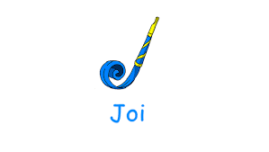
</div>
</div>

<div class="abs-br m-8 flex gap-2">

</div>

::right::
<div v-click="1" v-motion
  :initial="{ x: 80 }"
  :enter="{ x: 0, y: 0 }">

### auth.js
````md magic-move {lines: true}
```js {*|*|4|5|6|7|10-11|12-13|*}
const Joi = require("joi");
const verifyUserField = (req, res, next) => {
  const schema = Joi.object({
    pseudo: Joi.string().required(),
    email: Joi.string().email().required(),
    password: Joi.string().min(8).required(),
    confirmPassword: Joi.ref("password"),
  });
  const result = schema.validate(req.body);
  if (result.error) {
    res.status(400).send(result.error.message);
  } else {
    next();
  }
};
module.exports = {verifyUserField,};
```
````
</div>

<div class="progress-container">
  <div
    class="progress-bar"
    :style="{ width: ((($page) / 45) * 100) + '%' }"
  ></div>
</div>
<div class="page abs-bl m-4 flex gap-2 text-m">
  <h5><SlideCurrentNo /> / <SlidesTotal /></h5>
</div>

<style>

.page {
  color: #090A09;
  opacity:0.5;
  font-size: 10px;
}
.progress-container {
  border-top: 1px solid #F8E6CB;
  position: fixed;
  bottom: 0;
  left: 0;
  width: 100%;
  height: 8px;
  background-color: #F5F5F5;
  z-index: 100;
}

.progress-bar {
  border-radius: 0px 4px 4px 0px;
  height: 100%;
  background: linear-gradient(to right, #F8E6CB 0%, #E0C1A8 30%, #D8B192 60%);
  transition: width 0.3s ease-in-out;
}

h1 {
    color: #D8B192;
}
.client {
  display: grid;
  grid-template-columns: repeat(5, 1fr);
  justify-items: center;
  align-items: center;   
}

.client a {
  width: 10rem;
  min-height: 10rem;
  text-decoration: none;
  display: flex;
  flex-direction: column;
  justify-content: center;
  align-items: center;
  text-align: center;
  padding-bottom: 10px;
  margin-bottom:10px;
  height: 100%; 
}
.element{
  border-bottom: 4px solid #E0C1A8;
  border-radius: 8px;
  display: flex;
  flex-direction: column;
  justify-content: center;
  align-items: center;
  text-align: center;
  width: 10rem;
    height: 10rem;

}
  .element:hover { 
    background-color: #E0C1A8;
    color: #090A09;
  }
</style>
<!-- 
Pour la **validation des données**, nous avons utilisé **Joi**, une bibliothèque très pratique pour vérifier que les données envoyées par les utilisateurs respectent les règles définies.

Dans cet exemple, nous avons mis en place une validation pour les utilisateurs lors de leur inscription. Voici les points principaux :
- Le **pseudo** doit être une chaîne de caractères et est obligatoire.
- L'**email** doit respecter un format valide, comme `example@domain.com`.
- Le **mot de passe** doit comporter au moins 8 caractères.
- Enfin, nous avons ajouté une vérification pour que le champ **confirmPassword** corresponde au mot de passe.

Si une donnée ne respecte pas ces critères, une erreur est renvoyée avec un message précis pour informer l’utilisateur. Sinon, la requête passe au middleware suivant.

**Joi** nous permet ainsi de filtrer efficacement les données dès leur réception, évitant tout traitement inutile de requêtes incorrectes ou incomplètes.
 -->
---
layout: two-cols
equal: true
transition: slide-left
---

<div>

## Contrôle d'Accès et Gestion des Rôles
<br>
````md magic-move {lines: true}
```sql {*|3,8,12}
CREATE TABLE user (
[...]
    is_admin BOOLEAN DEFAULT FALSE
);
INSERT INTO
    user (
      [...]
      is_admin
    )
VALUES (
  [...]
    '0'||'1'
    )
```
````
</div>

::right::

<div v-click="2" v-motion
  :initial="{ x: 80 }"
  :enter="{ x: 0, y: 0 }">

## Sécurisation de la Base de Données
<br>
````md magic-move {lines: true}
```sql {*|*|3-5|6-10|*}
  async create(artwork) {
    const [result] = await this.database.query(
      `INSERT INTO artwork 
      (title,image_url, description, technique, date, user_id) 
      VALUES(?, ?, ?, ?, CURDATE(), ?)`,
      [ artwork.title,
        artwork.image_url,
        artwork.description,
        artwork.technique,
        artwork.user_id, ]
    );
    return result;
  }
```
````
</div>

<div class="abs-br m-8 flex gap-2">

</div>

<div class="progress-container">
  <div
    class="progress-bar"
    :style="{ width: ((($page) / 45) * 100) + '%' }"
  ></div>
</div>
<div class="page abs-bl m-4 flex gap-2 text-m">
  <h5><SlideCurrentNo /> / <SlidesTotal /></h5>
</div>

<style>

.page {
  color: #090A09;
  opacity:0.5;
  font-size: 10px;
}
.progress-container {
  border-top: 1px solid #F8E6CB;
  position: fixed;
  bottom: 0;
  left: 0;
  width: 100%;
  height: 8px;
  background-color: #F5F5F5;
  z-index: 100;
}

.progress-bar {
  border-radius: 0px 4px 4px 0px;
  height: 100%;
  background: linear-gradient(to right, #F8E6CB 0%, #E0C1A8 30%, #D8B192 60%);
  transition: width 0.3s ease-in-out;
}

h1 {
    color: #D8B192;
}
.client {
  display: grid;
  grid-template-columns: repeat(5, 1fr);
  justify-items: center;
  align-items: center;   
}

.client a {
  width: 10rem;
  min-height: 10rem;
  text-decoration: none;
  display: flex;
  flex-direction: column;
  justify-content: center;
  align-items: center;
  text-align: center;
  padding-bottom: 10px;
  margin-bottom:10px;
  height: 100%; 
}
.element{
  border-bottom: 4px solid #E0C1A8;
  border-radius: 8px;
  display: flex;
  flex-direction: column;
  justify-content: center;
  align-items: center;
  text-align: center;
  width: 10rem;
    height: 10rem;

}
  .element:hover { 
    background-color: #E0C1A8;
    color: #090A09;
  }
</style>
<!-- 
Contrôle d'Accès et Gestion des Rôles

Nous avons implémenté un système de contrôle d'accès en utilisant un champ spécifique dans la table `user` : **is_admin**.  
- Ce champ est de type **BOOLEAN** et permet de distinguer les administrateurs des utilisateurs standards.  
- Par défaut, il est défini sur `FALSE`, mais il peut être activé (`TRUE`) pour accorder des droits spécifiques, comme la gestion des expositions.  

Sécurisation des Injections SQL

Dans nos requêtes SQL, comme celle permettant d’ajouter une œuvre dans la table `artwork`, nous avons utilisé des **requêtes préparées** avec des **paramètres dynamiques**.  
- Cela empêche toute tentative d'injection SQL en isolant les données fournies par l'utilisateur des instructions SQL.  
- Par exemple, les valeurs comme `title` ou `user_id` sont intégrées de manière sécurisée à la requête via un tableau de paramètres.  

Ce système assure une gestion claire des rôles et une base de données protégée contre des attaques courantes comme les injections SQL, tout en respectant les droits et les accès des différents utilisateurs. 
 -->
---
layout: two-cols
equal: true
transition: slide-left
---

## Validation et Téléchargement de Données

<div class="client">
<div class="element" v-click="1" v-motion
  :initial="{ y: 80 }"
  :enter="{ x: 0, y: 0 }">
<p>- Multer</p>

</div>
</div>

<br>

<div v-click="2" v-motion
  :initial="{ y: 80 }"
  :enter="{ x: 0, y: 0 }">
<h2>Gestion des Identifiants Uniques</h2>
</div>

<div class="client">
<div class="element" v-click="2" v-motion
  :initial="{ y: 80 }"
  :enter="{ x: 0, y: 0 }">
<p>- UUID</p>

</div>
</div>

<div class="abs-br m-8 flex gap-2">

</div>

::right::
<div v-click="3" v-motion
  :initial="{ x: 80 }"
  :enter="{ x: 0, y: 0 }">

### middleware.js
````md magic-move {lines: true}
```js {*|*|*|*|9|13-16|*}
const multer = require("multer");
const storage = multer.diskStorage({
  destination(req, file, cb) {
    cb(null, "./public/assets/images/uploads");
  },
  filename(req, file, cb) {
    const id = uuidv4();
    const pictureName = `${id}${path.extname(file.originalname)}`;
    req.body.image_url = `/assets/images/uploads/${pictureName}`;
    cb(null, pictureName);
  },
});
const uploadImg = (req, res, next) => {
  const upload = multer({ storage });
  return upload.single("image")(req, res, next);
};
module.exports = {uploadImg};
```
````
</div>

<div class="progress-container">
  <div
    class="progress-bar"
    :style="{ width: ((($page) / 45) * 100) + '%' }"
  ></div>
</div>
<div class="page abs-bl m-4 flex gap-2 text-m">
  <h5><SlideCurrentNo /> / <SlidesTotal /></h5>
</div>

<style>

.page {
  color: #090A09;
  opacity:0.5;
  font-size: 10px;
}
.progress-container {
  border-top: 1px solid #F8E6CB;
  position: fixed;
  bottom: 0;
  left: 0;
  width: 100%;
  height: 8px;
  background-color: #F5F5F5;
  z-index: 100;
}

.progress-bar {
  border-radius: 0px 4px 4px 0px;
  height: 100%;
  background: linear-gradient(to right, #F8E6CB 0%, #E0C1A8 30%, #D8B192 60%);
  transition: width 0.3s ease-in-out;
}

h1 {
    color: #D8B192;
}
.client {
  display: grid;
  grid-template-columns: repeat(5, 1fr);
  justify-items: center;
  align-items: center;   
}

.client a {
  width: 10rem;
  min-height: 10rem;
  text-decoration: none;
  display: flex;
  flex-direction: column;
  justify-content: center;
  align-items: center;
  text-align: center;
  padding-bottom: 10px;
  margin-bottom:10px;
  height: 100%; 
}
.element{
  border-bottom: 4px solid #E0C1A8;
  border-radius: 8px;
  display: flex;
  flex-direction: column;
  justify-content: center;
  align-items: center;
  text-align: center;
  width: 10rem;
    height: 10rem;

}
  .element:hover { 
    background-color: #E0C1A8;
    color: #090A09;
  }
</style>
<!-- 
Dans cette partie, je vais vous expliquer comment nous avons géré le **téléchargement de fichiers** dans notre projet. 
Pour cela, nous avons utilisé **Multer**, une bibliothèque qui facilite considérablement le traitement des fichiers envoyés via un formulaire. 
Multer nous a permis de configurer un dossier spécifique pour stocker les fichiers. 
Nous avons également pu définir une logique pour renommer et organiser ces fichiers de manière dynamique, garantissant ainsi une structure claire et ordonnée.

Pour éviter les conflits liés aux noms de fichiers identiques, nous avons fait appel à **UUID**, un outil qui génère des identifiants uniques. Grâce à cela, chaque fichier reçoit un nouveau nom basé sur un identifiant, même si plusieurs utilisateurs envoient des fichiers avec le même nom d’origine. Cela garantit une gestion efficace et sans erreur des fichiers téléchargés.

Enfin, dans le code, Multer a été configuré pour enregistrer les fichiers et les renommer automatiquement à l’aide d’UUID. Une fois qu’un fichier est enregistré, son chemin est immédiatement ajouté dans `req.body.image_url`, ce qui nous permet de l’utiliser dans les étapes suivantes du traitement, comme l’affichage ou le stockage en base de données.

Cette méthode nous a permis de gérer les téléchargements de fichiers de manière simple, sécurisée et parfaitement adaptée aux besoins de notre projet.
-->
---
transition: slide-up
---

<div>

## Audit et Sécurisation des Dépendances
<br>
</div>

<div v-motion
  :initial="{ x: 80 }"
  :enter="{ x: 0, y: 0 }">

````md magic-move {lines: true}
```bash{*}
$ npm audit
```
```bash{*|6|16}
$ npm audit
[...]
body-parser  <1.20.3
Severity: high
body-parser vulnerable to denial of service when url encoding is enabled - https://github.com/advisories/GHSA-qwcr-r2fm-qrc7
fix available via `npm audit fix`
node_modules/body-parser
  express  <=4.21.0 || 5.0.0-alpha.1 - 5.0.0
  Depends on vulnerable versions of body-parser
  Depends on vulnerable versions of cookie
  Depends on vulnerable versions of path-to-regexp
  Depends on vulnerable versions of send
  Depends on vulnerable versions of serve-static
  node_modules/express
[...]
12 vulnerabilities (1 low, 5 moderate, 6 high)

To address all issues, run:
  npm audit fix
```

```bash{*}
$ npm audit fix
```

```bash{*}
$ npm audit fix

[...]

added 7 packages, removed 3 packages, changed 38 packages, and audited 936 packages in 27s

185 packages are looking for funding
  run `npm fund` for details

found 0 vulnerabilities
```
````
</div>

<div class="abs-br m-8 flex gap-2">

</div>

<div class="progress-container">
  <div
    class="progress-bar"
    :style="{ width: ((($page) / 45) * 100) + '%' }"
  ></div>
</div>
<div class="page abs-bl m-4 flex gap-2 text-m">
  <h5><SlideCurrentNo /> / <SlidesTotal /></h5>
</div>

<style>

.page {
  color: #090A09;
  opacity:0.5;
  font-size: 10px;
}
.progress-container {
  border-top: 1px solid #F8E6CB;
  position: fixed;
  bottom: 0;
  left: 0;
  width: 100%;
  height: 8px;
  background-color: #F5F5F5;
  z-index: 100;
}

.progress-bar {
  border-radius: 0px 4px 4px 0px;
  height: 100%;
  background: linear-gradient(to right, #F8E6CB 0%, #E0C1A8 30%, #D8B192 60%);
  transition: width 0.3s ease-in-out;
}

h1 {
    color: #D8B192;
}
.client {
  display: grid;
  grid-template-columns: repeat(5, 1fr);
  justify-items: center;
  align-items: center;   
}

.client a {
  width: 10rem;
  min-height: 10rem;
  text-decoration: none;
  display: flex;
  flex-direction: column;
  justify-content: center;
  align-items: center;
  text-align: center;
  padding-bottom: 10px;
  margin-bottom:10px;
  height: 100%; 
}
.element{
  border-bottom: 4px solid #E0C1A8;
  border-radius: 8px;
  display: flex;
  flex-direction: column;
  justify-content: center;
  align-items: center;
  text-align: center;
  width: 10rem;
    height: 10rem;

}
  .element:hover { 
    background-color: #E0C1A8;
    color: #090A09;
  }
</style>

<!-- 
Sur cette slide, je vais vous présenter le processus d’**audit et de sécurisation des dépendances** dans notre projet.  

En premier lieu, nous avons utilisé la commande **`npm audit`**, affichée ici, pour analyser toutes les dépendances du projet et détecter d’éventuelles vulnérabilités.  
CLICK<br>
Comme le montre cet exemple, l’audit a identifié une vulnérabilité dans la bibliothèque **body-parser**, avec une gravité élevée. 
<br>CLICK<br>
Une solution est également suggérée directement dans le rapport, avec la commande **`npm audit fix`**, indiquant qu’il est possible de corriger ce problème automatiquement.  
CLICK<br>
Un peu plus bas, nous voyons un résumé qui indique qu’il y avait **12 vulnérabilités** dans les dépendances, classées par niveaux de gravité.  
CLICK<br>
Nous avons ensuite exécuté la commande **`npm audit fix`**, qui met à jour ou corrige automatiquement les dépendances vulnérables lorsque cela est possible.  
CLICK<br>
Enfin, après correction, nous obtenons un nouveau rapport confirmant qu’il n’y a plus aucune vulnérabilité détectée dans le projet.  

Ce processus est essentiel pour garantir que notre projet reste à jour et protégé contre les éventuelles failles liées aux dépendances utilisées.
-->
---
layout: dynamic-image 
image: "./media/Pictures/Lumières_Réactives.webp"
equal: false
left: false
---

# Gestion client (Frontend)

<div class="abs-br m-8 flex gap-2">

</div>

<div class="progress-container">
  <div
    class="progress-bar"
    :style="{ width: ((($page) / 45) * 100) + '%' }"
  ></div>
</div>
<div class="page abs-bl m-4 flex gap-2 text-m">
  <h5><SlideCurrentNo /> / <SlidesTotal /></h5>
</div>

<style>

.page {
  color: #090A09;
  opacity:0.5;
  font-size: 10px;
}
.progress-container {
  border-top: 1px solid #F8E6CB;
  position: fixed;
  bottom: 0;
  left: 0;
  width: 100%;
  height: 8px;
  background-color: #F5F5F5;
  z-index: 100;
}

.progress-bar {
  border-radius: 0px 4px 4px 0px;
  height: 100%;
  background: linear-gradient(to right, #F8E6CB 0%, #E0C1A8 30%, #D8B192 60%);
  transition: width 0.3s ease-in-out;
}

h1 {
    color: #D8B192;
}
</style>

<!-- Ensuite, je vous présenterai comment nous avons travaillé sur l’interface utilisateur et l’intégration des données pour offrir une expérience fluide et intuitive aux utilisateurs. -->

---
transition: slide-left
---

<h2>Technos</h2>
<div class="method" v-click="1" v-motion
  :initial="{ y: 80 }"
  :enter="{ x: 0, y: 0 }">

<div class="element">
<p>- ReactJS</p>

</div>
<div class="element">
<p>- React Router Dom</p>

</div>
<div class="element">
<p>- HTML</p>

</div>
<div class="element">
<p>- CSS</p>

</div>
<div class="element">
<p>- JavaScript</p>

</div>
<div class="element">
<p>- Axios</p>

</div>
<div class="element">
<p>- React Masonry CSS</p>
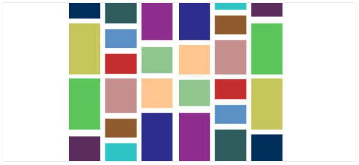
</div>
<div class="element">
<p>- Prop-Types</p>
</div>
<div class="element">
<p>- Phaser</p>

</div>
</div>

<br>

<div class="progress-container">
  <div
    class="progress-bar"
    :style="{ width: ((($page) / 45) * 100) + '%' }"
  ></div>
</div>
<div class="page abs-bl m-4 flex gap-2 text-m">
  <h5><SlideCurrentNo /> / <SlidesTotal /></h5>
</div>

<style>

.page {
  color: #090A09;
  opacity:0.5;
  font-size: 10px;
}
.progress-container {
  border-top: 1px solid #F8E6CB;
  position: fixed;
  bottom: 0;
  left: 0;
  width: 100%;
  height: 8px;
  background-color: #F5F5F5;
  z-index: 100;
}

.progress-bar {
  border-radius: 0px 4px 4px 0px;
  height: 100%;
  background: linear-gradient(to right, #F8E6CB 0%, #E0C1A8 30%, #D8B192 60%);
  transition: width 0.3s ease-in-out;
}

h1 {
    color: #D8B192;
}
.block {
  display: flex;
  flex-direction: column;
  }
.orga, .method {
  display: grid;
  grid-template-columns: repeat(5, 1fr);
  justify-items: center;
  align-items: center; 
  
}
.element{
  border-bottom: 4px solid #E0C1A8;
  border-radius: 8px;
  display: flex;
  flex-direction: column;
  justify-content: center;
  align-items: center;
  text-align: center;
  width: 10rem;
  height: 10rem;
}
  .element:hover { 
    background-color: #E0C1A8;
    color: #090A09;
  }
</style>
<!-- 
Nous avons structuré notre application avec **ReactJS**, une bibliothèque JavaScript moderne qui nous a permis de construire une interface utilisateur dynamique et réactive.

Pour la gestion des **routes**, nous avons utilisé **React Router Dom**, essentiel pour naviguer entre les différentes pages de notre application.

Ensuite, les fondations classiques mais indispensables :  
- **HTML**, pour la structure de nos pages.  
- **CSS**, pour styliser et harmoniser l'apparence de notre site.  
- **JavaScript**, qui est au cœur de notre logique interactive.

Pour faciliter les requêtes vers notre backend, nous avons intégré **Axios**, une bibliothèque performante pour gérer les appels API.

Nous avons également employé **React Masonry CSS** pour concevoir une disposition élégante et modulable des galeries d’œuvres, assurant une présentation visuelle optimisée.

**Prop-Types** a été utilisé pour vérifier les types de données passées dans nos composants React, ce qui améliore la robustesse et la maintenabilité du code.

Enfin, pour la fonctionnalité d'immertion, la visite virtuelle, nous avons intégré **Phaser**, un framework puissant dédié à la création d’expériences interactives. 
-->

---
transition: slide-left
---

<div>

## Authentification - Gestion des Requêtes
<br>
</div>

<div v-motion
  :initial="{ x: 80 }"
  :enter="{ x: 0, y: 0 }">

### request.js

````md magic-move {lines: true}
```js{*}
import axios from "axios";

const url = import.meta.env.VITE_API_URL;

// POST : Connexion utilisateur
export function postloginUser(userData) {
  return axios
    .post(`${url}/api/login`, userData, {
      withCredentials: true,
    })
    .then((reponse) => reponse)
    .catch((error) => {
      console.error("Erreur lors de la connexion :", error.response.data);
      return [];
    });
}
```
```js{*}
import axios from "axios";

const url = import.meta.env.VITE_API_URL;

// POST : Inscription utilisateur
export function postRegisterUser(userData) {
  return axios
    .post(`${url}/api/users`, userData)
    .then((reponse) => reponse)
    .catch((error) => {
      console.error("Erreur lors de l'inscription :", error.response.data);
      return [];
    });
}
```
````

</div>

<div class="abs-br m-8 flex gap-2">

</div>

<div class="progress-container">
  <div
    class="progress-bar"
    :style="{ width: ((($page) / 45) * 100) + '%' }"
  ></div>
</div>
<div class="page abs-bl m-4 flex gap-2 text-m">
  <h5><SlideCurrentNo /> / <SlidesTotal /></h5>
</div>

<style>

.page {
  color: #090A09;
  opacity:0.5;
  font-size: 10px;
}
.progress-container {
  border-top: 1px solid #F8E6CB;
  position: fixed;
  bottom: 0;
  left: 0;
  width: 100%;
  height: 8px;
  background-color: #F5F5F5;
  z-index: 100;
}

.progress-bar {
  border-radius: 0px 4px 4px 0px;
  height: 100%;
  background: linear-gradient(to right, #F8E6CB 0%, #E0C1A8 30%, #D8B192 60%);
  transition: width 0.3s ease-in-out;
}

h1 {
    color: #D8B192;
}
.client {
  display: grid;
  grid-template-columns: repeat(5, 1fr);
  justify-items: center;
  align-items: center;   
}

.client a {
  width: 10rem;
  min-height: 10rem;
  text-decoration: none;
  display: flex;
  flex-direction: column;
  justify-content: center;
  align-items: center;
  text-align: center;
  padding-bottom: 10px;
  margin-bottom:10px;
  height: 100%; 
}
.element{
  border-bottom: 4px solid #E0C1A8;
  border-radius: 8px;
  display: flex;
  flex-direction: column;
  justify-content: center;
  align-items: center;
  text-align: center;
  width: 10rem;
    height: 10rem;

}
  .element:hover { 
    background-color: #E0C1A8;
    color: #090A09;
  }
</style>
<!-- 

Nous avons configuré deux fonctions principales pour gérer l’authentification des utilisateurs via des requêtes POST envoyées au backend.

La fonction `postloginUser` est responsable de l’envoi des données d'identification (email et mot de passe) pour permettre à un utilisateur de se connecter. Elle utilise **Axios** pour effectuer une requête POST vers l'API avec les informations nécessaires.  
L'option `withCredentials: true` est spécifiée pour inclure automatiquement les cookies dans la requête, assurant ainsi une session sécurisée. En cas d’erreur, elle capture et affiche les messages d’erreur pour faciliter le débogage.

La fonction `postRegisterUser`, quant à elle, gère l’inscription de nouveaux utilisateurs. Elle envoie les données saisies par l’utilisateur, comme le pseudo, l’email et le mot de passe, au backend pour créer un compte. Comme pour la connexion, tout problème rencontré lors de l’inscription est logué pour pouvoir être corrigé rapidement.
 -->
---
transition: slide-left
---

<div>

## Authentification - Intégration des Routes
<br>
</div>

<div v-motion
  :initial="{ x: 80 }"
  :enter="{ x: 0, y: 0 }">

### main.jsx

````md magic-move {lines: true}
```jsx{*|2|8-11|12-15|16-19}
import { createBrowserRouter, RouterProvider } from "react-router-dom";
import { postloginUser, postRegisterUser } from "./services/request";

const router = createBrowserRouter([
  {
    element: <App />,
    children: [
      {
        path: "/authentification",
        element: <AuthPage />,
      },
      {
        path: "/login",
        element: <LoginPage />,
      },
      {
        path: "/register",
        element: <RegisterPage />,
      },
    ],
  },
]);
// Fourniture du contexte Auth
root.render(
  <AuthProvider>
    <RouterProvider router={router} />
  </AuthProvider>
);
```
````
</div>

<div class="abs-br m-8 flex gap-2">

</div>

<div class="progress-container">
  <div
    class="progress-bar"
    :style="{ width: ((($page) / 45) * 100) + '%' }"
  ></div>
</div>
<div class="page abs-bl m-4 flex gap-2 text-m">
  <h5><SlideCurrentNo /> / <SlidesTotal /></h5>
</div>

<style>

.page {
  color: #090A09;
  opacity:0.5;
  font-size: 10px;
}
.progress-container {
  border-top: 1px solid #F8E6CB;
  position: fixed;
  bottom: 0;
  left: 0;
  width: 100%;
  height: 8px;
  background-color: #F5F5F5;
  z-index: 100;
}

.progress-bar {
  border-radius: 0px 4px 4px 0px;
  height: 100%;
  background: linear-gradient(to right, #F8E6CB 0%, #E0C1A8 30%, #D8B192 60%);
  transition: width 0.3s ease-in-out;
}

h1 {
    color: #D8B192;
}
.client {
  display: grid;
  grid-template-columns: repeat(5, 1fr);
  justify-items: center;
  align-items: center;   
}

.client a {
  width: 10rem;
  min-height: 10rem;
  text-decoration: none;
  display: flex;
  flex-direction: column;
  justify-content: center;
  align-items: center;
  text-align: center;
  padding-bottom: 10px;
  margin-bottom:10px;
  height: 100%; 
}
.element{
  border-bottom: 4px solid #E0C1A8;
  border-radius: 8px;
  display: flex;
  flex-direction: column;
  justify-content: center;
  align-items: center;
  text-align: center;
  width: 10rem;
    height: 10rem;

}
  .element:hover { 
    background-color: #E0C1A8;
    color: #090A09;
  }
</style>
<!-- 
Dans cette partie, nous configurons les routes liées à l'authentification dans notre projet ReactJS, en centralisant leur gestion dans le fichier `main.jsx`.

Nous commençons par importer les fonctions `postloginUser` et `postRegisterUser` depuis le fichier `request.js`. Ces fonctions gèrent respectivement les requêtes pour la connexion et l'inscription des utilisateurs.

Ensuite, nous définissons la route `/authentification`, associée à la page `AuthPage`, qui sert de point d’entrée pour l’utilisateur afin de choisir entre se connecter ou s’inscrire.

La route `/login` est ensuite configurée pour afficher la page de connexion, où l’utilisateur peut saisir ses identifiants pour accéder à son compte.

Enfin, la route `/register` permet aux nouveaux utilisateurs de s’inscrire via une page dédiée.

 -->
---
transition: slide-left
---

<div>

## Les pages d'authentification
<br>
</div>

<div class="codes">

<div class="code" v-click.hide="1" v-motion
  :initial="{ x: 80 }"
  :enter="{ x: 0, y: 0 }">

<h3>AuthPage.jsx</h3>

````md magic-move {lines: true}
```jsx{*}
function AuthPage() {
  const { auth } = useAuth();
  const navigate = useNavigate();
  useEffect(() => {
    if (auth) {navigate("/dashboard");}
  }, [auth, navigate]);
  return (
    <div>
      <h1>Bienvenue {auth ? auth.user.pseudo : ""}</h1>
      <ul>
        {auth == null && (
          <>
            <li><Link to="/login">Connexion</Link></li>
            <li><Link to="/register">Inscription</Link></li>
          </>
        )}
      </ul>
    </div>
  );
}
```
````
</div>

<div class="code" v-click="[1,2]" v-motion
  :initial="{ x: 80 }"
  :enter="{ x: 0, y: 0 }">

<h3>LoginPage.jsx</h3>

````md magic-move {lines: true}
```jsx{*}
function LoginPage() {
  const [email, setEmail] = useState("");
  const [password, setPassword] = useState("");
  const { setAuth } = useAuth();
  const navigate = useNavigate();
  const handleSubmit = async (event) => { event.preventDefault();
    const res = await postloginUser({ email, password });
    if (res.status === 200) {
      setAuth(res.data);
      navigate("/dashboard");
    }};
  return (
    <form onSubmit={handleSubmit}>
      <input type="email" onChange={(e) => setEmail(e.target.value)} />
      <input type="password" onChange={(e) => setPassword(e.target.value)} />
      <button type="submit">Se connecter</button>
    </form>
  );
}
```
````
</div>
<div class="code" v-click="2" v-motion
  :initial="{ x: 80 }"
  :enter="{ x: 0, y: 0 }">

<h3>RegisterPage.jsx</h3>

````md magic-move {lines: true}
```jsx{*}
function RegisterPage() {
  const [pseudo, setPseudo] = useState("");
  const [email, setEmail] = useState("");
  const [hashedPassword, setHashedPassword] = useState("");
  const [confirmPassword, setConfirmPassword] = useState("");
  const navigate = useNavigate();
  const handleSubmit = async (event) => {
    event.preventDefault();
    if (hashedPassword === confirmPassword) {
      const res = await postRegisterUser({ pseudo, email, password: hashedPassword });
      if (res.status === 201) { navigate("/login");}
    }};
  return (
    <form onSubmit={handleSubmit}>
      <input type="text" placeholder="Pseudo" onChange={(e) => setPseudo(e.target.value)} />
      <input type="email" placeholder="Email" onChange={(e) => setEmail(e.target.value)} />
      <input type="password" placeholder="Mot de passe" onChange={(e) => setHashedPassword(e.target.value)} />
      <input type="password" placeholder="Confirmer le mot de passe" onChange={(e) => setConfirmPassword(e.target.value)} />
      <button type="submit">S'inscrire</button>
    </form>
  );
}
```
````
</div>
</div>

<div class="abs-br m-8 flex gap-2">

</div>

<div class="progress-container">
  <div
    class="progress-bar"
    :style="{ width: ((($page) / 45) * 100) + '%' }"
  ></div>
</div>
<div class="page abs-bl m-4 flex gap-2 text-m">
  <h5><SlideCurrentNo /> / <SlidesTotal /></h5>
</div>

<style>

.page {
  color: #090A09;
  opacity:0.5;
  font-size: 10px;
}
.progress-container {
  border-top: 1px solid #F8E6CB;
  position: fixed;
  bottom: 0;
  left: 0;
  width: 100%;
  height: 8px;
  background-color: #F5F5F5;
  z-index: 100;
}

.progress-bar {
  border-radius: 0px 4px 4px 0px;
  height: 100%;
  background: linear-gradient(to right, #F8E6CB 0%, #E0C1A8 30%, #D8B192 60%);
  transition: width 0.3s ease-in-out;
}

h1 {
    color: #D8B192;
}
.client {
  display: grid;
  grid-template-columns: repeat(5, 1fr);
  justify-items: center;
  align-items: center;   
}

.client a {
  width: 10rem;
  min-height: 10rem;
  text-decoration: none;
  display: flex;
  flex-direction: column;
  justify-content: center;
  align-items: center;
  text-align: center;
  padding-bottom: 10px;
  margin-bottom:10px;
  height: 100%; 
}
.element{
  border-bottom: 4px solid #E0C1A8;
  border-radius: 8px;
  display: flex;
  flex-direction: column;
  justify-content: center;
  align-items: center;
  text-align: center;
  width: 10rem;
    height: 10rem;

}
  .element:hover { 
    background-color: #E0C1A8;
    color: #090A09;
  }
  .codes {
  position: relative;
  width: 100%;
  max-width: 1000px;
}
.code {
  position: absolute;
  top: 0;
  left: 0;
  width: 100%;
  height: auto;
}
</style>

<!-- 
Ce composant est la page principale pour l'authentification. Il utilise le contexte `Auth` pour vérifier si un utilisateur est connecté.  
- Si l'utilisateur est déjà authentifié, il est automatiquement redirigé vers la page de bord grâce à `navigate("/dashboard")`.  
- Sinon, la page affiche deux liens simples : un pour la **connexion** et un autre pour l'**inscription**, permettant à l'utilisateur de choisir son action.
<br>CLICK<br><br>
Pour la page **Login**, elle permet aux utilisateurs existants de se connecter.  
- Elle dispose de champs pour l'**email** et le **mot de passe**, gérés avec des `useState`.  
- Lors de la soumission du formulaire, la fonction `handleSubmit` envoie les données via `postloginUser`.  
- Si la réponse est positive (statut 200), le contexte d'authentification est mis à jour avec `setAuth`, et l'utilisateur est redirigé vers le tableau de bord.
<br>CLICK<br><br>
Et enfin pour l'inscription, pour des nouveaux utilisateurs.  
- Cette page propose des champs pour saisir le pseudo, l'email, et deux champs pour le mot de passe don un pour la confirmation.  
- Avant l'envoi, une validation simple vérifie si les deux mots de passe correspondent.  
- Si tout est correct, les données sont envoyées via `postRegisterUser`, et en cas de succès (statut 201), l'utilisateur est redirigé vers la page de connexion afin de pouvoir s'authentifier. 
-->

---
transition: slide-left
---

<div>

## Gestion de l'authentification avec Context
<br>
</div>

<div v-motion
  :initial="{ x: 80 }"
  :enter="{ x: 0, y: 0 }">

### AuthContext.jsx

````md magic-move {lines: true}
```jsx{*|3|4,5|17}
import { createContext, useState, useContext } from "react";
const AuthContext = createContext();
export function AuthProvider({ children }) {
  const [auth, setAuth] = useState(null);
  const updateUser = (userData) => {
    setAuth((prev) => ({
      ...prev,
      user: { ...prev.user, ...userData },
    }));
  };
  return (
    <AuthContext.Provider value={{ auth, setAuth, updateUser }}>
      {children}
    </AuthContext.Provider>
  );
}
export function useAuth() {
  const context = useContext(AuthContext);
  if (!context) {
    throw new Error("useAuth must be used within AuthProvider");
  }
  return context;}
```
````
</div>

<div class="abs-br m-8 flex gap-2">

</div>

<div class="progress-container">
  <div
    class="progress-bar"
    :style="{ width: ((($page) / 45) * 100) + '%' }"
  ></div>
</div>
<div class="page abs-bl m-4 flex gap-2 text-m">
  <h5><SlideCurrentNo /> / <SlidesTotal /></h5>
</div>

<style>

.page {
  color: #090A09;
  opacity:0.5;
  font-size: 10px;
}
.progress-container {
  border-top: 1px solid #F8E6CB;
  position: fixed;
  bottom: 0;
  left: 0;
  width: 100%;
  height: 8px;
  background-color: #F5F5F5;
  z-index: 100;
}

.progress-bar {
  border-radius: 0px 4px 4px 0px;
  height: 100%;
  background: linear-gradient(to right, #F8E6CB 0%, #E0C1A8 30%, #D8B192 60%);
  transition: width 0.3s ease-in-out;
}

h1 {
    color: #D8B192;
}
.client {
  display: grid;
  grid-template-columns: repeat(5, 1fr);
  justify-items: center;
  align-items: center;   
}

.client a {
  width: 10rem;
  min-height: 10rem;
  text-decoration: none;
  display: flex;
  flex-direction: column;
  justify-content: center;
  align-items: center;
  text-align: center;
  padding-bottom: 10px;
  margin-bottom:10px;
  height: 100%; 
}
.element{
  border-bottom: 4px solid #E0C1A8;
  border-radius: 8px;
  display: flex;
  flex-direction: column;
  justify-content: center;
  align-items: center;
  text-align: center;
  width: 10rem;
    height: 10rem;

}
  .element:hover { 
    background-color: #E0C1A8;
    color: #090A09;
  }
</style>
<!-- 
Le contexte React `AuthContext` centralise les informations d'authentification. Il repose sur trois éléments clés :  
1. **`AuthProvider`** : un composant qui encapsule l'application et partage les données d'authentification via un contexte.  
2. **L'état de `auth`** : il stocke les informations de l'utilisateur connecté et peut être mis à jour avec `setAuth` ou partiellement modifié via `updateUser`.  
3. **`useAuth`** : un hook personnalisé qui simplifie l'accès au contexte depuis n'importe quel composant.

Ce système nous a permis de gérer efficacement l'état d'authentification dans toute l'application, en rendant les interactions plus cohérentes et le code plus maintenable.
 -->
---
transition: slide-up
---

<div>

## Centralisation des imports CSS
<br>
</div>

<div v-motion
  :initial="{ x: 80 }"
  :enter="{ x: 0, y: 0 }">

### App.jsx

````md magic-move {lines: true}
```jsx{*}
import "./App.css";
import "./assets/styles/homepage.css";
import "./assets/styles/navbarcomponent.css";
import "./assets/styles/artworkpage.css";
import "./assets/styles/artistlist.css";
import "./assets/styles/artworkForm.css";
import "./assets/styles/exhibition.css";
import "./assets/styles/exhibitionForm.css";
import "./assets/styles/exhibitioncomponent.css";
import "./assets/styles/favorites.css";
import "./assets/styles/artistprofile.css";
import "./assets/styles/authentification_styles/authpage.css";
import "./assets/styles/authentification_styles/loginpage.css";
import "./assets/styles/authentification_styles/registerpage.css";
import "./assets/styles/authentification_styles/backbuttoncomponent.css";
import "./assets/styles/user_connected_styles/personalinformationspage.css";
import "./assets/styles/footercomponent.css";
import "./assets/styles/confirmButton.css";
```
````
</div>

<div class="abs-br m-8 flex gap-2">

</div>

<div class="progress-container">
  <div
    class="progress-bar"
    :style="{ width: ((($page) / 45) * 100) + '%' }"
  ></div>
</div>
<div class="page abs-bl m-4 flex gap-2 text-m">
  <h5><SlideCurrentNo /> / <SlidesTotal /></h5>
</div>

<style>

.page {
  color: #090A09;
  opacity:0.5;
  font-size: 10px;
}
.progress-container {
  border-top: 1px solid #F8E6CB;
  position: fixed;
  bottom: 0;
  left: 0;
  width: 100%;
  height: 8px;
  background-color: #F5F5F5;
  z-index: 100;
}

.progress-bar {
  border-radius: 0px 4px 4px 0px;
  height: 100%;
  background: linear-gradient(to right, #F8E6CB 0%, #E0C1A8 30%, #D8B192 60%);
  transition: width 0.3s ease-in-out;
}

h1 {
    color: #D8B192;
}
.client {
  display: grid;
  grid-template-columns: repeat(5, 1fr);
  justify-items: center;
  align-items: center;   
}

.client a {
  width: 10rem;
  min-height: 10rem;
  text-decoration: none;
  display: flex;
  flex-direction: column;
  justify-content: center;
  align-items: center;
  text-align: center;
  padding-bottom: 10px;
  margin-bottom:10px;
  height: 100%; 
}
.element{
  border-bottom: 4px solid #E0C1A8;
  border-radius: 8px;
  display: flex;
  flex-direction: column;
  justify-content: center;
  align-items: center;
  text-align: center;
  width: 10rem;
    height: 10rem;

}
  .element:hover { 
    background-color: #E0C1A8;
    color: #090A09;
  }
</style>
<!-- 
L'idée principale de la **centralisation des imports CSS** dans le fichier **App.jsx** est de regrouper tous les fichiers de styles en un seul point d'entrée. 
Chaque fichier étant dédié à une partie spécifique de l'interface, ce qui optimise l'organisation et simplifie leur gestion.

Comme `homepage.css` pour la page d'accueil ainsi que les composants spécificique tels que `navbarcomponent.css` ou `footercomponent.css`.
-->

---
layout: dynamic-image 
image: "./media/Pictures/Chaos_Organisé.webp"
equal: false
left: false
---

# Aperçu pratique

<div class="abs-br m-8 flex gap-2">

</div>

<div class="progress-container">
  <div
    class="progress-bar"
    :style="{ width: ((($page) / 45) * 100) + '%' }"
  ></div>
</div>
<div class="page abs-bl m-4 flex gap-2 text-m">
  <h5><SlideCurrentNo /> / <SlidesTotal /></h5>
</div>

<style>

.page {
  color: #090A09;
  opacity:0.5;
  font-size: 10px;
}
.progress-container {
  border-top: 1px solid #F8E6CB;
  position: fixed;
  bottom: 0;
  left: 0;
  width: 100%;
  height: 8px;
  background-color: #F5F5F5;
  z-index: 100;
}

.progress-bar {
  border-radius: 0px 4px 4px 0px;
  height: 100%;
  background: linear-gradient(to right, #F8E6CB 0%, #E0C1A8 30%, #D8B192 60%);
  transition: width 0.3s ease-in-out;
}

h1 {
    color: #D8B192;
}
</style>

<!-- Après avoir détaillé les différentes parties du projet, je vais maintenant vous montrer une démonstration des fonctionnalités principales pour vous donner un aperçu concret du rendu final. -->

---
layout: dynamic-image 
image: "./media/Pictures/Algorithme_de_Vie.webp"
equal: false
left: false
---

# Conclusion et perspectives

<div class="abs-br m-8 flex gap-2">

</div>

<div class="progress-container">
  <div
    class="progress-bar"
    :style="{ width: ((($page) / 45) * 100) + '%' }"
  ></div>
</div>
<div class="page abs-bl m-4 flex gap-2 text-m">
  <h5><SlideCurrentNo /> / <SlidesTotal /></h5>
</div>

<style>

.page {
  color: #090A09;
  opacity:0.5;
  font-size: 10px;
}
.progress-container {
  border-top: 1px solid #F8E6CB;
  position: fixed;
  bottom: 0;
  left: 0;
  width: 100%;
  height: 8px;
  background-color: #F5F5F5;
  z-index: 100;
}

.progress-bar {
  border-radius: 0px 4px 4px 0px;
  height: 100%;
  background: linear-gradient(to right, #F8E6CB 0%, #E0C1A8 30%, #D8B192 60%);
  transition: width 0.3s ease-in-out;
}

h1 {
    color: #D8B192;
}
</style>
<!-- 
Nous sommes pleinement conscients que, réalisé en seulement un mois, ce premier projet fullstack n’est pas parfait. Cependant, il a été une expérience extrêmement enrichissante, nous permettant d'apprendre énormément, que ce soit en termes de gestion de projet, d'organisation, ou de prise en main des différentes technologies utilisées.

Ce fut un mois intense, rempli de défis et de découvertes. Au fil du projet, nous avons identifié plusieurs axes d'amélioration : l'optimisation de l'expérience utilisateur, un visuel plus abouti, une meilleure ergonomie des formulaires, ou encore le perfectionnement de la fonctionnalité d’immersion interactive.

Malgré ces points perfectibles, nous sommes très fiers du travail accompli. Ce projet a représenté un véritable défi, et l’avoir mené à bien en si peu de temps est une grande satisfaction pour toute l’équipe. -->

---
layout: dynamic-image 
image: 'https://avatars.githubusercontent.com/dampherrr'
upperImage: 'https://avatars.githubusercontent.com/dampherrr'
equal: true
left: false
---
    <!--  -->

# Merci pour votre attention ! 🙌

<br>

<h2> Damien Goguet</h2>

<br>

<div class="link">

</div>
<div class="links">
  <a href="https://www.linkedin.com/in/damien-goguet-63a749180/" target="_blank" alt="LinkedIn" title="LinkedIn: Damien GOGUET"
    class="text-xl slidev-icon-btn !border-none !hover:text-black">
    <carbon-logo-linkedin />
  </a>
<div class="link">
  <a href="https://github.com/dampherrr" target="_blank" alt="GitHub" title="GitHub: Dampherrr"
    class="text-xl slidev-icon-btn !border-none !hover:text-black">
    <carbon-logo-github />
  </a>
</div>
<div class="abs-br m-8 flex gap-2">

</div>
</div>

<div class="progress-container">
  <div
    class="progress-bar"
    :style="{ width: ((($page) / 45) * 100) + '%' }"
  ></div>
</div>
<div class="page abs-bl m-4 flex gap-2 text-m">
  <h5><SlideCurrentNo /> / <SlidesTotal /></h5>
</div>

<style>

.page {
  color: #090A09;
  opacity:0.5;
  font-size: 10px;
}
.progress-container {
  border-top: 1px solid #F8E6CB;
  position: fixed;
  bottom: 0;
  left: 0;
  width: 100%;
  height: 8px;
  background-color: #F5F5F5;
  z-index: 100;
}

.progress-bar {
  border-radius: 0px 4px 4px 0px;
  height: 100%;
  background: linear-gradient(to right, #F8E6CB 0%, #E0C1A8 30%, #D8B192 60%);
  transition: width 0.3s ease-in-out;
}

h1 {
    color: #D8B192;
}

.links {
display:grid;
  grid-template-columns: repeat(2, 1fr);
  justify-items: center;
  align-items: center; 
}

.link {
display: flex; 
align-items: center;
flex-direction: column;
}
</style>
<!-- 
Avant de conclure, je tiens à vous remercier pour votre attention tout au long de cette présentation. 

Vous pouvez me retrouver sur mes réseaux professionnels. 

J’ai ajouté un QR code qui mène directement à mon profil LinkedIn, si vous souhaitez en savoir plus sur mon parcours." -->
