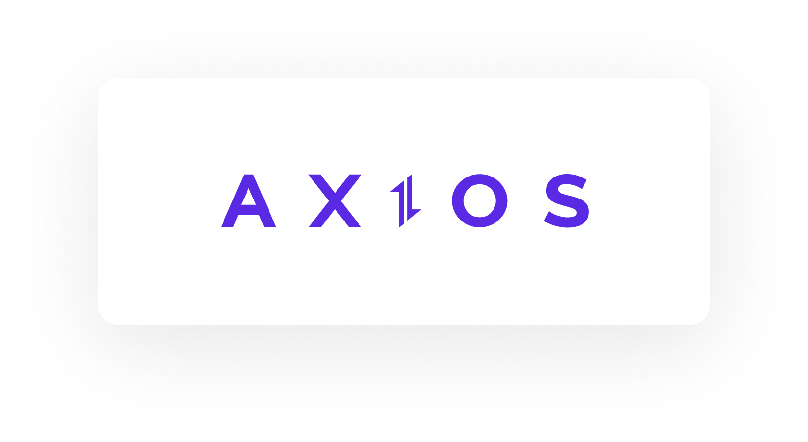

# Présentation au titre de **Développeur Web Full Stack** 
<br>
<br>
<h2 style="margin-top: 2rem;"> Damien Goguet </h2>

<h2 style="font-size: 14px; display: inline-flex; align-items: center; gap: 0.5rem;">
  Promo 2024 - 
   
  Wild Code School
</h2>

<br>
<br>
<br>

#### Présentation réalisée avec : **Slidev**

<div class="progress-container">
  <div
    class="progress-bar"
    :style="{ width: ((($page) / 45) * 100) + '%' }"
  ></div>
</div>
<div class="page abs-bl m-4 flex gap-2 text-m">
  <h5><SlideCurrentNo /> / <SlidesTotal /></h5>
</div>

<style>

.page {
  color: #F5F5F5;
  opacity:0.5;
  font-size: 10px;
}
.progress-container {
  border-top: 1px solid #F8E6CB;
  position: fixed;
  bottom: 0;
  left: 0;
  width: 100%;
  height: 8px;
  background-color: #F5F5F5;
  z-index: 100;
}

.progress-bar {
  border-radius: 0px 4px 4px 0px;
  height: 100%;
  background: linear-gradient(to right, #F8E6CB 0%, #E0C1A8 30%, #D8B192 60%);
  transition: width 0.3s ease-in-out;
}

  * {text-align: end;}
  h1 {
    color: #D8B192;
}
  h2, h3, h4 {
    color: #090A09;
}

.links {
display:grid;
  grid-template-columns: repeat(2, 1fr);
  justify-items: center;
  align-items: center; 
}

.link {
display: flex; 
align-items: center;
flex-direction: column;
}
</style>
---
layout: dynamic-image
image: "./media/Pictures/Eclosion.png"
upperImage: "./media/Pictures/Eclosion.png"
equal: true
left: false
---

<div>

<p style="color:#D8B192;">L'art pour tous!</p>
</div>

<div class="absolute left-40% m--12 flex gap-2">
  <a href="https://github.com/dampherrr/P3-VirtuArt" target="_blank" alt="GitHub" title="GitHub: P3-VirtuArt"
    class="text-xl slidev-icon-btn !border-none !hover:text-black">
    <carbon-logo-github />
  </a>
</div>

<!-- Présentation:Nom ; <br>
Projet professionnel: TSSR -> Développeur Web FS 
Présentation du projet: contexte (Projet 3 fil rouge FullStack)
-->
<div class="progress-container">
  <div
    class="progress-bar"
    :style="{ width: ((($page) / 45) * 100) + '%' }"
  ></div>
</div>
<div class="page abs-bl m-4 flex gap-2 text-m">
  <h5><SlideCurrentNo /> / <SlidesTotal /></h5>
</div>

<style>
  .page {
    color: #090A09;
  opacity:0.5;
  font-size: 10px;
}
.progress-container {
  border-top: 1px solid #F8E6CB;
  position: fixed;
  bottom: 0;
  left: 0;
  width: 100%;
  height: 8px;
  background-color: #F5F5F5;
  z-index: 100;
}

.progress-bar {
  border-radius: 0px 4px 4px 0px;
  height: 100%;
  background: linear-gradient(to right, #F8E6CB 0%, #E0C1A8 30%, #D8B192 60%);
  transition: width 0.3s ease-in-out;
}
</style>
---
transition: slide-up
---

# Membre de l'équipe sur le projet:

<div class="team-members">
  <a class="member" href="https://github.com/BaptisteFredj" target="_blank">
    Baptiste <br>
    
  </a>
  <a class="member" href="https://github.com/Agraheris" target="_blank">
    Clément <br>
    
  </a>
  <a class="member" href="https://github.com/dampherrr" target="_blank">
    Damien <br>
    
  </a>
  <a class="member" href="https://github.com/Ryokoh-974" target="_blank">
    Daniel <br>
    
  </a>
  <a class="member" href="https://github.com/monica-tech75" target="_blank">
    Monica <br>
    
  </a>
</div>

<div class="abs-br m-8 flex gap-2">

</div>

<div class="progress-container">
  <div
    class="progress-bar"
    :style="{ width: ((($page) / 45) * 100) + '%' }"
  ></div>
</div>
<div class="page abs-bl m-4 flex gap-2 text-m">
  <h5><SlideCurrentNo /> / <SlidesTotal /></h5>
</div>

<style>

.page {
  color: #090A09;
  opacity:0.5;
  font-size: 10px;
}
.progress-container {
  border-top: 1px solid #F8E6CB;
  position: fixed;
  bottom: 0;
  left: 0;
  width: 100%;
  height: 8px;
  background-color: #F5F5F5;
  z-index: 100;
}

.progress-bar {
  border-radius: 0px 4px 4px 0px;
  height: 100%;
  background: linear-gradient(to right, #F8E6CB 0%, #E0C1A8 30%, #D8B192 60%);
  transition: width 0.3s ease-in-out;
}

.team-members {
  display: flex;
  gap: 10px;
  flex-wrap: wrap;
  align-items: center;
  justify-content: center;
}

.member { 
  border-bottom: 4px solid #E0C1A8;
  border-radius: 8px;
  text-align: center;
  margin: 10px;  
  height: 10rem;
  width: 8rem;
  display: flex;
  align-items: center;
  justify-content: center;
  flex-direction: column;
}
.member:hover { 
  background-color: #E0C1A8;
  color: #090A09;
}
.team-members a img {   
border-radius: 8px;
}
</style>

---
transition: slide-up
level: 2
---

# Demande du client:

<div class="client">
<div v-click class="rules" v-motion
  :initial="{ y: 80 }"
  :enter="{ x: 0, y: 0 }">
<p>- Galerie d'art</p>

</div>
<div v-click class="rules"   v-motion
  :initial="{ y: 80 }"
  :enter="{ x: 0, y: 0 }">
<p>- Interactif</p>

</div>
<div v-click class="rules"   v-motion
  :initial="{ y: 80 }"
  :enter="{ x: 0, y: 0 }">
<p>- Différents profils utilisateurs</p>

</div>
<div v-click class="rules"   v-motion
  :initial="{ y: 80 }"
  :enter="{ x: 0, y: 0 }">
<p>- Ajout des favoris</p>

</div>
<div v-click class="rules"   v-motion
  :initial="{ y: 80 }"
  :enter="{ x: 0, y: 0 }">
<p>- Responsive</p>

</div>
<div v-click class="rules"   v-motion
  :initial="{ y: 80 }"
  :enter="{ x: 0, y: 0 }">
<p>- Deadline</p>

</div>
</div>

<div class="abs-br m-8 flex gap-2">

</div>

<div class="progress-container">
  <div
    class="progress-bar"
    :style="{ width: ((($page) / 45) * 100) + '%' }"
  ></div>
</div>
<div class="page abs-bl m-4 flex gap-2 text-m">
  <h5><SlideCurrentNo /> / <SlidesTotal /></h5>
</div>

<style>

.page {
  color: #090A09;
  opacity:0.5;
  font-size: 10px;
}
.progress-container {
  border-top: 1px solid #F8E6CB;
  position: fixed;
  bottom: 0;
  left: 0;
  width: 100%;
  height: 8px;
  background-color: #F5F5F5;
  z-index: 100;
}

.progress-bar {
  border-radius: 0px 4px 4px 0px;
  height: 100%;
  background: linear-gradient(to right, #F8E6CB 0%, #E0C1A8 30%, #D8B192 60%);
  transition: width 0.3s ease-in-out;
}

h1 {
    color: #D8B192;
}

.client {

  display: grid;
  grid-template-columns: repeat(3, 1fr);
  justify-items: center;
  align-items: center; 
}

.rules {    
  border-bottom: 4px solid #E0C1A8;
  border-radius: 8px;
  display: flex;
  flex-direction: column;
  justify-content: center;
  align-items: center;
  text-align: center;
  padding: 10px;
  height: 100%; 
  width: 15rem;
}
.rules:hover { 
  background-color: #E0C1A8;
  color: #090A09;
}
</style>

---
layout: dynamic-image 
image: './media/Pictures/Vie_Urbaine.webp'
equal: true
left: false
transition: slide-up
---

# Introduction

<div class="client">
<div v-click v-motion
  :initial="{ x: -80 }"
  :enter="{ x: 0 }">
<p>- Organisation du projet</p>
</div>
<div v-click v-motion
  :initial="{ x: -80 }"
  :enter="{ x: 0 }">
<p>- Design</p>
</div>
<div v-click v-motion
  :initial="{ x: -80 }"
  :enter="{ x: 0 }">
<p>- Architecture </p>
</div>
<div v-click v-motion
  :initial="{ x: -80 }"
  :enter="{ x: 0 }">
<p>- La modélisation de la base de donnée</p>
</div>
<div v-click v-motion
  :initial="{ x: -80 }"
  :enter="{ x: 0 }">
<p>- Backend </p>
</div>
<div v-click v-motion
  :initial="{ x: -80 }"
  :enter="{ x: 0 }">
<p>- Sécurité</p>
</div>
<div v-click v-motion
  :initial="{ x: -80 }"
  :enter="{ x: 0 }">
<p>- Frontend</p>
</div>
<div v-click v-motion
  :initial="{ x: -80 }"
  :enter="{ x: 0 }">
<p>- Démonstration</p>
</div>
<div v-click v-motion
  :initial="{ x: -80 }"
  :enter="{ x: 0 }">
<p>- Conclusion</p>
</div>
</div>

<div class="abs-br m-8 flex gap-2">

</div>

<div class="progress-container">
  <div
    class="progress-bar"
    :style="{ width: ((($page) / 45) * 100) + '%' }"
  ></div>
</div>
<div class="page abs-bl m-4 flex gap-2 text-m">
  <h5><SlideCurrentNo /> / <SlidesTotal /></h5>
</div>

<style>

.page {
  color: #090A09;
  opacity:0.5;
  font-size: 10px;
}
.progress-container {
  border-top: 1px solid #F8E6CB;
  position: fixed;
  bottom: 0;
  left: 0;
  width: 100%;
  height: 8px;
  background-color: #F5F5F5;
  z-index: 100;
}

.progress-bar {
  border-radius: 0px 4px 4px 0px;
  height: 100%;
  background: linear-gradient(to right, #F8E6CB 0%, #E0C1A8 30%, #D8B192 60%);
  transition: width 0.3s ease-in-out;
}

h1 {
    color: #D8B192;
  margin-bottom: 5rem;
}

.team-members {
  display: flex;
  gap: 10px;
  flex-wrap: wrap;
  align-items: center;
  justify-content: center;
}

.member { 
  border-bottom: 4px solid #E0C1A8;
  border-radius: 8px;
  text-align: center;
  margin: 10px;
}
.member:hover { 
  background-color: #E0C1A8;
  color: #090A09;
}
.team-members a img {   
border-radius: 8px;
}
</style>
---
layout: dynamic-image 
image: "./media/Pictures/Chaos_Organisé.webp"
equal: false
left: false
transition: slide-left
---

# Organisation du projet

<div class="abs-br m-8 flex gap-2">

</div>

<div class="progress-container">
  <div
    class="progress-bar"
    :style="{ width: ((($page) / 45) * 100) + '%' }"
  ></div>
</div>
<div class="page abs-bl m-4 flex gap-2 text-m">
  <h5><SlideCurrentNo /> / <SlidesTotal /></h5>
</div>

<style>

.page {
  color: #090A09;
  opacity:0.5;
  font-size: 10px;
}
.progress-container {
  border-top: 1px solid #F8E6CB;
  position: fixed;
  bottom: 0;
  left: 0;
  width: 100%;
  height: 8px;
  background-color: #F5F5F5;
  z-index: 100;
}

.progress-bar {
  border-radius: 0px 4px 4px 0px;
  height: 100%;
  background: linear-gradient(to right, #F8E6CB 0%, #E0C1A8 30%, #D8B192 60%);
  transition: width 0.3s ease-in-out;
}

h1 {
    color: #D8B192;
}
</style>
---
transition: slide-up
layout: two-cols
---

<div class="block" v-motion
  :initial="{ y: 80 }"
  :enter="{ x: 0, y: 0 }">
<h2>Méthodologie</h2>
<div class="method" v-click="1" v-motion
  :initial="{ y: 80 }"
  :enter="{ x: 0, y: 0 }">
<div class="element">
<p>- Agile (Scrum)</p>

</div>
</div>
</div>

<br>

<div v-click="2" class="block" v-motion
  :initial="{ y: 80 }"
  :enter="{ x: 0, y: 0 }">
<h2>Organisation et communication</h2>
<div class="orga" v-click="3" v-motion
  :initial="{ y: 80 }"
  :enter="{ x: 0, y: 0 }">
<div class="element">
<p>- Discord</p>

</div>
<div class="element">
<p>- Google Sheet</p>

</div>
<div class="element">
<p>- FigJam</p>

</div>
</div>
</div>

::right::
<div>


</div>
<div class="abs-br m-4 flex gap-2">

</div>

<div class="progress-container">
  <div
    class="progress-bar"
    :style="{ width: ((($page) / 45) * 100) + '%' }"
  ></div>
</div>
<div class="page abs-bl m-4 flex gap-2 text-m">
  <h5><SlideCurrentNo /> / <SlidesTotal /></h5>
</div>

<style>

.page {
  color: #090A09;
  opacity:0.5;
  font-size: 10px;
}
.progress-container {
  border-top: 1px solid #F8E6CB;
  position: fixed;
  bottom: 0;
  left: 0;
  width: 100%;
  height: 8px;
  background-color: #F5F5F5;
  z-index: 100;
}

.progress-bar {
  border-radius: 0px 4px 4px 0px;
  height: 100%;
  background: linear-gradient(to right, #F8E6CB 0%, #E0C1A8 30%, #D8B192 60%);
  transition: width 0.3s ease-in-out;
}

h1 {
    color: #D8B192;
}
.block {
  display: flex;
  flex-direction: column;
  }
.orga, .method {
  display: grid;
  grid-template-columns: repeat(3, 1fr);
  justify-items: center;
  align-items: center; 
}
.element{
  margin: 1rem;
  border-bottom: 4px solid #E0C1A8;
  border-radius: 8px;
  display: flex;
  flex-direction: column;
  justify-content: center;
  align-items: center;
  text-align: center;
  width: 10rem;
    height: 10rem;

}
  .element:hover { 
    background-color: #E0C1A8;
    color: #090A09;
  }
</style>
---
layout: two-cols
transition: slide-left
---

<div class="block" v-motion
  :initial="{ y: 80 }"
  :enter="{ x: 0, y: 0 }">
<h2>Template</h2>
<div class="method" v-click="1" v-motion
  :initial="{ y: 80 }"
  :enter="{ x: 0, y: 0 }">
<div class="element">
<p>- Harmonia</p>

</div>
</div>
</div>

<br>

<div class="block" v-click="2" v-motion
  :initial="{ y: 80 }"
  :enter="{ x: 0, y: 0 }">
<h2>Génération des données</h2>
<div class="method" v-click="3" v-motion
  :initial="{ y: 80 }"
  :enter="{ x: 0, y: 0 }">
<div class="element">
<p>- ChatGPT</p>

</div>
</div>
</div>

::right::
<div v-click="4" class="block" v-motion
  :initial="{ y: 80 }"
  :enter="{ x: 0, y: 0 }">
<h2>Outils de développement</h2>
<div class="orga" v-click="5" v-motion
  :initial="{ y: 80 }"
  :enter="{ x: 0, y: 0 }">
<div class="element">
<p>- VS Code</p>

</div>
<div class="element">
<p>- Node.js</p>

</div>
<div class="element">
<p>- Git</p>

</div>
<div class="element">
<p>- Github</p>

</div>
<div class="element">
<p>- Jest</p>

</div>
<div class="element">
<p>- Postman</p>

</div>
</div>
</div>

<div class="abs-br m-4 flex gap-2">

</div>

<div class="progress-container">
  <div
    class="progress-bar"
    :style="{ width: ((($page) / 45) * 100) + '%' }"
  ></div>
</div>
<div class="page abs-bl m-4 flex gap-2 text-m">
  <h5><SlideCurrentNo /> / <SlidesTotal /></h5>
</div>

<style>

.page {
  color: #090A09;
  opacity:0.5;
  font-size: 10px;
}
.progress-container {
  border-top: 1px solid #F8E6CB;
  position: fixed;
  bottom: 0;
  left: 0;
  width: 100%;
  height: 8px;
  background-color: #F5F5F5;
  z-index: 100;
}

.progress-bar {
  border-radius: 0px 4px 4px 0px;
  height: 100%;
  background: linear-gradient(to right, #F8E6CB 0%, #E0C1A8 30%, #D8B192 60%);
  transition: width 0.3s ease-in-out;
}

h1 {
    color: #D8B192;
}
.block {
  display: flex;
  flex-direction: column;
  }
.orga, .method {
  display: grid;
  grid-template-columns: repeat(2, 1fr);
  justify-items: center;
  align-items: center; 
  
}
.element{
  border-bottom: 4px solid #E0C1A8;
  border-radius: 8px;
  display: flex;
  flex-direction: column;
  justify-content: center;
  align-items: center;
  text-align: center;
  width: 10rem;
    height: 8rem;

}
  .element:hover { 
    background-color: #E0C1A8;
    color: #090A09;
  }
</style>
---
transition: slide-left
---

<div class="block" v-motion
  :initial="{ y: 80 }"
  :enter="{ x: 0, y: 0 }">
<h2>Qualité du code</h2>
<div class="orga" v-click="1" v-motion
  :initial="{ y: 80 }"
  :enter="{ x: 0, y: 0 }">
<div class="element">
<p>- EsLint</p>

</div>
<div class="element">
<p>- Prettier</p>

</div>
<div class="element">
<p>- Husky</p>

</div>
<div class="element">
<p>- Lint-Staged</p>

</div>
<div class="element">
<p>- Vite</p>

</div>
</div>
</div>

<div class="abs-br m-4 flex gap-2">

</div>

<div class="progress-container">
  <div
    class="progress-bar"
    :style="{ width: ((($page) / 45) * 100) + '%' }"
  ></div>
</div>
<div class="page abs-bl m-4 flex gap-2 text-m">
  <h5><SlideCurrentNo /> / <SlidesTotal /></h5>
</div>

<style>

.page {
  color: #090A09;
  opacity:0.5;
  font-size: 10px;
}
.progress-container {
  border-top: 1px solid #F8E6CB;
  position: fixed;
  bottom: 0;
  left: 0;
  width: 100%;
  height: 8px;
  background-color: #F5F5F5;
  z-index: 100;
}

.progress-bar {
  border-radius: 0px 4px 4px 0px;
  height: 100%;
  background: linear-gradient(to right, #F8E6CB 0%, #E0C1A8 30%, #D8B192 60%);
  transition: width 0.3s ease-in-out;
}

h1 {
    color: #D8B192;
}
.block {
  display: flex;
  flex-direction: column;
  }
.orga, .method {
  display: grid;
  grid-template-columns: repeat(3, 1fr);
  justify-items: center;
  align-items: center; 
  
}
.element{
  border-bottom: 4px solid #E0C1A8;
  border-radius: 8px;
  display: flex;
  flex-direction: column;
  justify-content: center;
  align-items: center;
  text-align: center;
  width: 10rem;
    height: 10rem;

}
  .element:hover { 
    background-color: #E0C1A8;
    color: #090A09;
  }
</style>

---
layout: dynamic-image 
image: "./media/Pictures/Connexion.webp"
equal: false
left: false
transition: slide-left
---

# Design

<div class="abs-br m-8 flex gap-2">

</div>

<div class="progress-container">
  <div
    class="progress-bar"
    :style="{ width: ((($page) / 45) * 100) + '%' }"
  ></div>
</div>
<div class="page abs-bl m-4 flex gap-2 text-m">
  <h5><SlideCurrentNo /> / <SlidesTotal /></h5>
</div>

<style>

.page {
  color: #090A09;
  opacity:0.5;
  font-size: 10px;
}
.progress-container {
  border-top: 1px solid #F8E6CB;
  position: fixed;
  bottom: 0;
  left: 0;
  width: 100%;
  height: 8px;
  background-color: #F5F5F5;
  z-index: 100;
}

.progress-bar {
  border-radius: 0px 4px 4px 0px;
  height: 100%;
  background: linear-gradient(to right, #F8E6CB 0%, #E0C1A8 30%, #D8B192 60%);
  transition: width 0.3s ease-in-out;
}

h1 {
    color: #D8B192;
}
</style>
---
layout: two-cols
transition: slide-left
---

<div v-motion
  :initial="{ x: -80 }"
  :enter="{ x: 0, y: 0 }">
<h2>Recherche et inspiration</h2>

  <a href="https://www.carredartistes.com/fr-fr/" target="_blank">
    Carré d'artistes<br>
    
  </a>
</div>
::right::
<div v-click v-motion
  :initial="{ y: -80 }"
  :enter="{ x: 0, y: 0 }">
<h2>Charte graphique</h2>

<br>
</div>
<div v-click v-motion
  :initial="{ y: 80 }"
  :enter="{ x: 0, y: 0 }">
<h2>Typographie</h2>
<p>Monserrat</p>
</div>

<div class="abs-br m-8 flex gap-2">

</div>

<div class="progress-container">
  <div
    class="progress-bar"
    :style="{ width: ((($page) / 45) * 100) + '%' }"
  ></div>
</div>
<div class="page abs-bl m-4 flex gap-2 text-m">
  <h5><SlideCurrentNo /> / <SlidesTotal /></h5>
</div>

<style>

.page {
  color: #090A09;
  opacity:0.5;
  font-size: 10px;
}
.progress-container {
  border-top: 1px solid #F8E6CB;
  position: fixed;
  bottom: 0;
  left: 0;
  width: 100%;
  height: 8px;
  background-color: #F5F5F5;
  z-index: 100;
}

.progress-bar {
  border-radius: 0px 4px 4px 0px;
  height: 100%;
  background: linear-gradient(to right, #F8E6CB 0%, #E0C1A8 30%, #D8B192 60%);
  transition: width 0.3s ease-in-out;
}

h1 {
    color: #D8B192;
}
</style>

---
layout: two-cols
transition: slide-up
---


<div class="method">
<h2>Maquettage</h2>

<div class="element">
<p>- Figma</p>

</div>
</div>

::right::

<br>
<br>
<br>
<div v-click v-motion
  :initial="{ x: 80 }"
  :enter="{ x: 0, y: 0 }">

</div>

<div class="abs-br m-4 flex gap-2">

</div>

<div class="progress-container">
  <div
    class="progress-bar"
    :style="{ width: ((($page) / 45) * 100) + '%' }"
  ></div>
</div>
<div class="page abs-bl m-4 flex gap-2 text-m">
  <h5><SlideCurrentNo /> / <SlidesTotal /></h5>
</div>

<style>

.page {
  color: #090A09;
  opacity:0.5;
  font-size: 10px;
}
.progress-container {
  border-top: 1px solid #F8E6CB;
  position: fixed;
  bottom: 0;
  left: 0;
  width: 100%;
  height: 8px;
  background-color: #F5F5F5;
  z-index: 100;
}

.progress-bar {
  border-radius: 0px 4px 4px 0px;
  height: 100%;
  background: linear-gradient(to right, #F8E6CB 0%, #E0C1A8 30%, #D8B192 60%);
  transition: width 0.3s ease-in-out;
}

h1 {
    color: #D8B192;
}

.method {
  display: flex;
  flex-direction: column;
  justify-content: center;
  align-items: center;
  height: 100%;

}
.element{
  border-bottom: 4px solid #E0C1A8;
  border-radius: 8px;
  display: flex;
  flex-direction: column;
  justify-content: center;
  align-items: center;
  text-align: center;
  width: 10rem;
    height: 10rem;

}
  .element:hover { 
    background-color: #E0C1A8;
    color: #090A09;
  }
</style>
---
layout: dynamic-image 
image: "./media/Pictures/Douce_Mélancolie.webp"
equal: false
left: false
transition: slide-left
---

# Architecture

<div class="abs-br m-8 flex gap-2">

</div>

<div class="progress-container">
  <div
    class="progress-bar"
    :style="{ width: ((($page) / 45) * 100) + '%' }"
  ></div>
</div>
<div class="page abs-bl m-4 flex gap-2 text-m">
  <h5><SlideCurrentNo /> / <SlidesTotal /></h5>
</div>

<style>

.page {
  color: #090A09;
  opacity:0.5;
  font-size: 10px;
}
.progress-container {
  border-top: 1px solid #F8E6CB;
  position: fixed;
  bottom: 0;
  left: 0;
  width: 100%;
  height: 8px;
  background-color: #F5F5F5;
  z-index: 100;
}

.progress-bar {
  border-radius: 0px 4px 4px 0px;
  height: 100%;
  background: linear-gradient(to right, #F8E6CB 0%, #E0C1A8 30%, #D8B192 60%);
  transition: width 0.3s ease-in-out;
}

h1 {
    color: #D8B192;
}
</style>
---
layout: two-cols
transition: slide-left
---
<br>
<br>
<br>
<br>
<br>
<div v-click v-motion
  :initial="{ x: -80 }"
  :enter="{ x: 0, y: 0 }">

</div>

::right::

<br>
<br>
<br>
<br>
<br>
<br>
<br>

<div class="text">
  <h2 v-click.hide="1">
    <strong>M V C</strong>
  </h2>

  <h2 v-click="1" v-motion
      :initial="{ x: 80 }"
      :enter="{ x: 0 }">
    <strong> M</strong><span>odel</span>
    <strong> V</strong><span>iew</span>
    <strong> C</strong><span>ontroller</span>
  </h2>
</div>

<div class="abs-br m-8 flex gap-2">
  
</div>

<div class="progress-container">
  <div
    class="progress-bar"
    :style="{ width: ((($page) / 45) * 100) + '%' }"
  ></div>
</div>
<div class="page abs-bl m-4 flex gap-2 text-m">
  <h5><SlideCurrentNo /> / <SlidesTotal /></h5>
</div>

<style>

.page {
  color: #090A09;
  opacity:0.5;
  font-size: 10px;
}
.progress-container {
  border-top: 1px solid #F8E6CB;
  position: fixed;
  bottom: 0;
  left: 0;
  width: 100%;
  height: 8px;
  background-color: #F5F5F5;
  z-index: 100;
}

.progress-bar {
  border-radius: 0px 4px 4px 0px;
  height: 100%;
  background: linear-gradient(to right, #F8E6CB 0%, #E0C1A8 30%, #D8B192 60%);
  transition: width 0.3s ease-in-out;
}

h1 {
    color: #D8B192;
}
.text {
  position: relative;
  width: 100%;
  max-width: 1000px;
}

.text h2 {
  position: absolute;
  top: 0;
  left: 0;
  width: 100%;
  height: auto;
}
</style>
---
layout: two-cols
transition: slide-left
level: 3
equal: true
left: false
---

## Exemple de **"Model"**
### ArtworkRepository.js

````md magic-move {lines: true}
```js {*|6-14} 
class ArtworkRepository extends AbstractRepository {
  constructor() {
    super({ table: "artwork" });
  }

  async readAll() {
    const [rows] = await this.database.query(
      `select artwork.*,
      DATE_FORMAT(date, '%d/%m/%Y') AS formatedDate, 
      user.pseudo user_name FROM ${this.table} 
      INNER JOIN user on artwork.user_id = user.id`
    );
    return rows;
  }
} 

module.exports = ArtworkRepository;
```
```js {6-16} 
class ArtworkRepository extends AbstractRepository {
  constructor() {
    super({ table: "artwork" });
  }

  async read(id) {
    const [rows] = await this.database.query(
      `select artwork.*,
      DATE_FORMAT(date, '%d/%m/%Y') AS formatedDate, 
      user.pseudo user_name from ${this.table}  
      INNER JOIN user ON artwork.user_id = user.id 
      WHERE artwork.id = ? `,
      [id]
    );
    return rows[0];
  }
} 

module.exports = ArtworkRepository;
```
````
::right::
<div class="element" v-click v-motion
  :initial="{ x: 80 }"
  :enter="{ x: 0, y: 0 }">
  
## Exemple de **"View"**

<div v-click>

</div>
</div>

<div class="abs-br m-8 flex gap-2">

</div>
<div class="progress-container">
  <div
    class="progress-bar"
    :style="{ width: ((($page) / 45) * 100) + '%' }"
  ></div>
</div>
<div class="page abs-bl m-4 flex gap-2 text-m">
  <h5><SlideCurrentNo /> / <SlidesTotal /></h5>
</div>

<style>
  
  .page {
    color: #090A09;
  opacity:0.5;
  font-size: 10px;
}
.progress-container {
  border-top: 1px solid #F8E6CB;
  position: fixed;
  bottom: 0;
  left: 0;
  width: 100%;
  height: 8px;
  background-color: #F5F5F5;
  z-index: 100;
}

.progress-bar {
  border-radius: 0px 4px 4px 0px;
  height: 100%;
  background: linear-gradient(to right, #F8E6CB 0%, #E0C1A8 30%, #D8B192 60%);
  transition: width 0.3s ease-in-out;
}
</style>
---
transition: slide-up
level: 3
---

## Exemple de **"Controller"**
### artworkActions.js
````md magic-move {lines: true}
```js {*} 
const tables = require("../../database/tables");

const browse = async (req, res, next) => {
  try {
    const artworks = await tables.artwork.readAll();
    res.json(artworks);
  } catch (error) {
    next(error);
  }
};
module.exports = { browse, read, add, edit, destroy};
```
```js {*} 
const tables = require("../../database/tables");

const read = async (req, res, next) => {
  try {
    const artwork = await tables.artwork.read(req.params.id);
    if (artwork == null) {
      res.sendStatus(404);
    } else {
      res.json(artwork);
    }
  } catch (error) {
    next(error);
  }
};
module.exports = { browse, read, add, edit, destroy};
```
````
<div class="abs-br m-8 flex gap-2">

</div>

<div class="progress-container">
  <div
    class="progress-bar"
    :style="{ width: ((($page) / 45) * 100) + '%' }"
  ></div>
</div>
<div class="page abs-bl m-4 flex gap-2 text-m">
  <h5><SlideCurrentNo /> / <SlidesTotal /></h5>
</div>

<style>
  
  .page {
    color: #090A09;
  opacity:0.5;
  font-size: 10px;
}
.progress-container {
  border-top: 1px solid #F8E6CB;
  position: fixed;
  bottom: 0;
  left: 0;
  width: 100%;
  height: 8px;
  background-color: #F5F5F5;
  z-index: 100;
}

.progress-bar {
  border-radius: 0px 4px 4px 0px;
  height: 100%;
  background: linear-gradient(to right, #F8E6CB 0%, #E0C1A8 30%, #D8B192 60%);
  transition: width 0.3s ease-in-out;
}
</style>
---
layout: dynamic-image 
image: "./media/Pictures/Joie_Ephémère.webp"
equal: false
left: false
transition: slide-left
---

# La modélisation de la base de données

<div class="abs-br m-8 flex gap-2">

</div>

<div class="progress-container">
  <div
    class="progress-bar"
    :style="{ width: ((($page) / 45) * 100) + '%' }"
  ></div>
</div>
<div class="page abs-bl m-4 flex gap-2 text-m">
  <h5><SlideCurrentNo /> / <SlidesTotal /></h5>
</div>

<style>

.page {
  color: #090A09;
  opacity:0.5;
  font-size: 10px;
}
.progress-container {
  border-top: 1px solid #F8E6CB;
  position: fixed;
  bottom: 0;
  left: 0;
  width: 100%;
  height: 8px;
  background-color: #F5F5F5;
  z-index: 100;
}

.progress-bar {
  border-radius: 0px 4px 4px 0px;
  height: 100%;
  background: linear-gradient(to right, #F8E6CB 0%, #E0C1A8 30%, #D8B192 60%);
  transition: width 0.3s ease-in-out;
}

h1 {
    color: #D8B192;
}
</style>

---
transition: slide-left
---

## Outil et méthode

<div class="client">
<div class="element" v-click v-motion
  :initial="{ y: 80 }"
  :enter="{ x: 0, y: 0 }">
<h3>Modélisation</h3>
<p>- Draw.io</p>

</div>
<div class="element" v-click v-motion
  :initial="{ y: 80 }"
  :enter="{ x: 0, y: 0 }">
<h3>Méthodologie</h3>
<p>- Méthode Merise</p>

</div>
</div>

<div class="abs-br m-8 flex gap-2">

</div>

<div class="progress-container">
  <div
    class="progress-bar"
    :style="{ width: ((($page) / 45) * 100) + '%' }"
  ></div>
</div>
<div class="page abs-bl m-4 flex gap-2 text-m">
  <h5><SlideCurrentNo /> / <SlidesTotal /></h5>
</div>

<style>

.page {
  color: #090A09;
  opacity:0.5;
  font-size: 10px;
}
.progress-container {
  border-top: 1px solid #F8E6CB;
  position: fixed;
  bottom: 0;
  left: 0;
  width: 100%;
  height: 8px;
  background-color: #F5F5F5;
  z-index: 100;
}

.progress-bar {
  border-radius: 0px 4px 4px 0px;
  height: 100%;
  background: linear-gradient(to right, #F8E6CB 0%, #E0C1A8 30%, #D8B192 60%);
  transition: width 0.3s ease-in-out;
}

h1 {
    color: #D8B192;
}
.element{
  border-bottom: 4px solid #E0C1A8;
  border-radius: 8px;
  display: flex;
  flex-direction: column;
  justify-content: center;
  align-items: center;
  text-align: center;
  width: 10rem;
    height: 10rem;

}
  .element:hover { 
    background-color: #E0C1A8;
    color: #090A09;
  }
.client {
  padding-top: 5rem;
  display: grid;
  grid-template-columns: repeat(2, 1fr);
  justify-items: center;
  align-items: center; 
}

.client a {
  text-decoration: none;
  display: flex;
  flex-direction: column;
  justify-content: center;
  align-items: center;
  text-align: center;
  padding: 10px;
  height: 100%; 
}
</style>

---
layout: two-cols
transition: slide-left
---
<br>
<br>
<br>
<br>
<br>
<br>
<br>
<div class="text">
  <h2 v-click.hide="1">
    <strong>M C D</strong>
  </h2>

  <h2 v-click="1" v-motion
      :initial="{ x: -80 }"
      :enter="{ x: 0 }">
    <strong>M</strong><span>odèle</span>
    <br>
    <strong> C</strong><span>onceptuelle de </span>
    <br>
    <strong> D</strong><span>onnée</span>
  </h2>
</div>

::right::

<br>
<div v-click v-motion
  :initial="{ x: 80 }"
  :enter="{ x: 0, y: 0 }">

</div>

<div class="abs-br m-8 flex gap-2">

</div>

<div class="progress-container">
  <div
    class="progress-bar"
    :style="{ width: ((($page) / 45) * 100) + '%' }"
  ></div>
</div>
<div class="page abs-bl m-4 flex gap-2 text-m">
  <h5><SlideCurrentNo /> / <SlidesTotal /></h5>
</div>

<style>

.page {
  color: #090A09;
  opacity:0.5;
  font-size: 10px;
}
.progress-container {
  border-top: 1px solid #F8E6CB;
  position: fixed;
  bottom: 0;
  left: 0;
  width: 100%;
  height: 8px;
  background-color: #F5F5F5;
  z-index: 100;
}

.progress-bar {
  border-radius: 0px 4px 4px 0px;
  height: 100%;
  background: linear-gradient(to right, #F8E6CB 0%, #E0C1A8 30%, #D8B192 60%);
  transition: width 0.3s ease-in-out;
}

.text {
  position: relative;
  width: 100%;
  max-width: 1000px;
}

.text h2 {
  position: absolute;
  top: 0;
  left: 0;
  width: 100%;
  height: auto;
}
</style>
---
layout: two-cols
transition: slide-left
---
<br>
<div v-click v-motion
  :initial="{ x: -80 }"
  :enter="{ x: 0, y: 0 }">

</div>

::right::
<br>
<br>
<br>
<br>
<br>
<br>
<br>
<div class="text">
  <h2 v-click.hide="1">
    <strong>M L D</strong>
  </h2>

  <h2 v-click="1" v-motion
      :initial="{ x: 80 }"
      :enter="{ x: 0 }">
    <strong>M</strong><span>odèle</span>
    <br>
    <strong> L</strong><span>ogique de </span>
    <br>
    <strong> D</strong><span>onnée</span>
  </h2>
</div>


<div class="abs-br m-8 flex gap-2">

</div>

<div class="progress-container">
  <div
    class="progress-bar"
    :style="{ width: ((($page) / 45) * 100) + '%' }"
  ></div>
</div>
<div class="page abs-bl m-4 flex gap-2 text-m">
  <h5><SlideCurrentNo /> / <SlidesTotal /></h5>
</div>

<style>

.page {
  color: #090A09;
  opacity:0.5;
  font-size: 10px;
}
.progress-container {
  border-top: 1px solid #F8E6CB;
  position: fixed;
  bottom: 0;
  left: 0;
  width: 100%;
  height: 8px;
  background-color: #F5F5F5;
  z-index: 100;
}

.progress-bar {
  border-radius: 0px 4px 4px 0px;
  height: 100%;
  background: linear-gradient(to right, #F8E6CB 0%, #E0C1A8 30%, #D8B192 60%);
  transition: width 0.3s ease-in-out;
}
.text {
  position: relative;
  width: 100%;
  max-width: 1000px;
}

.text h2 {
  position: absolute;
  top: 0;
  left: 0;
  width: 100%;
  height: auto;
  padding-left:2rem;
}
</style>
---
layout: two-cols
transition: slide-up
---
<br>
<br>
<br>
<br>
<br>
<br>
<br>
<div class="text">
  <h2 v-click.hide="1">
    <strong>M P D</strong>
  </h2>

  <h2 v-click="1" v-motion
      :initial="{ x: -80 }"
      :enter="{ x: 0 }">
    <strong>M</strong><span>odèle</span>
    <br>
    <strong> P</strong><span>hysique de </span>
    <br>
    <strong> D</strong><span>onnée</span>
  </h2>
</div>

::right::

<div class="img" v-click v-motion
  :initial="{ x: 80 }"
  :enter="{ x: 0, y: 0 }">

</div>

<div class="abs-br m-8 flex gap-2">

</div>

<div class="progress-container">
  <div
    class="progress-bar"
    :style="{ width: ((($page) / 45) * 100) + '%' }"
  ></div>
</div>
<div class="page abs-bl m-4 flex gap-2 text-m">
  <h5><SlideCurrentNo /> / <SlidesTotal /></h5>
</div>

<style>

.page {
  color: #090A09;
  opacity:0.5;
  font-size: 10px;
}
.progress-container {
  border-top: 1px solid #F8E6CB;
  position: fixed;
  bottom: 0;
  left: 0;
  width: 100%;
  height: 8px;
  background-color: #F5F5F5;
  z-index: 100;
}

.progress-bar {
  border-radius: 0px 4px 4px 0px;
  height: 100%;
  background: linear-gradient(to right, #F8E6CB 0%, #E0C1A8 30%, #D8B192 60%);
  transition: width 0.3s ease-in-out;
}
.text {
  position: relative;
  width: 100%;
  max-width: 1000px;
}

.text h2 {
  position: absolute;
  top: 0;
  left: 0;
  width: 100%;
  height: auto;
}
.img{
 position: absolute;
 left: 17rem;
 height: 100%;
 width: 100%;
}
.img img{
 height: 70%;
 width: 70%;
}
</style>
---
layout: dynamic-image 
image: "./media/Pictures/Lumière_dans_Obscurité.webp"
equal: false
left: false
transition: slide-left
---

# Backend

<div class="abs-br m-8 flex gap-2">

</div>

<div class="progress-container">
  <div
    class="progress-bar"
    :style="{ width: ((($page) / 45) * 100) + '%' }"
  ></div>
</div>
<div class="page abs-bl m-4 flex gap-2 text-m">
  <h5><SlideCurrentNo /> / <SlidesTotal /></h5>
</div>

<style>

.page {
  color: #090A09;
  opacity:0.5;
  font-size: 10px;
}
.progress-container {
  border-top: 1px solid #F8E6CB;
  position: fixed;
  bottom: 0;
  left: 0;
  width: 100%;
  height: 8px;
  background-color: #F5F5F5;
  z-index: 100;
}

.progress-bar {
  border-radius: 0px 4px 4px 0px;
  height: 100%;
  background: linear-gradient(to right, #F8E6CB 0%, #E0C1A8 30%, #D8B192 60%);
  transition: width 0.3s ease-in-out;
}

h1 {
    color: #D8B192;
}
</style>

---
transition: slide-left
---

## Les technos utilisées

<br>

<div class="client">

<div class="element" v-click v-motion
  :initial="{ y: 80 }"
  :enter="{ x: 0, y: 0 }">
  <p>- MySQL</p>

</div>

<div class="element" v-click v-motion
  :initial="{ y: 80 }"
  :enter="{ x: 0, y: 0 }">
  <p>- Express</p>

</div>

</div>

<div class="abs-br m-8 flex gap-2">

</div>

<div class="progress-container">
  <div
    class="progress-bar"
    :style="{ width: ((($page) / 45) * 100) + '%' }"
  ></div>
</div>
<div class="page abs-bl m-4 flex gap-2 text-m">
  <h5><SlideCurrentNo /> / <SlidesTotal /></h5>
</div>

<style>

.page {
  color: #090A09;
  opacity:0.5;
  font-size: 10px;
}
.progress-container {
  border-top: 1px solid #F8E6CB;
  position: fixed;
  bottom: 0;
  left: 0;
  width: 100%;
  height: 8px;
  background-color: #F5F5F5;
  z-index: 100;
}

.progress-bar {
  border-radius: 0px 4px 4px 0px;
  height: 100%;
  background: linear-gradient(to right, #F8E6CB 0%, #E0C1A8 30%, #D8B192 60%);
  transition: width 0.3s ease-in-out;
}

h1 {
    color: #D8B192;
}
.element{
  border-bottom: 4px solid #E0C1A8;
  border-radius: 8px;
  display: flex;
  flex-direction: column;
  justify-content: center;
  align-items: center;
  text-align: center;
  width: 10rem;
    height: 10rem;

}
.element:hover { 
  background-color: #E0C1A8;
  color: #090A09;
}

.client {
  padding-top: 5rem;
  display: grid;
  grid-template-columns: repeat(2, 1fr);
  justify-items: center;
  align-items: center; 
}

.client a {
  text-decoration: none;
  display: flex;
  flex-direction: column;
  justify-content: center;
  align-items: center;
  text-align: center;
  padding: 10px;
  height: 100%; 
}
</style>
---
transition: slide-left
level: 3
---

## Base de données
### Exemple de la table 'artwork':

````md magic-move {lines: true}
```sql {*|2,10|3|5|*}
// Étape 1
create table artwork (
    id INT UNSIGNED PRIMARY KEY AUTO_INCREMENT NOT NULL,
    title VARCHAR(100) NOT NULL,
    image_url VARCHAR(255) DEFAULT "/assets/avatar_user/default.png",
    description TEXT,
    user_id INT unsigned,
    collection_id INT unsigned,
    FOREIGN KEY (user_id) REFERENCES user (id) ON DELETE CASCADE
);
```
```sql {*|2-3,9|4-8|10,18|11-17|*}
// Étape 2
INSERT INTO
    artwork (
        title,
        image_url,
        description,
        user_id
        collection_id
    )
VALUES (
        'Éclosion',
        '/assets/images/PicturesTest/Eclosion.webp',
        'Une peinture abstraite représentant une explosion de couleurs vives.',
        'Peinture à l\'huile',
        '2023-02-15',
        3,
        1
    );
```
````

<div class="abs-br m-8 flex gap-2">

</div>
<div class="progress-container">
  <div
    class="progress-bar"
    :style="{ width: ((($page) / 45) * 100) + '%' }"
  ></div>
</div>
<div class="page abs-bl m-4 flex gap-2 text-m">
  <h5><SlideCurrentNo /> / <SlidesTotal /></h5>
</div>

<style>
  
  .page {
    color: #090A09;
  opacity:0.5;
  font-size: 10px;
}
.progress-container {
  border-top: 1px solid #F8E6CB;
  position: fixed;
  bottom: 0;
  left: 0;
  width: 100%;
  height: 8px;
  background-color: #F5F5F5;
  z-index: 100;
}

.progress-bar {
  border-radius: 0px 4px 4px 0px;
  height: 100%;
  background: linear-gradient(to right, #F8E6CB 0%, #E0C1A8 30%, #D8B192 60%);
  transition: width 0.3s ease-in-out;
}
</style>
---
transition: slide-left
level: 3
---

<div class="text">
  <h2 v-click.hide="1">
    <strong>C R U D</strong>
  </h2>

  <h2 v-click="1" v-motion
      :initial="{ x: -80 }"
      :enter="{ x: 0 }">
    <strong> C</strong><span>reate</span>
    <strong> R</strong><span>ead</span>
    <strong> U</strong><span>pdate</span>
    <strong> D</strong><span>elete</span>
  </h2>
</div>

<br>
<br>

<div class="content" v-click="[2, 3]" v-motion
      :initial="{ x: -80 }"
      :enter="{ x: 0 }"
      :leave="{ x: -80 }">
      
<h3>Exemple <strong>Create</strong> de la table 'artwork': </h3>

````md magic-move {lines: true}
```js {*}
  async create(artwork) {
    const [result] = await this.database.query(
      `INSERT INTO artwork (title,image_url, description, technique, date, user_id) VALUES(?, ?, ?, ?, CURDATE(), ?)`,
      [
        artwork.title,
        artwork.image_url,
        artwork.description,
        artwork.technique,
        artwork.user_id,
      ]
    );
    return result;
  }
```
````
</div>

<div class="content" v-click="[3, 5]" v-motion
      :initial="{ x: -80 }"
      :enter="{ x: 0 }"
      :leave="{ x: -80 }">
<h3>Exemple <strong>Read</strong> de la table 'artwork': </h3>

````md magic-move {lines: true}
```js {*|*|*|*}
  async readAll() {
    const [rows] = await this.database.query(
      `select artwork.*,DATE_FORMAT(date, '%d/%m/%Y') as formatedDate, 
      user.pseudo user_name from ${this.table} 
      INNER JOIN user on artwork.user_id = user.id`
    );
    return rows;
  }
```
```js {*}
  async read(id) {
    const [rows] = await this.database.query(
      `select artwork.*,DATE_FORMAT(date, '%d/%m/%Y') as formatedDate, 
      user.pseudo user_name from ${this.table}  
      INNER JOIN user on artwork.user_id = user.id WHERE artwork.id = ? `,
      [id]
    );
    return rows[0];
  }
```
````
</div>

<div class="content" v-click="[5, 6]" v-motion
      :initial="{ x: -80 }"
      :enter="{ x: 0 }"
      :leave="{ x: -80 }">
<h3>Exemple <strong>Update</strong> de la table 'artwork': </h3>

````md magic-move {lines: true}
```js {*}
  async update(artwork) {
    const [result] = await this.database.query(
      `UPDATE ${this.table} SET title = ?, image_url = ?, description = ?, technique = ?, date = ? WHERE id = ?`,
      [
        artwork.title,
        artwork.image_url,
        artwork.description,
        artwork.technique,
        artwork.date,
        artwork.id,
      ]
    );
    return result.affectedRows;
  }
```
````
</div>

<div class="content" v-click="6" v-motion
      :initial="{ x: -80 }"
      :enter="{ x: 0 }"
      :leave="{ x: -80 }">
<h3>Exemple <strong>Delete</strong> de la table 'artwork': </h3>

````md magic-move {lines: true}
```js {*}
  async delete(id) {
    const [result] = await this.database.query(
      `DELETE FROM ${this.table} WHERE id = ?`,
      [id]
    );
    return result.affectedRows;
  }
```
````
</div>

<div class="abs-br m-8 flex gap-2">

</div>

<div class="progress-container">
  <div
    class="progress-bar"
    :style="{ width: ((($page) / 45) * 100) + '%' }"
  ></div>
</div>
<div class="page abs-bl m-4 flex gap-2 text-m">
  <h5><SlideCurrentNo /> / <SlidesTotal /></h5>
</div>

<style>

.page {
  color: #090A09;
  opacity:0.5;
  font-size: 10px;
}
.progress-container {
  border-top: 1px solid #F8E6CB;
  position: fixed;
  bottom: 0;
  left: 0;
  width: 100%;
  height: 8px;
  background-color: #F5F5F5;
  z-index: 100;
}

.progress-bar {
  border-radius: 0px 4px 4px 0px;
  height: 100%;
  background: linear-gradient(to right, #F8E6CB 0%, #E0C1A8 30%, #D8B192 60%);
  transition: width 0.3s ease-in-out;
}
.text {
  position: relative;
  width: 100%;
  max-width: 1000px;
}

.text h2 {
  position: absolute;
  top: 0;
  left: 0;
  width: 100%;
  height: auto;
}

.content{
    position: absolute;

}
</style>
---
layout: two-cols
equals: false
transition: slide-up
---

## Routes de l’application

### Router.js

````md magic-move {lines: true}
```js {*|1-2|4|7|8|6-11|*} 
const express = require("express");
const router = express.Router();

const artworks = require("./controllers/artworkActions");

// ARTWORK
router.get("/artworks", artworks.browse);
router.get("/artworks/:id", artworks.read);
router.post("/artworks", middleware.uploadImg, verifyToken, artworks.add);
router.delete("/artworks/:id", artworks.destroy);
router.put("/artworks/:id", artworks.edit);
```
````
::right::

<div v-click="[3, 5]" v-motion
  :initial="{ y: -80 }"
  :enter="{ x: 0 , y: 0}" 
  :leave="{ y: -80 }"
style="display: flex; align-items: center;">
  
  Test des routes sur Postman
</div>

<div class="image" >
  
  
</div>

<div class="abs-br m-8 flex gap-2">
  
</div>

<div class="progress-container">
  <div
    class="progress-bar"
    :style="{ width: ((($page) / 45) * 100) + '%' }"
  ></div>
</div>
<div class="page abs-bl m-4 flex gap-2 text-m">
  <h5><SlideCurrentNo /> / <SlidesTotal /></h5>
</div>

<style>

.page {
  color: #090A09;
  opacity:0.5;
  font-size: 10px;
}
.progress-container {
  border-top: 1px solid #F8E6CB;
  position: fixed;
  bottom: 0;
  left: 0;
  width: 100%;
  height: 8px;
  background-color: #F5F5F5;
  z-index: 100;
}

.progress-bar {
  border-radius: 0px 4px 4px 0px;
  height: 100%;
  background: linear-gradient(to right, #F8E6CB 0%, #E0C1A8 30%, #D8B192 60%);
  transition: width 0.3s ease-in-out;
}
.image {
  position: relative;
  width: 100%;
  max-width: 1000px;
}

.image img {
  position: absolute;
  top: 0;
  left: 0;
  width: 80%;
  height: auto;
}
</style>
---
layout: dynamic-image 
image: "./media/Pictures/Harmonie.webp"
equal: false
left: false
transition: slide-left
---

# Sécurité de l'application

<div class="abs-br m-8 flex gap-2">

</div>

<div class="progress-container">
  <div
    class="progress-bar"
    :style="{ width: ((($page) / 45) * 100) + '%' }"
  ></div>
</div>
<div class="page abs-bl m-4 flex gap-2 text-m">
  <h5><SlideCurrentNo /> / <SlidesTotal /></h5>
</div>

<style>

.page {
  color: #090A09;
  opacity:0.5;
  font-size: 10px;
}
.progress-container {
  border-top: 1px solid #F8E6CB;
  position: fixed;
  bottom: 0;
  left: 0;
  width: 100%;
  height: 8px;
  background-color: #F5F5F5;
  z-index: 100;
}

.progress-bar {
  border-radius: 0px 4px 4px 0px;
  height: 100%;
  background: linear-gradient(to right, #F8E6CB 0%, #E0C1A8 30%, #D8B192 60%);
  transition: width 0.3s ease-in-out;
}

h1 {
    color: #D8B192;
}
</style>
---
layout: two-cols
transition: slide-left
---

## Hashage de mot de passe
<br>
<div class="client">
<div class="element" v-click v-motion
  :initial="{ y: 80 }"
  :enter="{ x: 0, y: 0 }">
  <p>- Argon2</p>

</div>
</div>

::right::
<div v-click="2" v-motion
  :initial="{ x: 80 }"
  :enter="{ x: 0, y: 0 }">

### Middleware: auth.js

````md magic-move {lines: true}
```js {*|*|1,23|2-7|8-22} 
const argon2 = require("argon2");
const hashingOptions = {
  type: argon2.argon2id,
  memoryCost: 19 * 2 ** 10,
  timeCost: 2,
  parallelism: 1,
};
const hashPassword = async (req, res, next) => {
  try {
    const { password } = req.body;
    const hashedPassword = await argon2.hash(password,
     hashingOptions);

    req.body.hashedPassword = hashedPassword;

    delete req.body.password;

    next();
  } catch (err) {
    next(err);
  }
};
module.exports = {hashPassword};
```
````
</div>

<div class="abs-br m-8 flex gap-2">

</div>

<div class="progress-container">
  <div
    class="progress-bar"
    :style="{ width: ((($page) / 45) * 100) + '%' }"
  ></div>
</div>
<div class="page abs-bl m-4 flex gap-2 text-m">
  <h5><SlideCurrentNo /> / <SlidesTotal /></h5>
</div>

<style>

.page {
  color: #090A09;
  opacity:0.5;
  font-size: 10px;
}
.progress-container {
  border-top: 1px solid #F8E6CB;
  position: fixed;
  bottom: 0;
  left: 0;
  width: 100%;
  height: 8px;
  background-color: #F5F5F5;
  z-index: 100;
}

.progress-bar {
  border-radius: 0px 4px 4px 0px;
  height: 100%;
  background: linear-gradient(to right, #F8E6CB 0%, #E0C1A8 30%, #D8B192 60%);
  transition: width 0.3s ease-in-out;
}

h1 {
    color: #D8B192;
}
.client {
  display: grid;
  grid-template-columns: repeat(5, 1fr);
  justify-items: center;
  align-items: center;   
}

.client a {
  width: 10rem;
  min-height: 10rem;
  text-decoration: none;
  display: flex;
  flex-direction: column;
  justify-content: center;
  align-items: center;
  text-align: center;
  padding-bottom: 10px;
  margin-bottom:10px;
  height: 100%; 
}
.element{
  border-bottom: 4px solid #E0C1A8;
  border-radius: 8px;
  display: flex;
  flex-direction: column;
  justify-content: center;
  align-items: center;
  text-align: center;
  width: 10rem;
    height: 10rem;

}
  .element:hover { 
    background-color: #E0C1A8;
    color: #090A09;
  }
</style>
---
layout: two-cols
transition: fade
---

## Authentification
<br>
<div class="client">
<div class="element" v-click="1" v-motion
  :initial="{ y: 80 }"
  :enter="{ x: 0, y: 0 }">
<p>- JWT (JSON Web Token)</p>

</div>
</div>

::right::
<div v-click="1" v-motion
  :initial="{ x: 80 }"
  :enter="{ x: 0, y: 0 }">

### Controller: authActions.js

````md magic-move {lines: true}
```js{*|*}
const argon2 = require("argon2");
const jwt = require("jsonwebtoken");
const tables = require("../../database/tables");
const login = async (req, res, next) => {
  try {
    const user = await tables.user.readByEmailWithPassword(req.body.email);
    if (user == null) {
      res.sendStatus(422);
      return;}
    const verified = await argon2.verify(
      user.hashed_password,
      req.body.password);
    if (verified) {
      delete user.hashed_password;
      const token = await jwt.sign(
        { sub: user.id, isAdmin: user.is_admin },
        process.env.APP_SECRET,
        {expiresIn: "1h",});
      res.cookie("auth", token).json({
        token, user,});
    } else {res.sendStatus(422);}
  } catch (err) {next(err);}
};
const admin = async (req, res, next) => {
  try {
    res.sendStatus(200);
  } catch (error) {
    next(error);
  }
};
module.exports = {login, admin,};
```
```js
const jwt = require("jsonwebtoken");
const login = async (req, res, next) => {
  try {
[...]
    if (verified) {
      delete user.hashed_password;
      const token = await jwt.sign(
        { sub: user.id, isAdmin: user.is_admin },
        process.env.APP_SECRET,
        {expiresIn: "1h",});
      res.cookie("auth", token).json({
        token, user,});
    } else {res.sendStatus(422);}
  } catch (err) {next(err);}};
[...]
module.exports = {login, admin,};
```
````
</div>

<div class="abs-br m-8 flex gap-2">

</div>

<div class="progress-container">
  <div
    class="progress-bar"
    :style="{ width: ((($page) / 45) * 100) + '%' }"
  ></div>
</div>
<div class="page abs-bl m-4 flex gap-2 text-m">
  <h5><SlideCurrentNo /> / <SlidesTotal /></h5>
</div>

<style>

.page {
  color: #090A09;
  opacity:0.5;
  font-size: 10px;
}
.progress-container {
  border-top: 1px solid #F8E6CB;
  position: fixed;
  bottom: 0;
  left: 0;
  width: 100%;
  height: 8px;
  background-color: #F5F5F5;
  z-index: 100;
}

.progress-bar {
  border-radius: 0px 4px 4px 0px;
  height: 100%;
  background: linear-gradient(to right, #F8E6CB 0%, #E0C1A8 30%, #D8B192 60%);
  transition: width 0.3s ease-in-out;
}

h1 {
    color: #D8B192;
}
.client {
  display: grid;
  grid-template-columns: repeat(5, 1fr);
  justify-items: center;
  align-items: center;   
}

.client a {
  width: 10rem;
  min-height: 10rem;
  text-decoration: none;
  display: flex;
  flex-direction: column;
  justify-content: center;
  align-items: center;
  text-align: center;
  padding-bottom: 10px;
  margin-bottom:10px;
  height: 100%; 
}
.element{
  border-bottom: 4px solid #E0C1A8;
  border-radius: 8px;
  display: flex;
  flex-direction: column;
  justify-content: center;
  align-items: center;
  text-align: center;
  width: 10rem;
    height: 10rem;

}
  .element:hover { 
    background-color: #E0C1A8;
    color: #090A09;
  }
</style>
---
layout: two-cols
transition: slide-left
---

## Vérification des Tokens
<br>
<div class="client">
<div class="element">
<p>- JWT (JSON Web Token)</p>

</div>
</div>

::right::
<div v-motion
  :initial="{ x: 80 }"
  :enter="{ x: 0, y: 0 }">

### Middleware: auth.js

````md magic-move {lines: true}
```js
const jwt = require("jsonwebtoken");
const verifyToken = (req, res, next) => {
  try {
    const { auth } = req.cookies;
    if (!auth) {
      throw new Error("");
    }
    req.auth = jwt.verify(auth, process.env.APP_SECRET);
    req.body.user_id = req.auth.sub;
    next();
  } catch (err) {
    console.error(err.message);
    res.status(401).json({ message: "Unauthorized: Invalid or missing token" });
  }
};
module.exports = {verifyToken,};
```
````
</div>

<div class="abs-br m-8 flex gap-2">

</div>

<div class="progress-container">
  <div
    class="progress-bar"
    :style="{ width: ((($page) / 45) * 100) + '%' }"
  ></div>
</div>
<div class="page abs-bl m-4 flex gap-2 text-m">
  <h5><SlideCurrentNo /> / <SlidesTotal /></h5>
</div>

<style>

.page {
  color: #090A09;
  opacity:0.5;
  font-size: 10px;
}
.progress-container {
  border-top: 1px solid #F8E6CB;
  position: fixed;
  bottom: 0;
  left: 0;
  width: 100%;
  height: 8px;
  background-color: #F5F5F5;
  z-index: 100;
}

.progress-bar {
  border-radius: 0px 4px 4px 0px;
  height: 100%;
  background: linear-gradient(to right, #F8E6CB 0%, #E0C1A8 30%, #D8B192 60%);
  transition: width 0.3s ease-in-out;
}

h1 {
    color: #D8B192;
}
.client {
  display: grid;
  grid-template-columns: repeat(5, 1fr);
  justify-items: center;
  align-items: center;   
}

.client a {
  width: 10rem;
  min-height: 10rem;
  text-decoration: none;
  display: flex;
  flex-direction: column;
  justify-content: center;
  align-items: center;
  text-align: center;
  padding-bottom: 10px;
  margin-bottom:10px;
  height: 100%; 
}
.element{
  border-bottom: 4px solid #E0C1A8;
  border-radius: 8px;
  display: flex;
  flex-direction: column;
  justify-content: center;
  align-items: center;
  text-align: center;
  width: 10rem;
    height: 10rem;

}
  .element:hover { 
    background-color: #E0C1A8;
    color: #090A09;
  }
</style>
---
layout: two-cols
equal: true
transition: slide-left
---

## Protection des API
<br>
<div class="client">
<div class="element" v-click="1" v-motion
  :initial="{ y: 80 }"
  :enter="{ x: 0, y: 0 }">
<p>- Cors</p>

</div>
<div class="element" v-click="2" v-motion
  :initial="{ y: 80 }"
  :enter="{ x: 0, y: 0 }">
  <p>- Cookie-Parser</p>

</div>
<div class="element" v-click="3" v-motion
  :initial="{ y: 80 }"
  :enter="{ x: 0, y: 0 }">
  <p>- DotEnv</p>

</div>
<div class="element" v-click="4" v-motion
  :initial="{ y: 80 }"
  :enter="{ x: 0, y: 0 }">
  <p>- .gitignore</p>

</div>
</div>

::right::
<div v-click="1" v-motion
  :initial="{ x: 80 }"
  :enter="{ x: 0, y: 0 }">

### Cors: config.js

````md magic-move {lines: true}
```js
const cors = require("cors");
app.use(cors({
  origin: [process.env.CLIENT_URL],  
credentials: true,
})
);
```
````
</div>

<div v-click="2" v-motion
  :initial="{ x: 80 }"
  :enter="{ x: 0, y: 0 }">

### cookieParser: config.js
````md magic-move {lines: true}
```js
const cookieParser = require("cookie-parser");
app.use(cookieParser());
```
````
</div>

<div v-click="3" v-motion
  :initial="{ x: 80 }"
  :enter="{ x: 0, y: 0 }">

### Dotenv: .env (back)
````md magic-move {lines: true}
```js
# .env.sample - Sample Environment Variables
# Application Configuration
APP_PORT=3310
APP_SECRET=YOUR_APP_SECRET_KEY
# Database Configuration
DB_HOST=localhost
DB_PORT=3306
DB_USER=ItsASecret
DB_PASSWORD=ItsASecret
DB_NAME=virtuart
# Client URL (for CORS configuration)
CLIENT_URL=http://localhost:3000
```
````
</div>

<div class="abs-br m-8 flex gap-2">

</div>

<div class="progress-container">
  <div
    class="progress-bar"
    :style="{ width: ((($page) / 45) * 100) + '%' }"
  ></div>
</div>
<div class="page abs-bl m-4 flex gap-2 text-m">
  <h5><SlideCurrentNo /> / <SlidesTotal /></h5>
</div>

<style>

.page {
  color: #090A09;
  opacity:0.5;
  font-size: 10px;
}
.progress-container {
  border-top: 1px solid #F8E6CB;
  position: fixed;
  bottom: 0;
  left: 0;
  width: 100%;
  height: 8px;
  background-color: #F5F5F5;
  z-index: 100;
}

.progress-bar {
  border-radius: 0px 4px 4px 0px;
  height: 100%;
  background: linear-gradient(to right, #F8E6CB 0%, #E0C1A8 30%, #D8B192 60%);
  transition: width 0.3s ease-in-out;
}

h1 {
    color: #D8B192;
}
.client {
  display: grid;
  grid-template-columns: repeat(2, 1fr);
  justify-items: center;
  align-items: center;   
}

.client a {
  width: 10rem;
  min-height: 10rem;
  text-decoration: none;
  display: flex;
  flex-direction: column;
  justify-content: center;
  align-items: center;
  text-align: center;
  padding-bottom: 10px;
  margin-bottom:10px;
  height: 100%; 
}
.element{
  border-bottom: 4px solid #E0C1A8;
  border-radius: 8px;
  display: flex;
  flex-direction: column;
  justify-content: center;
  align-items: center;
  text-align: center;
  width: 10rem;
    height: 10rem;

}
  .element:hover { 
    background-color: #E0C1A8;
    color: #090A09;
  }
</style>
---
layout: two-cols
equal: true
transition: slide-left
---

## Validation des Données
<br>

<div class="client">
<div class="element" v-click="1" v-motion
  :initial="{ y: 80 }"
  :enter="{ x: 0, y: 0 }">
<p>- Joi</p>

</div>
</div>

<div class="abs-br m-8 flex gap-2">

</div>

::right::
<div v-click="1" v-motion
  :initial="{ x: 80 }"
  :enter="{ x: 0, y: 0 }">

### auth.js
````md magic-move {lines: true}
```js
const Joi = require("joi");
const verifyUserField = (req, res, next) => {
  const schema = Joi.object({
    pseudo: Joi.string().required(),
    email: Joi.string().email().required(),
    password: Joi.string().min(8).required(),
    confirmPassword: Joi.ref("password"),
  });
  const result = schema.validate(req.body);
  if (result.error) {
    res.status(400).send(result.error.message);
  } else {
    next();
  }
};
module.exports = {verifyUserField,};
```
````
</div>

<div class="progress-container">
  <div
    class="progress-bar"
    :style="{ width: ((($page) / 45) * 100) + '%' }"
  ></div>
</div>
<div class="page abs-bl m-4 flex gap-2 text-m">
  <h5><SlideCurrentNo /> / <SlidesTotal /></h5>
</div>

<style>

.page {
  color: #090A09;
  opacity:0.5;
  font-size: 10px;
}
.progress-container {
  border-top: 1px solid #F8E6CB;
  position: fixed;
  bottom: 0;
  left: 0;
  width: 100%;
  height: 8px;
  background-color: #F5F5F5;
  z-index: 100;
}

.progress-bar {
  border-radius: 0px 4px 4px 0px;
  height: 100%;
  background: linear-gradient(to right, #F8E6CB 0%, #E0C1A8 30%, #D8B192 60%);
  transition: width 0.3s ease-in-out;
}

h1 {
    color: #D8B192;
}
.client {
  display: grid;
  grid-template-columns: repeat(5, 1fr);
  justify-items: center;
  align-items: center;   
}

.client a {
  width: 10rem;
  min-height: 10rem;
  text-decoration: none;
  display: flex;
  flex-direction: column;
  justify-content: center;
  align-items: center;
  text-align: center;
  padding-bottom: 10px;
  margin-bottom:10px;
  height: 100%; 
}
.element{
  border-bottom: 4px solid #E0C1A8;
  border-radius: 8px;
  display: flex;
  flex-direction: column;
  justify-content: center;
  align-items: center;
  text-align: center;
  width: 10rem;
    height: 10rem;

}
  .element:hover { 
    background-color: #E0C1A8;
    color: #090A09;
  }
</style>

---
layout: two-cols
equal: true
transition: slide-left
---

<div>

## Contrôle d'Accès et Gestion des Rôles
<br>
````md magic-move {lines: true}
```sql
CREATE TABLE user (
[...]
    is_admin BOOLEAN DEFAULT FALSE
);
INSERT INTO
    user (
      [...]
      is_admin
    )
VALUES (
  [...]
    '0'||'1'
    )
```
````
</div>

::right::

<div v-click="1" v-motion
  :initial="{ x: 80 }"
  :enter="{ x: 0, y: 0 }">

## Sécurisation de la Base de Données
<br>
````md magic-move {lines: true}
```sql {*|2|3-5|6-10|*}
  async create(artwork) {
    const [result] = await this.database.query(
      `INSERT INTO artwork 
      (title,image_url, description, technique, date, user_id) 
      VALUES(?, ?, ?, ?, CURDATE(), ?)`,
      [ artwork.title,
        artwork.image_url,
        artwork.description,
        artwork.technique,
        artwork.user_id, ]
    );
    return result;
  }
```
````
</div>

<div class="abs-br m-8 flex gap-2">

</div>

<div class="progress-container">
  <div
    class="progress-bar"
    :style="{ width: ((($page) / 45) * 100) + '%' }"
  ></div>
</div>
<div class="page abs-bl m-4 flex gap-2 text-m">
  <h5><SlideCurrentNo /> / <SlidesTotal /></h5>
</div>

<style>

.page {
  color: #090A09;
  opacity:0.5;
  font-size: 10px;
}
.progress-container {
  border-top: 1px solid #F8E6CB;
  position: fixed;
  bottom: 0;
  left: 0;
  width: 100%;
  height: 8px;
  background-color: #F5F5F5;
  z-index: 100;
}

.progress-bar {
  border-radius: 0px 4px 4px 0px;
  height: 100%;
  background: linear-gradient(to right, #F8E6CB 0%, #E0C1A8 30%, #D8B192 60%);
  transition: width 0.3s ease-in-out;
}

h1 {
    color: #D8B192;
}
.client {
  display: grid;
  grid-template-columns: repeat(5, 1fr);
  justify-items: center;
  align-items: center;   
}

.client a {
  width: 10rem;
  min-height: 10rem;
  text-decoration: none;
  display: flex;
  flex-direction: column;
  justify-content: center;
  align-items: center;
  text-align: center;
  padding-bottom: 10px;
  margin-bottom:10px;
  height: 100%; 
}
.element{
  border-bottom: 4px solid #E0C1A8;
  border-radius: 8px;
  display: flex;
  flex-direction: column;
  justify-content: center;
  align-items: center;
  text-align: center;
  width: 10rem;
    height: 10rem;

}
  .element:hover { 
    background-color: #E0C1A8;
    color: #090A09;
  }
</style>
---
layout: two-cols
equal: true
transition: slide-left
---

## Validation et Téléchargement de Données

<div class="client">
<div class="element" v-click="1" v-motion
  :initial="{ y: 80 }"
  :enter="{ x: 0, y: 0 }">
<p>- Multer</p>

</div>
</div>

<br>

<div v-click="2" v-motion
  :initial="{ y: 80 }"
  :enter="{ x: 0, y: 0 }">
<h2>Gestion des Identifiants Uniques</h2>
</div>

<div class="client">
<div class="element" v-click="2" v-motion
  :initial="{ y: 80 }"
  :enter="{ x: 0, y: 0 }">
<p>- UUID</p>

</div>
</div>

<div class="abs-br m-8 flex gap-2">

</div>

::right::
<div v-click="3" v-motion
  :initial="{ x: 80 }"
  :enter="{ x: 0, y: 0 }">

### middleware.js
````md magic-move {lines: true}
```js {*|*|*|*|1,17|2-5,12|6-11|13-16|*}
const multer = require("multer");
const storage = multer.diskStorage({
  destination(req, file, cb) {
    cb(null, "./public/assets/images/uploads");
  },
  filename(req, file, cb) {
    const id = uuidv4();
    const pictureName = `${id}${path.extname(file.originalname)}`;
    req.body.image_url = `/assets/images/uploads/${pictureName}`;
    cb(null, pictureName);
  },
});
const uploadImg = (req, res, next) => {
  const upload = multer({ storage });
  return upload.single("image")(req, res, next);
};
module.exports = {uploadImg};
```
````
</div>

<div class="progress-container">
  <div
    class="progress-bar"
    :style="{ width: ((($page) / 45) * 100) + '%' }"
  ></div>
</div>
<div class="page abs-bl m-4 flex gap-2 text-m">
  <h5><SlideCurrentNo /> / <SlidesTotal /></h5>
</div>

<style>

.page {
  color: #090A09;
  opacity:0.5;
  font-size: 10px;
}
.progress-container {
  border-top: 1px solid #F8E6CB;
  position: fixed;
  bottom: 0;
  left: 0;
  width: 100%;
  height: 8px;
  background-color: #F5F5F5;
  z-index: 100;
}

.progress-bar {
  border-radius: 0px 4px 4px 0px;
  height: 100%;
  background: linear-gradient(to right, #F8E6CB 0%, #E0C1A8 30%, #D8B192 60%);
  transition: width 0.3s ease-in-out;
}

h1 {
    color: #D8B192;
}
.client {
  display: grid;
  grid-template-columns: repeat(5, 1fr);
  justify-items: center;
  align-items: center;   
}

.client a {
  width: 10rem;
  min-height: 10rem;
  text-decoration: none;
  display: flex;
  flex-direction: column;
  justify-content: center;
  align-items: center;
  text-align: center;
  padding-bottom: 10px;
  margin-bottom:10px;
  height: 100%; 
}
.element{
  border-bottom: 4px solid #E0C1A8;
  border-radius: 8px;
  display: flex;
  flex-direction: column;
  justify-content: center;
  align-items: center;
  text-align: center;
  width: 10rem;
    height: 10rem;

}
  .element:hover { 
    background-color: #E0C1A8;
    color: #090A09;
  }
</style>
---
transition: slide-up
---

<div>

## Audit et Sécurisation des Dépendances
<br>
</div>

<div v-motion
  :initial="{ x: 80 }"
  :enter="{ x: 0, y: 0 }">

````md magic-move {lines: true}
```bash{*}
$ npm audit
```
```bash{*|6|16}
$ npm audit
[...]
body-parser  <1.20.3
Severity: high
body-parser vulnerable to denial of service when url encoding is enabled - https://github.com/advisories/GHSA-qwcr-r2fm-qrc7
fix available via `npm audit fix`
node_modules/body-parser
  express  <=4.21.0 || 5.0.0-alpha.1 - 5.0.0
  Depends on vulnerable versions of body-parser
  Depends on vulnerable versions of cookie
  Depends on vulnerable versions of path-to-regexp
  Depends on vulnerable versions of send
  Depends on vulnerable versions of serve-static
  node_modules/express
[...]
12 vulnerabilities (1 low, 5 moderate, 6 high)

To address all issues, run:
  npm audit fix
```

```bash{*}
$ npm audit fix
```

```bash{*}
$ npm audit fix

[...]

added 7 packages, removed 3 packages, changed 38 packages, and audited 936 packages in 27s

185 packages are looking for funding
  run `npm fund` for details

found 0 vulnerabilities
```
````
</div>

<div class="abs-br m-8 flex gap-2">

</div>

<div class="progress-container">
  <div
    class="progress-bar"
    :style="{ width: ((($page) / 45) * 100) + '%' }"
  ></div>
</div>
<div class="page abs-bl m-4 flex gap-2 text-m">
  <h5><SlideCurrentNo /> / <SlidesTotal /></h5>
</div>

<style>

.page {
  color: #090A09;
  opacity:0.5;
  font-size: 10px;
}
.progress-container {
  border-top: 1px solid #F8E6CB;
  position: fixed;
  bottom: 0;
  left: 0;
  width: 100%;
  height: 8px;
  background-color: #F5F5F5;
  z-index: 100;
}

.progress-bar {
  border-radius: 0px 4px 4px 0px;
  height: 100%;
  background: linear-gradient(to right, #F8E6CB 0%, #E0C1A8 30%, #D8B192 60%);
  transition: width 0.3s ease-in-out;
}

h1 {
    color: #D8B192;
}
.client {
  display: grid;
  grid-template-columns: repeat(5, 1fr);
  justify-items: center;
  align-items: center;   
}

.client a {
  width: 10rem;
  min-height: 10rem;
  text-decoration: none;
  display: flex;
  flex-direction: column;
  justify-content: center;
  align-items: center;
  text-align: center;
  padding-bottom: 10px;
  margin-bottom:10px;
  height: 100%; 
}
.element{
  border-bottom: 4px solid #E0C1A8;
  border-radius: 8px;
  display: flex;
  flex-direction: column;
  justify-content: center;
  align-items: center;
  text-align: center;
  width: 10rem;
    height: 10rem;

}
  .element:hover { 
    background-color: #E0C1A8;
    color: #090A09;
  }
</style>
---
layout: dynamic-image 
image: "./media/Pictures/Lumières_Réactives.webp"
equal: false
left: false
---

# Frontend

<div class="abs-br m-8 flex gap-2">

</div>

<div class="progress-container">
  <div
    class="progress-bar"
    :style="{ width: ((($page) / 45) * 100) + '%' }"
  ></div>
</div>
<div class="page abs-bl m-4 flex gap-2 text-m">
  <h5><SlideCurrentNo /> / <SlidesTotal /></h5>
</div>

<style>

.page {
  color: #090A09;
  opacity:0.5;
  font-size: 10px;
}
.progress-container {
  border-top: 1px solid #F8E6CB;
  position: fixed;
  bottom: 0;
  left: 0;
  width: 100%;
  height: 8px;
  background-color: #F5F5F5;
  z-index: 100;
}

.progress-bar {
  border-radius: 0px 4px 4px 0px;
  height: 100%;
  background: linear-gradient(to right, #F8E6CB 0%, #E0C1A8 30%, #D8B192 60%);
  transition: width 0.3s ease-in-out;
}

h1 {
    color: #D8B192;
}
</style>
---
transition: slide-left
---

<h2>Technos</h2>
<div class="method" v-click="1" v-motion
  :initial="{ y: 80 }"
  :enter="{ x: 0, y: 0 }">

<div class="element">
<p>- ReactJS</p>

</div>
<div class="element">
<p>- React Router Dom</p>

</div>
<div class="element">
<p>- HTML</p>

</div>
<div class="element">
<p>- CSS</p>

</div>
<div class="element">
<p>- JavaScript</p>

</div>
<div class="element">
<p>- Axios</p>

</div>
<div class="element">
<p>- React Masonry CSS</p>

</div>
<div class="element">
<p>- Prop-Types</p>
</div>
<div class="element">
<p>- Phaser</p>

</div>
</div>

<br>

<div class="progress-container">
  <div
    class="progress-bar"
    :style="{ width: ((($page) / 45) * 100) + '%' }"
  ></div>
</div>
<div class="page abs-bl m-4 flex gap-2 text-m">
  <h5><SlideCurrentNo /> / <SlidesTotal /></h5>
</div>

<style>

.page {
  color: #090A09;
  opacity:0.5;
  font-size: 10px;
}
.progress-container {
  border-top: 1px solid #F8E6CB;
  position: fixed;
  bottom: 0;
  left: 0;
  width: 100%;
  height: 8px;
  background-color: #F5F5F5;
  z-index: 100;
}

.progress-bar {
  border-radius: 0px 4px 4px 0px;
  height: 100%;
  background: linear-gradient(to right, #F8E6CB 0%, #E0C1A8 30%, #D8B192 60%);
  transition: width 0.3s ease-in-out;
}

h1 {
    color: #D8B192;
}
.block {
  display: flex;
  flex-direction: column;
  }
.orga, .method {
  display: grid;
  grid-template-columns: repeat(5, 1fr);
  justify-items: center;
  align-items: center; 
  
}
.element{
  border-bottom: 4px solid #E0C1A8;
  border-radius: 8px;
  display: flex;
  flex-direction: column;
  justify-content: center;
  align-items: center;
  text-align: center;
  width: 10rem;
  height: 10rem;
}
  .element:hover { 
    background-color: #E0C1A8;
    color: #090A09;
  }
</style>
---
transition: slide-left
---

<div>

## Authentification - Gestion des Requêtes
<br>
</div>

<div v-motion
  :initial="{ x: 80 }"
  :enter="{ x: 0, y: 0 }">

### request.js

````md magic-move {lines: true}
```js{*}
import axios from "axios";

const url = import.meta.env.VITE_API_URL;

// POST : Connexion utilisateur
export function postloginUser(userData) {
  return axios
    .post(`${url}/api/login`, userData, {
      withCredentials: true,
    })
    .then((reponse) => reponse)
    .catch((error) => {
      console.error("Erreur lors de la connexion :", error.response.data);
      return [];
    });
}
```
```js{*}
import axios from "axios";

const url = import.meta.env.VITE_API_URL;

// POST : Inscription utilisateur
export function postRegisterUser(userData) {
  return axios
    .post(`${url}/api/users`, userData)
    .then((reponse) => reponse)
    .catch((error) => {
      console.error("Erreur lors de l'inscription :", error.response.data);
      return [];
    });
}
```
````

</div>

<div class="abs-br m-8 flex gap-2">

</div>

<div class="progress-container">
  <div
    class="progress-bar"
    :style="{ width: ((($page) / 45) * 100) + '%' }"
  ></div>
</div>
<div class="page abs-bl m-4 flex gap-2 text-m">
  <h5><SlideCurrentNo /> / <SlidesTotal /></h5>
</div>

<style>

.page {
  color: #090A09;
  opacity:0.5;
  font-size: 10px;
}
.progress-container {
  border-top: 1px solid #F8E6CB;
  position: fixed;
  bottom: 0;
  left: 0;
  width: 100%;
  height: 8px;
  background-color: #F5F5F5;
  z-index: 100;
}

.progress-bar {
  border-radius: 0px 4px 4px 0px;
  height: 100%;
  background: linear-gradient(to right, #F8E6CB 0%, #E0C1A8 30%, #D8B192 60%);
  transition: width 0.3s ease-in-out;
}

h1 {
    color: #D8B192;
}
.client {
  display: grid;
  grid-template-columns: repeat(5, 1fr);
  justify-items: center;
  align-items: center;   
}

.client a {
  width: 10rem;
  min-height: 10rem;
  text-decoration: none;
  display: flex;
  flex-direction: column;
  justify-content: center;
  align-items: center;
  text-align: center;
  padding-bottom: 10px;
  margin-bottom:10px;
  height: 100%; 
}
.element{
  border-bottom: 4px solid #E0C1A8;
  border-radius: 8px;
  display: flex;
  flex-direction: column;
  justify-content: center;
  align-items: center;
  text-align: center;
  width: 10rem;
    height: 10rem;

}
  .element:hover { 
    background-color: #E0C1A8;
    color: #090A09;
  }
</style>
---
transition: slide-left
---

<div>

## Authentification - Intégration des Routes
<br>
</div>

<div v-motion
  :initial="{ x: 80 }"
  :enter="{ x: 0, y: 0 }">

### main.jsx

````md magic-move {lines: true}
```jsx{*|2|8-11|12-15|16-19}
import { createBrowserRouter, RouterProvider } from "react-router-dom";
import { postloginUser, postRegisterUser } from "./services/request";

const router = createBrowserRouter([
  {
    element: <App />,
    children: [
      {
        path: "/authentification",
        element: <AuthPage />,
      },
      {
        path: "/login",
        element: <LoginPage />,
      },
      {
        path: "/register",
        element: <RegisterPage />,
      },
    ],
  },
]);
// Fourniture du contexte Auth
root.render(
  <AuthProvider>
    <RouterProvider router={router} />
  </AuthProvider>
);
```
````
</div>

<div class="abs-br m-8 flex gap-2">

</div>

<div class="progress-container">
  <div
    class="progress-bar"
    :style="{ width: ((($page) / 45) * 100) + '%' }"
  ></div>
</div>
<div class="page abs-bl m-4 flex gap-2 text-m">
  <h5><SlideCurrentNo /> / <SlidesTotal /></h5>
</div>

<style>

.page {
  color: #090A09;
  opacity:0.5;
  font-size: 10px;
}
.progress-container {
  border-top: 1px solid #F8E6CB;
  position: fixed;
  bottom: 0;
  left: 0;
  width: 100%;
  height: 8px;
  background-color: #F5F5F5;
  z-index: 100;
}

.progress-bar {
  border-radius: 0px 4px 4px 0px;
  height: 100%;
  background: linear-gradient(to right, #F8E6CB 0%, #E0C1A8 30%, #D8B192 60%);
  transition: width 0.3s ease-in-out;
}

h1 {
    color: #D8B192;
}
.client {
  display: grid;
  grid-template-columns: repeat(5, 1fr);
  justify-items: center;
  align-items: center;   
}

.client a {
  width: 10rem;
  min-height: 10rem;
  text-decoration: none;
  display: flex;
  flex-direction: column;
  justify-content: center;
  align-items: center;
  text-align: center;
  padding-bottom: 10px;
  margin-bottom:10px;
  height: 100%; 
}
.element{
  border-bottom: 4px solid #E0C1A8;
  border-radius: 8px;
  display: flex;
  flex-direction: column;
  justify-content: center;
  align-items: center;
  text-align: center;
  width: 10rem;
    height: 10rem;

}
  .element:hover { 
    background-color: #E0C1A8;
    color: #090A09;
  }
</style>
---
transition: slide-left
---

<div>

## Les pages d'authentification
<br>
</div>

<div class="codes">

<div class="code" v-click.hide="1" v-motion
  :initial="{ x: 80 }"
  :enter="{ x: 0, y: 0 }">

<h3>AuthPage.jsx</h3>

````md magic-move {lines: true}
```jsx{*}
function AuthPage() {
  const { auth } = useAuth();
  const navigate = useNavigate();
  useEffect(() => {
    if (auth) {navigate("/dashboard");}
  }, [auth, navigate]);
  return (
    <div>
      <h1>Bienvenue {auth ? auth.user.pseudo : ""}</h1>
      <ul>
        {auth == null && (
          <>
            <li><Link to="/login">Connexion</Link></li>
            <li><Link to="/register">Inscription</Link></li>
          </>
        )}
      </ul>
    </div>
  );
}
```
````
</div>

<div class="code" v-click="[1,2]" v-motion
  :initial="{ x: 80 }"
  :enter="{ x: 0, y: 0 }">

<h3>LoginPage.jsx</h3>

````md magic-move {lines: true}
```jsx{*}
function LoginPage() {
  const [email, setEmail] = useState("");
  const [password, setPassword] = useState("");
  const { setAuth } = useAuth();
  const navigate = useNavigate();
  const handleSubmit = async (event) => { event.preventDefault();
    const res = await postloginUser({ email, password });
    if (res.status === 200) {
      setAuth(res.data);
      navigate("/dashboard");
    }};
  return (
    <form onSubmit={handleSubmit}>
      <input type="email" onChange={(e) => setEmail(e.target.value)} />
      <input type="password" onChange={(e) => setPassword(e.target.value)} />
      <button type="submit">Se connecter</button>
    </form>
  );
}
```
````
</div>
<div class="code" v-click="2" v-motion
  :initial="{ x: 80 }"
  :enter="{ x: 0, y: 0 }">

<h3>RegisterPage.jsx</h3>

````md magic-move {lines: true}
```jsx{*}
function RegisterPage() {
  const [pseudo, setPseudo] = useState("");
  const [email, setEmail] = useState("");
  const [hashedPassword, setHashedPassword] = useState("");
  const [confirmPassword, setConfirmPassword] = useState("");
  const navigate = useNavigate();
  const handleSubmit = async (event) => {
    event.preventDefault();
    if (hashedPassword === confirmPassword) {
      const res = await postRegisterUser({ pseudo, email, password: hashedPassword });
      if (res.status === 201) { navigate("/login");}
    }};
  return (
    <form onSubmit={handleSubmit}>
      <input type="text" placeholder="Pseudo" onChange={(e) => setPseudo(e.target.value)} />
      <input type="email" placeholder="Email" onChange={(e) => setEmail(e.target.value)} />
      <input type="password" placeholder="Mot de passe" onChange={(e) => setHashedPassword(e.target.value)} />
      <input type="password" placeholder="Confirmer le mot de passe" onChange={(e) => setConfirmPassword(e.target.value)} />
      <button type="submit">S'inscrire</button>
    </form>
  );
}
```
````
</div>
</div>

<div class="abs-br m-8 flex gap-2">

</div>

<div class="progress-container">
  <div
    class="progress-bar"
    :style="{ width: ((($page) / 45) * 100) + '%' }"
  ></div>
</div>
<div class="page abs-bl m-4 flex gap-2 text-m">
  <h5><SlideCurrentNo /> / <SlidesTotal /></h5>
</div>

<style>

.page {
  color: #090A09;
  opacity:0.5;
  font-size: 10px;
}
.progress-container {
  border-top: 1px solid #F8E6CB;
  position: fixed;
  bottom: 0;
  left: 0;
  width: 100%;
  height: 8px;
  background-color: #F5F5F5;
  z-index: 100;
}

.progress-bar {
  border-radius: 0px 4px 4px 0px;
  height: 100%;
  background: linear-gradient(to right, #F8E6CB 0%, #E0C1A8 30%, #D8B192 60%);
  transition: width 0.3s ease-in-out;
}

h1 {
    color: #D8B192;
}
.client {
  display: grid;
  grid-template-columns: repeat(5, 1fr);
  justify-items: center;
  align-items: center;   
}

.client a {
  width: 10rem;
  min-height: 10rem;
  text-decoration: none;
  display: flex;
  flex-direction: column;
  justify-content: center;
  align-items: center;
  text-align: center;
  padding-bottom: 10px;
  margin-bottom:10px;
  height: 100%; 
}
.element{
  border-bottom: 4px solid #E0C1A8;
  border-radius: 8px;
  display: flex;
  flex-direction: column;
  justify-content: center;
  align-items: center;
  text-align: center;
  width: 10rem;
    height: 10rem;

}
  .element:hover { 
    background-color: #E0C1A8;
    color: #090A09;
  }
  .codes {
  position: relative;
  width: 100%;
  max-width: 1000px;
}
.code {
  position: absolute;
  top: 0;
  left: 0;
  width: 100%;
  height: auto;
}
</style>
---
transition: slide-up
---

<div>

## Gestion de l'authentification avec Context
<br>
</div>

<div v-motion
  :initial="{ x: 80 }"
  :enter="{ x: 0, y: 0 }">

### AuthContext.jsx

````md magic-move {lines: true}
```jsx{*}
import { createContext, useState, useContext } from "react";
const AuthContext = createContext();
export function AuthProvider({ children }) {
  const [auth, setAuth] = useState(null);
  const updateUser = (userData) => {
    setAuth((prev) => ({
      ...prev,
      user: { ...prev.user, ...userData },
    }));
  };
  return (
    <AuthContext.Provider value={{ auth, setAuth, updateUser }}>
      {children}
    </AuthContext.Provider>
  );
}
export function useAuth() {
  const context = useContext(AuthContext);
  if (!context) {
    throw new Error("useAuth must be used within AuthProvider");
  }
  return context;}
```
````
</div>

<div class="abs-br m-8 flex gap-2">

</div>

<div class="progress-container">
  <div
    class="progress-bar"
    :style="{ width: ((($page) / 45) * 100) + '%' }"
  ></div>
</div>
<div class="page abs-bl m-4 flex gap-2 text-m">
  <h5><SlideCurrentNo /> / <SlidesTotal /></h5>
</div>

<style>

.page {
  color: #090A09;
  opacity:0.5;
  font-size: 10px;
}
.progress-container {
  border-top: 1px solid #F8E6CB;
  position: fixed;
  bottom: 0;
  left: 0;
  width: 100%;
  height: 8px;
  background-color: #F5F5F5;
  z-index: 100;
}

.progress-bar {
  border-radius: 0px 4px 4px 0px;
  height: 100%;
  background: linear-gradient(to right, #F8E6CB 0%, #E0C1A8 30%, #D8B192 60%);
  transition: width 0.3s ease-in-out;
}

h1 {
    color: #D8B192;
}
.client {
  display: grid;
  grid-template-columns: repeat(5, 1fr);
  justify-items: center;
  align-items: center;   
}

.client a {
  width: 10rem;
  min-height: 10rem;
  text-decoration: none;
  display: flex;
  flex-direction: column;
  justify-content: center;
  align-items: center;
  text-align: center;
  padding-bottom: 10px;
  margin-bottom:10px;
  height: 100%; 
}
.element{
  border-bottom: 4px solid #E0C1A8;
  border-radius: 8px;
  display: flex;
  flex-direction: column;
  justify-content: center;
  align-items: center;
  text-align: center;
  width: 10rem;
    height: 10rem;

}
  .element:hover { 
    background-color: #E0C1A8;
    color: #090A09;
  }
</style>
---
transition: slide-left
---

<div>

## Centralisation des imports CSS
<br>
</div>

<div v-motion
  :initial="{ x: 80 }"
  :enter="{ x: 0, y: 0 }">

### App.jsx

````md magic-move {lines: true}
```jsx{*}
import "./App.css";
import "./assets/styles/homepage.css";
import "./assets/styles/navbarcomponent.css";
import "./assets/styles/artworkpage.css";
import "./assets/styles/artistlist.css";
import "./assets/styles/artworkForm.css";
import "./assets/styles/exhibition.css";
import "./assets/styles/exhibitionForm.css";
import "./assets/styles/exhibitioncomponent.css";
import "./assets/styles/favorites.css";
import "./assets/styles/artistprofile.css";
import "./assets/styles/authentification_styles/authpage.css";
import "./assets/styles/authentification_styles/loginpage.css";
import "./assets/styles/authentification_styles/registerpage.css";
import "./assets/styles/authentification_styles/backbuttoncomponent.css";
import "./assets/styles/user_connected_styles/personalinformationspage.css";
import "./assets/styles/footercomponent.css";
import "./assets/styles/confirmButton.css";
```
````
</div>

<div class="abs-br m-8 flex gap-2">

</div>

<div class="progress-container">
  <div
    class="progress-bar"
    :style="{ width: ((($page) / 45) * 100) + '%' }"
  ></div>
</div>
<div class="page abs-bl m-4 flex gap-2 text-m">
  <h5><SlideCurrentNo /> / <SlidesTotal /></h5>
</div>

<style>

.page {
  color: #090A09;
  opacity:0.5;
  font-size: 10px;
}
.progress-container {
  border-top: 1px solid #F8E6CB;
  position: fixed;
  bottom: 0;
  left: 0;
  width: 100%;
  height: 8px;
  background-color: #F5F5F5;
  z-index: 100;
}

.progress-bar {
  border-radius: 0px 4px 4px 0px;
  height: 100%;
  background: linear-gradient(to right, #F8E6CB 0%, #E0C1A8 30%, #D8B192 60%);
  transition: width 0.3s ease-in-out;
}

h1 {
    color: #D8B192;
}
.client {
  display: grid;
  grid-template-columns: repeat(5, 1fr);
  justify-items: center;
  align-items: center;   
}

.client a {
  width: 10rem;
  min-height: 10rem;
  text-decoration: none;
  display: flex;
  flex-direction: column;
  justify-content: center;
  align-items: center;
  text-align: center;
  padding-bottom: 10px;
  margin-bottom:10px;
  height: 100%; 
}
.element{
  border-bottom: 4px solid #E0C1A8;
  border-radius: 8px;
  display: flex;
  flex-direction: column;
  justify-content: center;
  align-items: center;
  text-align: center;
  width: 10rem;
    height: 10rem;

}
  .element:hover { 
    background-color: #E0C1A8;
    color: #090A09;
  }
</style>
---
layout: dynamic-image 
image: "./media/Pictures/Chaos_Organisé.webp"
equal: false
left: false
---

# Démonstration

<div class="abs-br m-8 flex gap-2">

</div>

<div class="progress-container">
  <div
    class="progress-bar"
    :style="{ width: ((($page) / 45) * 100) + '%' }"
  ></div>
</div>
<div class="page abs-bl m-4 flex gap-2 text-m">
  <h5><SlideCurrentNo /> / <SlidesTotal /></h5>
</div>

<style>

.page {
  color: #090A09;
  opacity:0.5;
  font-size: 10px;
}
.progress-container {
  border-top: 1px solid #F8E6CB;
  position: fixed;
  bottom: 0;
  left: 0;
  width: 100%;
  height: 8px;
  background-color: #F5F5F5;
  z-index: 100;
}

.progress-bar {
  border-radius: 0px 4px 4px 0px;
  height: 100%;
  background: linear-gradient(to right, #F8E6CB 0%, #E0C1A8 30%, #D8B192 60%);
  transition: width 0.3s ease-in-out;
}

h1 {
    color: #D8B192;
}
</style>
---
layout: dynamic-image 
image: "./media/Pictures/Algorithme_de_Vie.webp"
equal: false
left: false
---

# Conclusion

<div class="abs-br m-8 flex gap-2">

</div>

<div class="progress-container">
  <div
    class="progress-bar"
    :style="{ width: ((($page) / 45) * 100) + '%' }"
  ></div>
</div>
<div class="page abs-bl m-4 flex gap-2 text-m">
  <h5><SlideCurrentNo /> / <SlidesTotal /></h5>
</div>

<style>

.page {
  color: #090A09;
  opacity:0.5;
  font-size: 10px;
}
.progress-container {
  border-top: 1px solid #F8E6CB;
  position: fixed;
  bottom: 0;
  left: 0;
  width: 100%;
  height: 8px;
  background-color: #F5F5F5;
  z-index: 100;
}

.progress-bar {
  border-radius: 0px 4px 4px 0px;
  height: 100%;
  background: linear-gradient(to right, #F8E6CB 0%, #E0C1A8 30%, #D8B192 60%);
  transition: width 0.3s ease-in-out;
}

h1 {
    color: #D8B192;
}
</style>
---
layout: dynamic-image 
image: 'https://avatars.githubusercontent.com/dampherrr'
upperImage: 'https://avatars.githubusercontent.com/dampherrr'
equal: true
left: false
---
    <!--  -->

# Merci pour votre attention ! 🙌

<br>

<h2> Damien Goguet</h2>

<br>

<div class="link">

</div>
<div class="links">
  <a href="https://www.linkedin.com/in/damien-goguet-63a749180/" target="_blank" alt="LinkedIn" title="LinkedIn: Damien GOGUET"
    class="text-xl slidev-icon-btn !border-none !hover:text-black">
    <carbon-logo-linkedin />
  </a>
<div class="link">
  <a href="https://github.com/dampherrr" target="_blank" alt="GitHub" title="GitHub: Dampherrr"
    class="text-xl slidev-icon-btn !border-none !hover:text-black">
    <carbon-logo-github />
  </a>
</div>
<div class="abs-br m-8 flex gap-2">

</div>
</div>

<div class="progress-container">
  <div
    class="progress-bar"
    :style="{ width: ((($page) / 45) * 100) + '%' }"
  ></div>
</div>
<div class="page abs-bl m-4 flex gap-2 text-m">
  <h5><SlideCurrentNo /> / <SlidesTotal /></h5>
</div>

<style>

.page {
  color: #090A09;
  opacity:0.5;
  font-size: 10px;
}
.progress-container {
  border-top: 1px solid #F8E6CB;
  position: fixed;
  bottom: 0;
  left: 0;
  width: 100%;
  height: 8px;
  background-color: #F5F5F5;
  z-index: 100;
}

.progress-bar {
  border-radius: 0px 4px 4px 0px;
  height: 100%;
  background: linear-gradient(to right, #F8E6CB 0%, #E0C1A8 30%, #D8B192 60%);
  transition: width 0.3s ease-in-out;
}

h1 {
    color: #D8B192;
}

.links {
display:grid;
  grid-template-columns: repeat(2, 1fr);
  justify-items: center;
  align-items: center; 
}

.link {
display: flex; 
align-items: center;
flex-direction: column;
}
</style>
