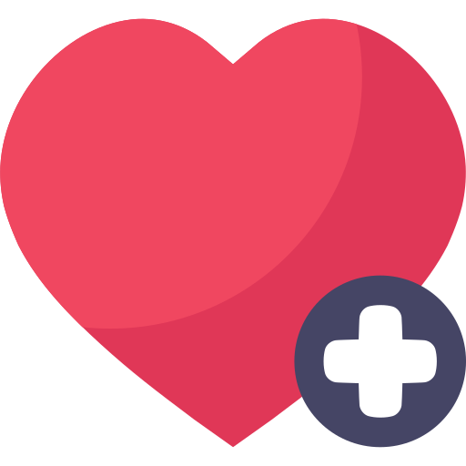
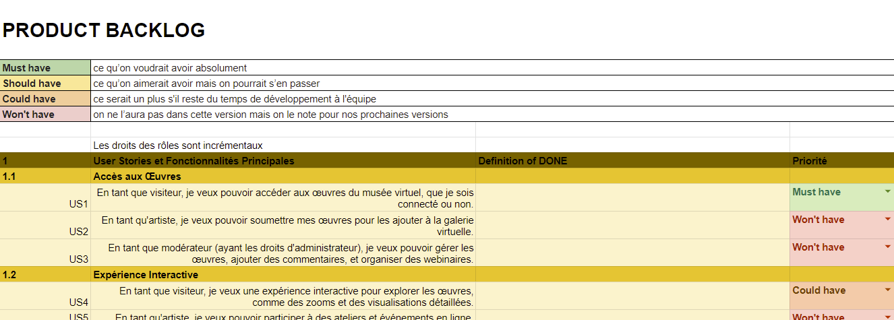

# Présentation au titre de **Développeur Web Full Stack** 
<br>
<br>
<h2 style="margin-top: 2rem;"> Damien Goguet </h2>

<h2 style="font-size: 14px; display: inline-flex; align-items: center; gap: 0.5rem;">
  Promo 2024 - 
   
  Wild Code School
</h2>

<br>
<br>
<br>

#### Présentation réalisée avec : **Slidev**

<div class="progress-container">
  <div
    class="progress-bar"
    :style="{ width: ((($page) / 45) * 100) + '%' }"
  ></div>
</div>
<div class="page abs-bl m-4 flex gap-2 text-m">
  <h5><SlideCurrentNo /> / <SlidesTotal /></h5>
</div>

<style>

.page {
  color: #F5F5F5;
  opacity:0.5;
  font-size: 10px;
}
.progress-container {
  border-top: 1px solid #F8E6CB;
  position: fixed;
  bottom: 0;
  left: 0;
  width: 100%;
  height: 8px;
  background-color: #F5F5F5;
  z-index: 100;
}

.progress-bar {
  border-radius: 0px 4px 4px 0px;
  height: 100%;
  background: linear-gradient(to right, #F8E6CB 0%, #E0C1A8 30%, #D8B192 60%);
  transition: width 0.3s ease-in-out;
}

  * {text-align: end;}
  h1 {
    color: #D8B192;
}
  h2, h3, h4 {
    color: #090A09;
}

.links {
display:grid;
  grid-template-columns: repeat(2, 1fr);
  justify-items: center;
  align-items: center; 
}

.link {
display: flex; 
align-items: center;
flex-direction: column;
}
</style>

<!--
Bonjour, <br>
Je m'appelle **Damien Goguet**, aujourd'hui je suis **développeur web full stack** après une **bifurcation** professionnelle.<br>
Car auparavant, j'ai été **technicien supérieur en systèmes et réseaux**. <br> 
J'ai suivi le **bootcamp** intensif à la **Wild Code School** qui a durée **5 mois** pour concrétiser ce nouveau parcours.<br>
Je suis ravi de vous **présenter** aujourd'hui l'un de mes projets que j'ai réalisé durant cette formation.<br>
-->

---
layout: dynamic-image
image: "./media/Pictures/Eclosion.png"
upperImage: "./media/Pictures/Eclosion.png"
equal: true
left: false
---

<div>

<p style="color:#D8B192;">L'art pour tous!</p>
</div>

<div class="absolute left-40% m--12 flex gap-2">
  <a href="https://github.com/dampherrr/P3-VirtuArt" target="_blank" alt="GitHub" title="GitHub: P3-VirtuArt"
    class="text-xl slidev-icon-btn !border-none !hover:text-black">
    <carbon-logo-github />
  </a>
</div>

<div class="progress-container">
  <div
    class="progress-bar"
    :style="{ width: ((($page) / 45) * 100) + '%' }"
  ></div>
</div>
<div class="page abs-bl m-4 flex gap-2 text-m">
  <h5><SlideCurrentNo /> / <SlidesTotal /></h5>
</div>

<style>
  .page {
    color: #090A09;
  opacity:0.5;
  font-size: 10px;
}
.progress-container {
  border-top: 1px solid #F8E6CB;
  position: fixed;
  bottom: 0;
  left: 0;
  width: 100%;
  height: 8px;
  background-color: #F5F5F5;
  z-index: 100;
}

.progress-bar {
  border-radius: 0px 4px 4px 0px;
  height: 100%;
  background: linear-gradient(to right, #F8E6CB 0%, #E0C1A8 30%, #D8B192 60%);
  transition: width 0.3s ease-in-out;
}
</style>

<!--
Le projet Virtuart est notre **troisième projet fil rouge**, mais le premier réalisé en **full stack**. Il s'agit d'une **galerie interactive** dédiée à la peinture et aux œuvres numériques.
Le code source du projet est **hébergé sur GitHub**.
-->

---
transition: slide-up
---

# Membre de l'équipe sur le projet:

<div class="team-members">
  <a class="member" href="https://github.com/BaptisteFredj" target="_blank">
    Baptiste <br>
    
  </a>
  <a class="member" href="https://github.com/Agraheris" target="_blank">
    Clément <br>
    
  </a>
  <a class="member" href="https://github.com/dampherrr" target="_blank">
    Damien <br>
    
  </a>
  <a class="member" href="https://github.com/Ryokoh-974" target="_blank">
    Daniel <br>
    
  </a>
  <a class="member" href="https://github.com/monica-tech75" target="_blank">
    Monica <br>
    
  </a>
</div>

<div class="abs-br m-8 flex gap-2">

</div>

<div class="progress-container">
  <div
    class="progress-bar"
    :style="{ width: ((($page) / 45) * 100) + '%' }"
  ></div>
</div>
<div class="page abs-bl m-4 flex gap-2 text-m">
  <h5><SlideCurrentNo /> / <SlidesTotal /></h5>
</div>

<style>

.page {
  color: #090A09;
  opacity:0.5;
  font-size: 10px;
}
.progress-container {
  border-top: 1px solid #F8E6CB;
  position: fixed;
  bottom: 0;
  left: 0;
  width: 100%;
  height: 8px;
  background-color: #F5F5F5;
  z-index: 100;
}

.progress-bar {
  border-radius: 0px 4px 4px 0px;
  height: 100%;
  background: linear-gradient(to right, #F8E6CB 0%, #E0C1A8 30%, #D8B192 60%);
  transition: width 0.3s ease-in-out;
}

.team-members {
  display: flex;
  gap: 10px;
  flex-wrap: wrap;
  align-items: center;
  justify-content: center;
}

.member { 
  border-bottom: 4px solid #E0C1A8;
  border-radius: 8px;
  text-align: center;
  margin: 10px;  
  height: 10rem;
  width: 8rem;
  display: flex;
  align-items: center;
  justify-content: center;
  flex-direction: column;
}
.member:hover { 
  background-color: #E0C1A8;
  color: #090A09;
}
.team-members a img {   
border-radius: 8px;
}
</style>

<!--
Nous étions une équipe de **5 personnes** pour concevoir ce projet. 
Nous avons adopté une **approche collaborative** **en nous répartissant** les rôles de manière tournante, ce qui a permis à **chacun** de participer à toutes les étapes de la réalisation.
-->

---
transition: slide-up
level: 2
---

# Demande du client:

<div class="client">
<div v-click class="rules" v-motion
  :initial="{ y: 80 }"
  :enter="{ x: 0, y: 0 }">
<p>- Galerie d'art</p>

</div>
<div v-click class="rules"   v-motion
  :initial="{ y: 80 }"
  :enter="{ x: 0, y: 0 }">
<p>- Interactif</p>

</div>
<div v-click class="rules"   v-motion
  :initial="{ y: 80 }"
  :enter="{ x: 0, y: 0 }">
<p>- Différents profils utilisateurs</p>

</div>
<div v-click class="rules"   v-motion
  :initial="{ y: 80 }"
  :enter="{ x: 0, y: 0 }">
<p>- Ajout des favoris</p>

</div>
<div v-click class="rules"   v-motion
  :initial="{ y: 80 }"
  :enter="{ x: 0, y: 0 }">
<p>- Responsive</p>

</div>
<div v-click class="rules"   v-motion
  :initial="{ y: 80 }"
  :enter="{ x: 0, y: 0 }">
<p>- Deadline</p>

</div>
</div>

<div class="abs-br m-8 flex gap-2">

</div>

<div class="progress-container">
  <div
    class="progress-bar"
    :style="{ width: ((($page) / 45) * 100) + '%' }"
  ></div>
</div>
<div class="page abs-bl m-4 flex gap-2 text-m">
  <h5><SlideCurrentNo /> / <SlidesTotal /></h5>
</div>

<style>

.page {
  color: #090A09;
  opacity:0.5;
  font-size: 10px;
}
.progress-container {
  border-top: 1px solid #F8E6CB;
  position: fixed;
  bottom: 0;
  left: 0;
  width: 100%;
  height: 8px;
  background-color: #F5F5F5;
  z-index: 100;
}

.progress-bar {
  border-radius: 0px 4px 4px 0px;
  height: 100%;
  background: linear-gradient(to right, #F8E6CB 0%, #E0C1A8 30%, #D8B192 60%);
  transition: width 0.3s ease-in-out;
}

h1 {
    color: #D8B192;
}

.client {

  display: grid;
  grid-template-columns: repeat(3, 1fr);
  justify-items: center;
  align-items: center; 
}

.rules {    
  border-bottom: 4px solid #E0C1A8;
  border-radius: 8px;
  display: flex;
  flex-direction: column;
  justify-content: center;
  align-items: center;
  text-align: center;
  padding: 10px;
  height: 100%; 
  width: 15rem;
}
.rules:hover { 
  background-color: #E0C1A8;
  color: #090A09;
}
</style>

<!--
Dans ce projet, nous avons travaillé à partir de **points précis** définis par un **client fictif**, tout en ayant une grande **liberté pour le reste**.  
CLICK<br>
1. L’un des points majeurs était la création d’une **galerie d’art accessible à tous**.  
CLICK<br>
2. Pour la version desktop, il souhaitait également intégrer une **visite interactive**.  
CLICK<br>
3. Le projet devait inclure la gestion de **trois niveaux d’utilisateurs** :  
   - Les **visiteurs**, qui peuvent consulter le site.  
   - Les **utilisateurs connectés**, capables de publier et gérer leurs propres œuvres.  
   - Les **administrateurs**, responsables de la gestion des événements, comme les expositions.  
CLICK<br>
1. Une autre fonctionnalité demandée était de permettre aux utilisateurs connectés **d’ajouter des œuvres à leurs favoris** pour les retrouver facilement.  
CLICK<br>
1. Enfin, le site devait être **entièrement responsive**, sur mobile et sur desktop.  
CLICK<br>
1. Pour relever ce défi, nous disposions d’une **deadline d’un mois** pour concevoir et livrer l’ensemble du projet.  
-->

---
layout: dynamic-image
image: './media/Pictures/Vie_Urbaine.webp'
equal: true
left: false
transition: slide-up
---

# Sommaire

<div class="client">
<div v-click v-motion
  :initial="{ x: -80 }"
  :enter="{ x: 0 }">
<p>- Organisation et outils de projet</p>
</div>
<div v-click v-motion
  :initial="{ x: -80 }"
  :enter="{ x: 0 }">
<p>- Identité visuelle et design</p>
</div>
<div v-click v-motion
  :initial="{ x: -80 }"
  :enter="{ x: 0 }">
<p>- Architecture technique </p>
</div>
<div v-click v-motion
  :initial="{ x: -80 }"
  :enter="{ x: 0 }">
<p>- Modélisation des données</p>
</div>
<div v-click v-motion
  :initial="{ x: -80 }"
  :enter="{ x: 0 }">
<p>- Gestion serveur (Backend) </p>
</div>
<div v-click v-motion
  :initial="{ x: -80 }"
  :enter="{ x: 0 }">
<p>- Sécurité</p>
</div>
<div v-click v-motion
  :initial="{ x: -80 }"
  :enter="{ x: 0 }">
<p>- Gestion client (Frontend)</p>
</div>
<div v-click v-motion
  :initial="{ x: -80 }"
  :enter="{ x: 0 }">
<p>- Aperçu pratique</p>
</div>
<div v-click v-motion
  :initial="{ x: -80 }"
  :enter="{ x: 0 }">
<p>- Conclusion et perspectives</p>
</div>
</div>

<div class="abs-br m-8 flex gap-2">

</div>

<div class="progress-container">
  <div
    class="progress-bar"
    :style="{ width: ((($page) / 45) * 100) + '%' }"
  ></div>
</div>
<div class="page abs-bl m-4 flex gap-2 text-m">
  <h5><SlideCurrentNo /> / <SlidesTotal /></h5>
</div>

<style>

.page {
  color: #090A09;
  opacity:0.5;
  font-size: 10px;
}
.progress-container {
  border-top: 1px solid #F8E6CB;
  position: fixed;
  bottom: 0;
  left: 0;
  width: 100%;
  height: 8px;
  background-color: #F5F5F5;
  z-index: 100;
}

.progress-bar {
  border-radius: 0px 4px 4px 0px;
  height: 100%;
  background: linear-gradient(to right, #F8E6CB 0%, #E0C1A8 30%, #D8B192 60%);
  transition: width 0.3s ease-in-out;
}

h1 {
    color: #D8B192;
  margin-bottom: 5rem;
}

.team-members {
  display: flex;
  gap: 10px;
  flex-wrap: wrap;
  align-items: center;
  justify-content: center;
}

.member { 
  border-bottom: 4px solid #E0C1A8;
  border-radius: 8px;
  text-align: center;
  margin: 10px;
}
.member:hover { 
  background-color: #E0C1A8;
  color: #090A09;
}
.team-members a img {   
border-radius: 8px;
}
</style>

<!-- 
Dans cette présentation, je vais détailler les différentes étapes de la conception et de la réalisation de ce projet :

1. Nous commencerons par explorer les **outils de communication et de collaboration** qui ont structuré notre travail en équipe.  
CLICK<br>
1. Ensuite, nous nous pencherons sur **l’identité visuelle et le design**, avec les choix graphiques qui reflètent l’essence du projet, ainsi que les outils utilisés.  
CLICK<br>
1. Puis, je vous présenterai **l’architecture technique**, pour structurer le code de manière claire et maintenable.  
CLICK<br>
1. Nous poursuivrons avec **la modélisation des données**, en partant de la conceptualisation des besoin.
<br>CLICK<br>
1. Ensuite du coté de **la gestion serveur**.
<br>CLICK<br>
1. Mais aussi la **sécurité**, nous verrons les mesures mises en place.
<br>CLICK<br>  
1. Puis la **gestion client**.  
CLICK<br>
1. Une **démonstration pratique** pour voir le projet en action. 
<br>CLICK<br>
1. Enfin, je **conclurai** cette présentation par une synthèse des défis que nous avons relevés, et les pistes pour de futures améliorations.  
-->
---
layout: dynamic-image
image: "./media/Pictures/Chaos_Organisé.webp"
equal: false
left: false
transition: slide-left
---

# Organisation et <br>outils de projet

<div class="abs-br m-8 flex gap-2">

</div>

<div class="progress-container">
  <div
    class="progress-bar"
    :style="{ width: ((($page) / 45) * 100) + '%' }"
  ></div>
</div>
<div class="page abs-bl m-4 flex gap-2 text-m">
  <h5><SlideCurrentNo /> / <SlidesTotal /></h5>
</div>

<style>

.page {
  color: #090A09;
  opacity:0.5;
  font-size: 10px;
}
.progress-container {
  border-top: 1px solid #F8E6CB;
  position: fixed;
  bottom: 0;
  left: 0;
  width: 100%;
  height: 8px;
  background-color: #F5F5F5;
  z-index: 100;
}

.progress-bar {
  border-radius: 0px 4px 4px 0px;
  height: 100%;
  background: linear-gradient(to right, #F8E6CB 0%, #E0C1A8 30%, #D8B192 60%);
  transition: width 0.3s ease-in-out;
}

h1 {
    color: #D8B192;
}
</style>

<!--
Passons maintenant à la manière dont nous avons structuré notre travail. Je vais vous présenter les outils que nous avons utilisés pour collaborer efficacement en équipe et suivre l’avancement de ce projet.
-->

---
transition: slide-up
layout: two-cols
---

<div class="block" v-motion
  :initial="{ y: 80 }"
  :enter="{ x: 0, y: 0 }">
<h2>Méthodologie</h2>
<div class="method" v-click="1" v-motion
  :initial="{ y: 80 }"
  :enter="{ x: 0, y: 0 }">
<div class="element">
<p>- Agile (Scrum)</p>

</div>
</div>
</div>

<br>

<div v-click="2" class="block" v-motion
  :initial="{ y: 80 }"
  :enter="{ x: 0, y: 0 }">
<h2>Organisation et communication</h2>
<div class="orga" v-click="3" v-motion
  :initial="{ y: 80 }"
  :enter="{ x: 0, y: 0 }">
<div class="element">
<p>- Discord</p>

</div>
<div class="element">
<p>- Google Sheet</p>

</div>
<div class="element">
<p>- FigJam</p>

</div>
</div>
</div>

::right::
<div>



</div>
<div class="abs-br m-4 flex gap-2">

</div>

<div class="progress-container">
  <div
    class="progress-bar"
    :style="{ width: ((($page) / 45) * 100) + '%' }"
  ></div>
</div>
<div class="page abs-bl m-4 flex gap-2 text-m">
  <h5><SlideCurrentNo /> / <SlidesTotal /></h5>
</div>

<style>

.page {
  color: #090A09;
  opacity:0.5;
  font-size: 10px;
}
.progress-container {
  border-top: 1px solid #F8E6CB;
  position: fixed;
  bottom: 0;
  left: 0;
  width: 100%;
  height: 8px;
  background-color: #F5F5F5;
  z-index: 100;
}

.progress-bar {
  border-radius: 0px 4px 4px 0px;
  height: 100%;
  background: linear-gradient(to right, #F8E6CB 0%, #E0C1A8 30%, #D8B192 60%);
  transition: width 0.3s ease-in-out;
}

h1 {
    color: #D8B192;
}
.block {
  display: flex;
  flex-direction: column;
  }
.orga, .method {
  display: grid;
  grid-template-columns: repeat(3, 1fr);
  justify-items: center;
  align-items: center; 
}
.element{
  margin: 1rem;
  border-bottom: 4px solid #E0C1A8;
  border-radius: 8px;
  display: flex;
  flex-direction: column;
  justify-content: center;
  align-items: center;
  text-align: center;
  width: 10rem;
    height: 10rem;

}
  .element:hover { 
    background-color: #E0C1A8;
    color: #090A09;
  }
</style>

<!-- 
Pour **structurer** notre travail, 
<br>CLICK<br>
nous avons opté pour une **méthodologie Agile basée sur Scrum**.

Grâce à des **sprints hebdomadaires**, nous avons fixé des **objectifs clairs** et ajusté les **priorités** tout au long du projet.

CLICK<br>

B- Pour rester organisés, nous avons utilisé trois outils principaux :
<br>CLICK<br>

<br>CLICK<br>
1- Nous avons **centralisé nos échanges** sur **Discord** avec des fils thématiques dédiés, comme pour le CSS ou les pull requests. Cela nous a permis de collaborer efficacement au quotidien, notamment pour valider les PR.<br>
<br>CLICK<br>
2- **Google Sheets** pour gérer le backlog, nous avons listé toutes les user stories et tâches, en les classant par ordre de priorité.<br>
<br>CLICK<br>
3- Puis nous avons utilisé FigJam pour **collaborer en temps réel**, notamment pour les brainstormings et la gestion des to-do lists hebdomadaires. Chaque sprint avait une colonne **'À faire'**, **'En cours'**, et **'Terminé'**.<br>
-->
---
layout: two-cols
transition: slide-left
---

<div class="block" v-motion
  :initial="{ y: 80 }"
  :enter="{ x: 0, y: 0 }">
<h2>Template</h2>
<div class="method" v-click="1" v-motion
  :initial="{ y: 80 }"
  :enter="{ x: 0, y: 0 }">
<div class="element">
<p>- Harmonia</p>

</div>
</div>
</div>

<br>

<div class="block" v-click="2" v-motion
  :initial="{ y: 80 }"
  :enter="{ x: 0, y: 0 }">
<h2>Génération des données</h2>
<div class="method" v-click="3" v-motion
  :initial="{ y: 80 }"
  :enter="{ x: 0, y: 0 }">
<div class="element">
<p>- ChatGPT</p>

</div>
</div>
</div>

::right::
<div v-click="4" class="block" v-motion
  :initial="{ y: 80 }"
  :enter="{ x: 0, y: 0 }">
<h2>Outils de développement</h2>
<div class="orga" v-click="5" v-motion
  :initial="{ y: 80 }"
  :enter="{ x: 0, y: 0 }">
<div class="element">
<p>- VS Code</p>

</div>
<div class="element">
<p>- Node.js</p>

</div>
<div class="element">
<p>- Git</p>

</div>
<div class="element">
<p>- Github</p>

</div>
<div class="element">
<p>- Jest</p>

</div>
<div class="element">
<p>- Postman</p>

</div>
</div>
</div>

<div class="abs-br m-4 flex gap-2">

</div>

<div class="progress-container">
  <div
    class="progress-bar"
    :style="{ width: ((($page) / 45) * 100) + '%' }"
  ></div>
</div>
<div class="page abs-bl m-4 flex gap-2 text-m">
  <h5><SlideCurrentNo /> / <SlidesTotal /></h5>
</div>

<style>

.page {
  color: #090A09;
  opacity:0.5;
  font-size: 10px;
}
.progress-container {
  border-top: 1px solid #F8E6CB;
  position: fixed;
  bottom: 0;
  left: 0;
  width: 100%;
  height: 8px;
  background-color: #F5F5F5;
  z-index: 100;
}

.progress-bar {
  border-radius: 0px 4px 4px 0px;
  height: 100%;
  background: linear-gradient(to right, #F8E6CB 0%, #E0C1A8 30%, #D8B192 60%);
  transition: width 0.3s ease-in-out;
}

h1 {
    color: #D8B192;
}
.block {
  display: flex;
  flex-direction: column;
  }
.orga, .method {
  display: grid;
  grid-template-columns: repeat(2, 1fr);
  justify-items: center;
  align-items: center; 
  
}
.element{
  border-bottom: 4px solid #E0C1A8;
  border-radius: 8px;
  display: flex;
  flex-direction: column;
  justify-content: center;
  align-items: center;
  text-align: center;
  width: 10rem;
    height: 8rem;

}
  .element:hover { 
    background-color: #E0C1A8;
    color: #090A09;
  }
</style>

<!-- 
Pour commencer,<br>CLICK<br> nous avons utilisé un template appelé **Harmonia**, fourni par la Wild Code School.

Ce template pédagogique a servi de point de départ pour structurer notre projet et poser les bases de notre développement.
<br>CLICK<br>

Pour alimenter rapidement notre base de données et créer un contenu de test réaliste, 
<br>CLICK<br>nous avons utilisé ChatGPT.

Cet outil nous a permis de générer de la data que ce soit des noms fictifs ou des images en quelques minutes, ce qui a été un gain de temps considérable.
<br>CLICK<br>

Nous avons utilisé plusieurs outils techniques pour le développement et le suivi du projet :
<br>CLICK<br>
**VS Code** : L’éditeur de code principal.<br>
**Node.js** : Pour exécuter notre code.<br>
**Git** : Pour le versionnement et la gestion des contributions de l’équipe.<br>
**GitHub** : Pour l’hébergement et le partage de notre dépôt.<br>
**Jest** : Pour les tests unitaires.<br>
**Postman** : Indispensable pour tester les API.<br>
 -->

---
transition: slide-up
---

<div class="block" v-motion
  :initial="{ y: 80 }"
  :enter="{ x: 0, y: 0 }">
<h2>Qualité du code</h2>
<div class="orga" v-click="1" v-motion
  :initial="{ y: 80 }"
  :enter="{ x: 0, y: 0 }">
<div class="element">
<p>- EsLint</p>

</div>
<div class="element">
<p>- Prettier</p>

</div>
<div class="element">
<p>- Husky</p>

</div>
<div class="element">
<p>- Lint-Staged</p>

</div>
<div class="element">
<p>- Vite</p>

</div>
</div>
</div>

<div class="abs-br m-4 flex gap-2">

</div>

<div class="progress-container">
  <div
    class="progress-bar"
    :style="{ width: ((($page) / 45) * 100) + '%' }"
  ></div>
</div>
<div class="page abs-bl m-4 flex gap-2 text-m">
  <h5><SlideCurrentNo /> / <SlidesTotal /></h5>
</div>

<style>

.page {
  color: #090A09;
  opacity:0.5;
  font-size: 10px;
}
.progress-container {
  border-top: 1px solid #F8E6CB;
  position: fixed;
  bottom: 0;
  left: 0;
  width: 100%;
  height: 8px;
  background-color: #F5F5F5;
  z-index: 100;
}

.progress-bar {
  border-radius: 0px 4px 4px 0px;
  height: 100%;
  background: linear-gradient(to right, #F8E6CB 0%, #E0C1A8 30%, #D8B192 60%);
  transition: width 0.3s ease-in-out;
}

h1 {
    color: #D8B192;
}
.block {
  display: flex;
  flex-direction: column;
  }
.orga, .method {
  display: grid;
  grid-template-columns: repeat(3, 1fr);
  justify-items: center;
  align-items: center; 
  
}
.element{
  border-bottom: 4px solid #E0C1A8;
  border-radius: 8px;
  display: flex;
  flex-direction: column;
  justify-content: center;
  align-items: center;
  text-align: center;
  width: 10rem;
    height: 10rem;

}
  .element:hover { 
    background-color: #E0C1A8;
    color: #090A09;
  }
</style>
<!-- 
Pour assurer la qualité de notre code et garantir qu’il soit maintenable et performant, nous avons utilisé plusieurs outils directement fournis par le template **Harmonia**.
<br>CLICK<br>
1- **ESLint** a permis de détecter rapidement les erreurs et d’assurer le respect des bonnes pratiques JavaScript.  
2- **Prettier** a harmonisé automatiquement le style de code, évitant toute divergence entre les membres de l’équipe.  
3- Avec **Husky**, des hooks Git ont été déclenchés avant chaque commit pour prévenir l’introduction d’erreurs.  
4- **Lint-Staged** a limité l’analyse et la correction aux fichiers modifiés, rendant le processus plus rapide.  
5- **Vite** a offert une compilation rapide pendant le développement.  

Ces outils ont assuré un workflow efficace, fiable et conforme aux standards professionnels.
-->
---
layout: dynamic-image 
image: "./media/Pictures/Connexion.webp"
equal: false
left: false
transition: slide-left
---

# Identité visuelle et design

<div class="abs-br m-8 flex gap-2">

</div>

<div class="progress-container">
  <div
    class="progress-bar"
    :style="{ width: ((($page) / 45) * 100) + '%' }"
  ></div>
</div>
<div class="page abs-bl m-4 flex gap-2 text-m">
  <h5><SlideCurrentNo /> / <SlidesTotal /></h5>
</div>

<style>

.page {
  color: #090A09;
  opacity:0.5;
  font-size: 10px;
}
.progress-container {
  border-top: 1px solid #F8E6CB;
  position: fixed;
  bottom: 0;
  left: 0;
  width: 100%;
  height: 8px;
  background-color: #F5F5F5;
  z-index: 100;
}

.progress-bar {
  border-radius: 0px 4px 4px 0px;
  height: 100%;
  background: linear-gradient(to right, #F8E6CB 0%, #E0C1A8 30%, #D8B192 60%);
  transition: width 0.3s ease-in-out;
}

h1 {
    color: #D8B192;
}
</style>

<!-- Une fois l'organisation en place, nous avons défini une **identité visuelle** pour le projet. 
Je vais vous expliquer les **choix graphiques** que nous avons faits et les outils que nous avons **utilisés pour la conception**. -->
---
layout: two-cols
transition: slide-left
---

<div v-motion
  :initial="{ x: -80 }"
  :enter="{ x: 0, y: 0 }">
<h2>Recherche et inspiration</h2>

  <a href="https://www.carredartistes.com/fr-fr/" target="_blank">
    Carré d'artistes<br>
    
  </a>
</div>
::right::
<div v-click v-motion
  :initial="{ y: -80 }"
  :enter="{ x: 0, y: 0 }">
<h2>Charte graphique</h2>

<br>
</div>
<div v-click v-motion
  :initial="{ y: 80 }"
  :enter="{ x: 0, y: 0 }">
<h2>Typographie</h2>
<p>Monserrat</p>
</div>

<div class="abs-br m-8 flex gap-2">

</div>

<div class="progress-container">
  <div
    class="progress-bar"
    :style="{ width: ((($page) / 45) * 100) + '%' }"
  ></div>
</div>
<div class="page abs-bl m-4 flex gap-2 text-m">
  <h5><SlideCurrentNo /> / <SlidesTotal /></h5>
</div>

<style>

.page {
  color: #090A09;
  opacity:0.5;
  font-size: 10px;
}
.progress-container {
  border-top: 1px solid #F8E6CB;
  position: fixed;
  bottom: 0;
  left: 0;
  width: 100%;
  height: 8px;
  background-color: #F5F5F5;
  z-index: 100;
}

.progress-bar {
  border-radius: 0px 4px 4px 0px;
  height: 100%;
  background: linear-gradient(to right, #F8E6CB 0%, #E0C1A8 30%, #D8B192 60%);
  transition: width 0.3s ease-in-out;
}

h1 {
    color: #D8B192;
}
</style>

<!-- 
Pour concevoir notre projet, nous avons cherché des sources d'inspiration dans le domaine des galeries d'art en ligne. **Le site Carré d'artistes** nous a particulièrement influencés grâce à son design élégant et sa simplicité d'accès. Cela nous a aidés à définir l'expérience utilisateur souhaitée.
<br>CLICK<br>
Pour donner une **identité visuelle** cohérente et esthétique à notre site, nous avons choisi une palette de couleurs sobres et élégantes, en harmonie avec l’univers de l’art.
<br>CLICK<br>
Enfin pour la typographie nous avons opté pour la police Montserrat, qui combine modernité et lisibilité, renforçant ainsi l’aspect professionnel et épuré du site. -->

---
layout: two-cols
transition: slide-up
---

<div class="method">
<h2>Maquettage</h2>

<div class="element">
<p>- Figma</p>

</div>
</div>

::right::

<br>
<br>
<br>
<div>

</div>

<div class="abs-br m-4 flex gap-2">

</div>

<div class="progress-container">
  <div
    class="progress-bar"
    :style="{ width: ((($page) / 45) * 100) + '%' }"
  ></div>
</div>
<div class="page abs-bl m-4 flex gap-2 text-m">
  <h5><SlideCurrentNo /> / <SlidesTotal /></h5>
</div>

<style>

.page {
  color: #090A09;
  opacity:0.5;
  font-size: 10px;
}
.progress-container {
  border-top: 1px solid #F8E6CB;
  position: fixed;
  bottom: 0;
  left: 0;
  width: 100%;
  height: 8px;
  background-color: #F5F5F5;
  z-index: 100;
}

.progress-bar {
  border-radius: 0px 4px 4px 0px;
  height: 100%;
  background: linear-gradient(to right, #F8E6CB 0%, #E0C1A8 30%, #D8B192 60%);
  transition: width 0.3s ease-in-out;
}

h1 {
    color: #D8B192;
}

.method {
  display: flex;
  flex-direction: column;
  justify-content: center;
  align-items: center;
  height: 100%;

}
.element{
  border-bottom: 4px solid #E0C1A8;
  border-radius: 8px;
  display: flex;
  flex-direction: column;
  justify-content: center;
  align-items: center;
  text-align: center;
  width: 10rem;
    height: 10rem;

}
  .element:hover { 
    background-color: #E0C1A8;
    color: #090A09;
  }
</style>

<!--
Pour le **maquettage**, nous avons utilisé Figma pour concevoir une maquette, ajuster le design en équipe et valider l’ergonomie avant le développement.
-->

---
layout: dynamic-image
image: "./media/Pictures/Douce_Mélancolie.webp"
equal: false
left: false
transition: slide-left
---

# Architecture technique

<div class="abs-br m-8 flex gap-2">

</div>

<div class="progress-container">
  <div
    class="progress-bar"
    :style="{ width: ((($page) / 45) * 100) + '%' }"
  ></div>
</div>
<div class="page abs-bl m-4 flex gap-2 text-m">
  <h5><SlideCurrentNo /> / <SlidesTotal /></h5>
</div>

<style>

.page {
  color: #090A09;
  opacity:0.5;
  font-size: 10px;
}
.progress-container {
  border-top: 1px solid #F8E6CB;
  position: fixed;
  bottom: 0;
  left: 0;
  width: 100%;
  height: 8px;
  background-color: #F5F5F5;
  z-index: 100;
}

.progress-bar {
  border-radius: 0px 4px 4px 0px;
  height: 100%;
  background: linear-gradient(to right, #F8E6CB 0%, #E0C1A8 30%, #D8B192 60%);
  transition: width 0.3s ease-in-out;
}

h1 {
    color: #D8B192;
}
</style>

<!--
Maintenant que nous avons une idée claire du design, nous allons aborder la structure technique du projet. Je vais vous présenter l’architecture que nous avons adoptée.
-->

---
layout: two-cols
transition: slide-left
---
<br>
<br>
<br>
<br>
<br>
<div v-click v-motion
  :initial="{ x: -80 }"
  :enter="{ x: 0, y: 0 }">

</div>

::right::

<br>
<br>
<br>
<br>
<br>
<br>
<br>

<div class="text">
  <h2 v-click.hide="1">
    <strong>M V C</strong>
  </h2>

  <h2 v-click="1" v-motion
      :initial="{ x: 80 }"
      :enter="{ x: 0 }">
    <strong> M</strong><span>odel</span>
    <strong> V</strong><span>iew</span>
    <strong> C</strong><span>ontroller</span>
  </h2>
</div>

<Arrow class="arrow" v-click="[2,3]" x1="400" y1="350" x2="350" y2="250" />
<Arrow class="arrow" v-click="[3,4]" x1="350" y1="220" x2="280" y2="220" />
<Arrow class="arrow" v-click="[4,5]" x1="250" y1="220" x2="180" y2="220" />
<Arrow class="arrow" v-click="[5,6]" x1="180" y1="220" x2="80" y2="220" />

<Arrow class="arrow" v-click="[6,7]" x1="80" y1="220" x2="180" y2="220" />
<Arrow class="arrow" v-click="[7,8]" x1="180" y1="220" x2="250" y2="220" />
<Arrow class="arrow" v-click="[8,9]" x1="280" y1="220" x2="350" y2="220" />
<Arrow class="arrow" v-click="[9,10]" x1="350" y1="220" x2="450" y2="220" />
<Arrow class="arrow" v-click="10" x1="450" y1="220" x2="400" y2="350" />


<div class="abs-br m-8 flex gap-2">
  
</div>

<div class="progress-container">
  <div
    class="progress-bar"
    :style="{ width: ((($page) / 45) * 100) + '%' }"
  ></div>
</div>
<div class="page abs-bl m-4 flex gap-2 text-m">
  <h5><SlideCurrentNo /> / <SlidesTotal /></h5>
</div>

<style>

.page {
  color: #090A09;
  opacity:0.5;
  font-size: 10px;
}
.progress-container {
  border-top: 1px solid #F8E6CB;
  position: fixed;
  bottom: 0;
  left: 0;
  width: 100%;
  height: 8px;
  background-color: #F5F5F5;
  z-index: 100;
}

.progress-bar {
  border-radius: 0px 4px 4px 0px;
  height: 100%;
  background: linear-gradient(to right, #F8E6CB 0%, #E0C1A8 30%, #D8B192 60%);
  transition: width 0.3s ease-in-out;
}

h1 {
    color: #D8B192;
}
.text {
  position: relative;
  width: 100%;
  max-width: 1000px;
}

.text h2 {
  position: absolute;
  top: 0;
  left: 0;
  width: 100%;
  height: auto;
}
.arrow {
  color:#D8B192;
}
</style>
<!-- 
Pour organiser le projet de manière claire et maintenable, nous avons adopté l'architecture **MVC**, qui repose sur la séparation des responsabilités.
<br>CLICK<br>
Ce schéma illustre le fonctionnement du **Model View Controller** dans notre projet. 

Je vais vous expliquer chaque étape représentée ici.
<br>CLICK<br>
1. **L'utilisateur** interagit avec le site, envoyant une requête HTTP.
<br>CLICK<br>
2. Le **Controller** gère la requête en orchestrant les appels aux **services**.
<br>CLICK<br>
3. Les **services** transmettent la requête au **Model**, <br>CLICK<br>
qui interagit directement avec la **base de données**.
<br>CLICK<br>
CLICK<br>
4. Une fois les données récupérées, le **Model** les renvoie au **Service** <br>CLICK<br>
 et ensuite **Controller**.
<br>CLICK<br>
1. Le **Controller** passe ensuite les données à la **Vue**, qui les formate en HTML pour les afficher à l'utilisateur.
<br>CLICK<br>
1. Enfin, l'utilisateur reçoit une **réponse HTTP** contenant la page générée.

L'architecture MVC organise et simplifie la **gestion des interactions** entre utilisateurs, données et interface.
 -->
---
layout: two-cols
transition: slide-left
level: 3
equal: true
left: false
---

## Exemple de **"Model"**
### ArtworkRepository.js

````md magic-move {lines: true}
```js {*|6-14} 
class ArtworkRepository extends AbstractRepository {
  constructor() {
    super({ table: "artwork" });
  }

  async readAll() {
    const [rows] = await this.database.query(
      `select artwork.*,
      DATE_FORMAT(date, '%d/%m/%Y') AS formatedDate, 
      user.pseudo user_name FROM ${this.table} 
      INNER JOIN user on artwork.user_id = user.id`
    );
    return rows;
  }
} 

module.exports = ArtworkRepository;
```
```js {6-16} 
class ArtworkRepository extends AbstractRepository {
  constructor() {
    super({ table: "artwork" });
  }

  async read(id) {
    const [rows] = await this.database.query(
      `select artwork.*,
      DATE_FORMAT(date, '%d/%m/%Y') AS formatedDate, 
      user.pseudo user_name from ${this.table}  
      INNER JOIN user ON artwork.user_id = user.id 
      WHERE artwork.id = ? `,
      [id]
    );
    return rows[0];
  }
} 

module.exports = ArtworkRepository;
```
````
::right::
<div class="element" v-click="3" v-motion
  :initial="{ x: 80 }"
  :enter="{ x: 0, y: 0 }">
  
## Exemple de **"View"**

<div v-click>

</div>
</div>

<div class="abs-br m-8 flex gap-2">

</div>
<div class="progress-container">
  <div
    class="progress-bar"
    :style="{ width: ((($page) / 45) * 100) + '%' }"
  ></div>
</div>
<div class="page abs-bl m-4 flex gap-2 text-m">
  <h5><SlideCurrentNo /> / <SlidesTotal /></h5>
</div>

<style>
  
  .page {
    color: #090A09;
  opacity:0.5;
  font-size: 10px;
}
.progress-container {
  border-top: 1px solid #F8E6CB;
  position: fixed;
  bottom: 0;
  left: 0;
  width: 100%;
  height: 8px;
  background-color: #F5F5F5;
  z-index: 100;
}

.progress-bar {
  border-radius: 0px 4px 4px 0px;
  height: 100%;
  background: linear-gradient(to right, #F8E6CB 0%, #E0C1A8 30%, #D8B192 60%);
  transition: width 0.3s ease-in-out;
}
</style>

<!-- 
Voici un exemple de **Model** avec le fichier `ArtworkRepository.js`. 
Ce fichier contient la logique pour interagir avec la bdd.
<br>CLICK<br>
Nous avons la méthode `readAll`, qui récupère toutes les œuvres de la table `artwork`, en joignant la table `user` pour inclure le nom de l’artiste, et en formatant la date pour une meilleure lisibilité.
<br>CLICK<br>
La méthode `read`, elle, sert à récupérer une œuvre spécifique à partir de son ID, utile pour afficher ses détails sur une page dédiée.
<br>CLICK<br>
Enfin, côté front, voici un exemple de **View**, où les données récupérées par notre modèle sont affichées directement dans l’interface utilisateur.
-->
---
transition: slide-up
level: 3
---

## Exemple de **"Controller"**
### artworkActions.js
````md magic-move {lines: true}
```js {*} 
const tables = require("../../database/tables");

const browse = async (req, res, next) => {
  try {
    const artworks = await tables.artwork.readAll();
    res.json(artworks);
  } catch (error) {
    next(error);
  }
};
module.exports = { browse, read, add, edit, destroy};
```
```js {*|15} 
const tables = require("../../database/tables");

const read = async (req, res, next) => {
  try {
    const artwork = await tables.artwork.read(req.params.id);
    if (artwork == null) {
      res.sendStatus(404);
    } else {
      res.json(artwork);
    }
  } catch (error) {
    next(error);
  }
};
module.exports = { browse, read, add, edit, destroy};
```
````
<div class="abs-br m-8 flex gap-2">

</div>

<div class="progress-container">
  <div
    class="progress-bar"
    :style="{ width: ((($page) / 45) * 100) + '%' }"
  ></div>
</div>
<div class="page abs-bl m-4 flex gap-2 text-m">
  <h5><SlideCurrentNo /> / <SlidesTotal /></h5>
</div>

<style>
  
  .page {
    color: #090A09;
  opacity:0.5;
  font-size: 10px;
}
.progress-container {
  border-top: 1px solid #F8E6CB;
  position: fixed;
  bottom: 0;
  left: 0;
  width: 100%;
  height: 8px;
  background-color: #F5F5F5;
  z-index: 100;
}

.progress-bar {
  border-radius: 0px 4px 4px 0px;
  height: 100%;
  background: linear-gradient(to right, #F8E6CB 0%, #E0C1A8 30%, #D8B192 60%);
  transition: width 0.3s ease-in-out;
}
</style>
<!-- 
Voyons maintenant un exemple de **Controller** avec le fichier `artworkActions.js`.  

Ce fichier gère les requêtes HTTP et communique avec le modèle.  

La méthode `browse` utilise `readAll` pour récupérer toutes les œuvres, puis renvoie les données en JSON au frontend.  
CLICK<br>
La méthode `read` récupère une œuvre via son ID. Si elle n’existe pas, un statut HTTP `404` est renvoyé, ce qui renforce la fiabilité de l’API.  
CLICK<br>
Enfin, d’autres méthodes comme `add` (ajout), `edit` (modification), et `destroy` (suppression) complètent la gestion des œuvres.
-->

---
layout: dynamic-image 
image: "./media/Pictures/Joie_Ephémère.webp"
equal: false
left: false
transition: slide-left
---

# Modélisation des données

<div class="abs-br m-8 flex gap-2">

</div>

<div class="progress-container">
  <div
    class="progress-bar"
    :style="{ width: ((($page) / 45) * 100) + '%' }"
  ></div>
</div>
<div class="page abs-bl m-4 flex gap-2 text-m">
  <h5><SlideCurrentNo /> / <SlidesTotal /></h5>
</div>

<style>

.page {
  color: #090A09;
  opacity:0.5;
  font-size: 10px;
}
.progress-container {
  border-top: 1px solid #F8E6CB;
  position: fixed;
  bottom: 0;
  left: 0;
  width: 100%;
  height: 8px;
  background-color: #F5F5F5;
  z-index: 100;
}

.progress-bar {
  border-radius: 0px 4px 4px 0px;
  height: 100%;
  background: linear-gradient(to right, #F8E6CB 0%, #E0C1A8 30%, #D8B192 60%);
  transition: width 0.3s ease-in-out;
}

h1 {
    color: #D8B192;
}
</style>

<!-- Pour **structurer** les données du projet, je vais vous présenter la **conception de la bdd** à travers différentes étapes.-->

---
transition: slide-left
---

## Outil et méthode

<div class="client">
<div class="element" v-click v-motion
  :initial="{ y: 80 }"
  :enter="{ x: 0, y: 0 }">
<h3>Modélisation</h3>
<p>- Draw.io</p>

</div>
<div class="element" v-click v-motion
  :initial="{ y: 80 }"
  :enter="{ x: 0, y: 0 }">
<h3>Méthodologie</h3>
<p>- Méthode Merise</p>

</div>
</div>

<div class="abs-br m-8 flex gap-2">

</div>

<div class="progress-container">
  <div
    class="progress-bar"
    :style="{ width: ((($page) / 45) * 100) + '%' }"
  ></div>
</div>
<div class="page abs-bl m-4 flex gap-2 text-m">
  <h5><SlideCurrentNo /> / <SlidesTotal /></h5>
</div>

<style>

.page {
  color: #090A09;
  opacity:0.5;
  font-size: 10px;
}
.progress-container {
  border-top: 1px solid #F8E6CB;
  position: fixed;
  bottom: 0;
  left: 0;
  width: 100%;
  height: 8px;
  background-color: #F5F5F5;
  z-index: 100;
}

.progress-bar {
  border-radius: 0px 4px 4px 0px;
  height: 100%;
  background: linear-gradient(to right, #F8E6CB 0%, #E0C1A8 30%, #D8B192 60%);
  transition: width 0.3s ease-in-out;
}

h1 {
    color: #D8B192;
}
.element{
  border-bottom: 4px solid #E0C1A8;
  border-radius: 8px;
  display: flex;
  flex-direction: column;
  justify-content: center;
  align-items: center;
  text-align: center;
  width: 10rem;
    height: 10rem;

}
  .element:hover { 
    background-color: #E0C1A8;
    color: #090A09;
  }
.client {
  padding-top: 5rem;
  display: grid;
  grid-template-columns: repeat(2, 1fr);
  justify-items: center;
  align-items: center; 
}

.client a {
  text-decoration: none;
  display: flex;
  flex-direction: column;
  justify-content: center;
  align-items: center;
  text-align: center;
  padding: 10px;
  height: 100%; 
}
</style>

<!-- 
Pour la modélisation, nous avons utilisé deux outils clés :

CLICK

Comme **Draw.io** pour concevoir les différents schémas.

CLICK

Nous avons également suivi la **méthode Merise**, qui nous a guidés étape par étape.
En partant du modèle conceptuel au modèle physique, pour structurer efficacement notre bdd.
 -->
---
layout: two-cols
transition: slide-left
---

<br>
<br>
<br>
<br>
<br>
<br>
<br>
<div class="text">
  <h2 v-click.hide="1">
    <strong>M C D</strong>
  </h2>

  <h2 v-click="1" v-motion
      :initial="{ x: -80 }"
      :enter="{ x: 0 }">
    <strong>M</strong><span>odèle</span>
    <br>
    <strong> C</strong><span>onceptuelle de </span>
    <br>
    <strong> D</strong><span>onnées</span>
  </h2>
</div>

::right::

<br>
<div v-click v-motion
  :initial="{ x: 80 }"
  :enter="{ x: 0, y: 0 }">

</div>

<div class="abs-br m-8 flex gap-2">

</div>

<div class="progress-container">
  <div
    class="progress-bar"
    :style="{ width: ((($page) / 45) * 100) + '%' }"
  ></div>
</div>
<div class="page abs-bl m-4 flex gap-2 text-m">
  <h5><SlideCurrentNo /> / <SlidesTotal /></h5>
</div>

<Arrow class="arrow" v-click="[2,3]" x1="300" y1="250" x2="550" y2="150" />
<Arrow class="arrow" v-click="[2,3]" x1="300" y1="250" x2="750" y2="150" />
<Arrow class="arrow" v-click="[3,4]" x1="300" y1="250" x2="550" y2="80" />
<Arrow class="arrow" v-click="[3,4]" x1="300" y1="250" x2="780" y2="80" />
<Arrow class="arrow" v-click="[4,5]" x1="300" y1="250" x2="750" y2="180" />
<Arrow class="arrow" v-click="[4,5]" x1="300" y1="250" x2="800" y2="380" />
<Arrow class="arrow" v-click="5" x1="300" y1="250" x2="500" y2="380" />
<Arrow class="arrow" v-click="5" x1="300" y1="250" x2="800" y2="380" />

<style>

.page {
  color: #090A09;
  opacity:0.5;
  font-size: 10px;
}
.progress-container {
  border-top: 1px solid #F8E6CB;
  position: fixed;
  bottom: 0;
  left: 0;
  width: 100%;
  height: 8px;
  background-color: #F5F5F5;
  z-index: 100;
}

.progress-bar {
  border-radius: 0px 4px 4px 0px;
  height: 100%;
  background: linear-gradient(to right, #F8E6CB 0%, #E0C1A8 30%, #D8B192 60%);
  transition: width 0.3s ease-in-out;
}

.text {
  position: relative;
  width: 100%;
  max-width: 1000px;
}

.text h2 {
  position: absolute;
  top: 0;
  left: 0;
  width: 100%;
  height: auto;
}

.arrow {
  color:#D8B192;
}
</style>

<!-- 
Nous allons commencer par le **MCD**.  

CLICK  

Le **Modèle Conceptuel de Données** représente les entités principales et leurs relations, sans entrer dans les détails techniques.  

CLICK  
- Un utilisateur peut ajouter plusieurs œuvres, mais chaque œuvre appartient à un seul utilisateur.  

CLICK  
- Un utilisateur peut ajouter des œuvres en favoris, et une œuvre peut être dans les favoris de plusieurs utilisateurs.  

CLICK  
- Une œuvre peut être présentée dans plusieurs expositions, et une exposition peut inclure plusieurs œuvres.  

CLICK  
- Un administrateur gère une ou plusieurs expositions, mais chaque exposition est gérée par un seul administrateur.    
-->

---
layout: two-cols
transition: slide-left
---

<br>

<div v-click v-motion
  :initial="{ x: -80 }"
  :enter="{ x: 0, y: 0 }">

</div>

::right::

<br>
<br>
<br>
<br>
<br>
<br>
<br>
<div class="text">
  <h2 v-click.hide="1">
    <strong>M L D</strong>
  </h2>

  <h2 v-click="1" v-motion
      :initial="{ x: 80 }"
      :enter="{ x: 0 }">
    <strong>M</strong><span>odèle</span>
    <br>
    <strong> L</strong><span>ogique de </span>
    <br>
    <strong> D</strong><span>onnées</span>
  </h2>
</div>

<Arrow class="arrow" v-click="[2,3]" x1="500" y1="280" x2="150" y2="190" />
<Arrow class="arrow" v-click="[2,3]" x1="500" y1="280" x2="300" y2="190" />

<Arrow class="arrow" v-click="[3,4]" x1="500" y1="280" x2="80" y2="190" />
<Arrow class="arrow" v-click="[3,4]" x1="500" y1="280" x2="350" y2="190" />
<Arrow class="arrow" v-click="[3,4]" x1="500" y1="280" x2="200" y2="80" />

<Arrow class="arrow" v-click="[4,5]" x1="500" y1="280" x2="350" y2="200" />
<Arrow class="arrow" v-click="[4,5]" x1="500" y1="280" x2="450" y2="300" />
<Arrow class="arrow" v-click="[4,5]" x1="500" y1="280" x2="400" y2="380" />

<Arrow class="arrow" v-click="5" x1="500" y1="280" x2="120" y2="380" />
<Arrow class="arrow" v-click="5" x1="500" y1="280" x2="400" y2="380" />


<div class="abs-br m-8 flex gap-2">

</div>

<div class="progress-container">
  <div
    class="progress-bar"
    :style="{ width: ((($page) / 45) * 100) + '%' }"
  ></div>
</div>
<div class="page abs-bl m-4 flex gap-2 text-m">
  <h5><SlideCurrentNo /> / <SlidesTotal /></h5>
</div>

<style>

.page {
  color: #090A09;
  opacity:0.5;
  font-size: 10px;
}
.progress-container {
  border-top: 1px solid #F8E6CB;
  position: fixed;
  bottom: 0;
  left: 0;
  width: 100%;
  height: 8px;
  background-color: #F5F5F5;
  z-index: 100;
}

.progress-bar {
  border-radius: 0px 4px 4px 0px;
  height: 100%;
  background: linear-gradient(to right, #F8E6CB 0%, #E0C1A8 30%, #D8B192 60%);
  transition: width 0.3s ease-in-out;
}
.text {
  position: relative;
  width: 100%;
  max-width: 1000px;
}

.text h2 {
  position: absolute;
  top: 0;
  left: 0;
  width: 100%;
  height: auto;
  padding-left:2rem;
}

.arrow {
  color:#D8B192;
}
</style>
<!-- 
Après la validation du MCD, nous avons élaboré le **MLD** <br>
CLICK<br>
(**Modèle Logique de Données**), où les relations et cardinalités sont traduites en tables et clés adaptées au modèle relationnel.

CLICK  

- Pour l'**Utilisateur et les œuvres** :  
La relation évolue en **one-to-many** (*1:N*), reflétant qu'un utilisateur peut créer plusieurs œuvres.  

CLICK  

- Les favoris nécessitent une table intermédiaire `favorite` pour gérer une relation **many-to-many** (*N:M*), 
permettant des liens multiples entre les  utilisateurs et les œuvres.  

CLICK  

- De même, les **Œuvres et les expositions** utilisent une table intermédiaire `artwork_exhibition` pour passer à une relation **many-to-many** (*N:M*).  

CLICK  

- Enfin, pour l'**Utilisateur et les expositions** :  
La relation reste en **one-to-many** (*1:N*), alignée avec le fait qu’un administrateur peut superviser plusieurs expositions.
-->

---
layout: two-cols
transition: slide-up
---
<br>
<br>
<br>
<br>
<br>
<br>
<br>
<div class="text">
  <h2 v-click.hide="1">
    <strong>M P D</strong>
  </h2>

  <h2 v-click="1" v-motion
      :initial="{ x: -80 }"
      :enter="{ x: 0 }">
    <strong>M</strong><span>odèle</span>
    <br>
    <strong> P</strong><span>hysique de </span>
    <br>
    <strong> D</strong><span>onnées</span>
  </h2>
</div>

::right::

<div class="img" v-click v-motion
  :initial="{ x: 80 }"
  :enter="{ x: 0, y: 0 }">

</div>

<div class="abs-br m-8 flex gap-2">

</div>

<div class="progress-container">
  <div
    class="progress-bar"
    :style="{ width: ((($page) / 45) * 100) + '%' }"
  ></div>
</div>
<div class="page abs-bl m-4 flex gap-2 text-m">
  <h5><SlideCurrentNo /> / <SlidesTotal /></h5>
</div>

<Arrow class="arrow" v-click="[2,3]" x1="200" y1="250" x2="280" y2="160" />
<Arrow class="arrow" v-click="[3,4]" x1="200" y1="250" x2="530" y2="240" />

<style>

.page {
  color: #090A09;
  opacity:0.5;
  font-size: 10px;
}
.progress-container {
  border-top: 1px solid #F8E6CB;
  position: fixed;
  bottom: 0;
  left: 0;
  width: 100%;
  height: 8px;
  background-color: #F5F5F5;
  z-index: 100;
}

.progress-bar {
  border-radius: 0px 4px 4px 0px;
  height: 100%;
  background: linear-gradient(to right, #F8E6CB 0%, #E0C1A8 30%, #D8B192 60%);
  transition: width 0.3s ease-in-out;
}
.text {
  position: relative;
  width: 100%;
  max-width: 1000px;
}

.text h2 {
  position: absolute;
  top: 0;
  left: 0;
  width: 100%;
  height: auto;
}
.img{
 position: absolute;
 left: 17rem;
 height: 100%;
 width: 100%;
}
.img img{
 height: 70%;
 width: 70%;
}

.arrow {
  color:#D8B192;
}

</style>
<!-- 
Nous arrivons maintenant au **MPD**.<br>
CLICK <br>
Le **Modèle Physique de Données**, la dernière étape de la modélisation, 
où les concepts deviennent une base de données prête à l’emploi avec des types, clés et contraintes. <br>
CLICK  

- Par exemple, la table `user` :  
Elle contient une colonne `id` en clé primaire, et des colonnes comme `email` avec les contraintes `NOT NULL` et `UNIQUE`, pour garantir qu’un email est obligatoire et unique. Le champ `password` est aussi obligatoire grâce à `NOT NULL`.  
CLICK  

- Dans la table `artwork`, la colonne `user_id` est une clé étrangère liée à `id` de `user`, assurant qu’une œuvre est toujours associée à un utilisateur valide.  
CLICK  

Le **MPD** est maintenant prêt à être déployé dans un **SGBD** comme MySQL, traduisant les concepts du MCD et du MLD en une base robuste et opérationnelle.  
-->
---
layout: dynamic-image 
image: "./media/Pictures/Lumière_dans_Obscurité.webp"
equal: false
left: false
transition: slide-left
---

# Gestion serveur (Backend)

<div class="abs-br m-8 flex gap-2">

</div>

<div class="progress-container">
  <div
    class="progress-bar"
    :style="{ width: ((($page) / 45) * 100) + '%' }"
  ></div>
</div>
<div class="page abs-bl m-4 flex gap-2 text-m">
  <h5><SlideCurrentNo /> / <SlidesTotal /></h5>
</div>

<style>

.page {
  color: #090A09;
  opacity:0.5;
  font-size: 10px;
}
.progress-container {
  border-top: 1px solid #F8E6CB;
  position: fixed;
  bottom: 0;
  left: 0;
  width: 100%;
  height: 8px;
  background-color: #F5F5F5;
  z-index: 100;
}

.progress-bar {
  border-radius: 0px 4px 4px 0px;
  height: 100%;
  background: linear-gradient(to right, #F8E6CB 0%, #E0C1A8 30%, #D8B192 60%);
  transition: width 0.3s ease-in-out;
}

h1 {
    color: #D8B192;
}
</style>

<!-- Passons maintenant à la partie serveur, où je vais vous montrer les technologies utilisées, avec des exemples. -->

---
transition: slide-left
---

## Les technos utilisées

<br>

<div class="client">

<div class="element" v-click v-motion
  :initial="{ y: 80 }"
  :enter="{ x: 0, y: 0 }">
  <p>- MySQL</p>

</div>

<div class="element" v-click v-motion
  :initial="{ y: 80 }"
  :enter="{ x: 0, y: 0 }">
  <p>- Express</p>

</div>

</div>

<div class="abs-br m-8 flex gap-2">

</div>

<div class="progress-container">
  <div
    class="progress-bar"
    :style="{ width: ((($page) / 45) * 100) + '%' }"
  ></div>
</div>
<div class="page abs-bl m-4 flex gap-2 text-m">
  <h5><SlideCurrentNo /> / <SlidesTotal /></h5>
</div>

<style>

.page {
  color: #090A09;
  opacity:0.5;
  font-size: 10px;
}
.progress-container {
  border-top: 1px solid #F8E6CB;
  position: fixed;
  bottom: 0;
  left: 0;
  width: 100%;
  height: 8px;
  background-color: #F5F5F5;
  z-index: 100;
}

.progress-bar {
  border-radius: 0px 4px 4px 0px;
  height: 100%;
  background: linear-gradient(to right, #F8E6CB 0%, #E0C1A8 30%, #D8B192 60%);
  transition: width 0.3s ease-in-out;
}

h1 {
    color: #D8B192;
}
.element{
  border-bottom: 4px solid #E0C1A8;
  border-radius: 8px;
  display: flex;
  flex-direction: column;
  justify-content: center;
  align-items: center;
  text-align: center;
  width: 10rem;
    height: 10rem;

}
.element:hover { 
  background-color: #E0C1A8;
  color: #090A09;
}

.client {
  padding-top: 5rem;
  display: grid;
  grid-template-columns: repeat(2, 1fr);
  justify-items: center;
  align-items: center; 
}

.client a {
  text-decoration: none;
  display: flex;
  flex-direction: column;
  justify-content: center;
  align-items: center;
  text-align: center;
  padding: 10px;
  height: 100%; 
}
</style>
<!-- 
Pour notre projet, nous avons utilisé deux technologies principales pour gérer le backend :  
CLICK
- Nous avons choisi MySQL comme **Système de Gestion de Base de Données relationnel**. Il nous a permis de structurer et de gérer efficacement nos données grâce à ses performances robustes et sa capacité à supporter des requêtes complexes.  
CLICK

- Nous avons utilisé aussi **Express**, un framework léger et rapide pour Node.js. 
Il nous a permis de créer et de gérer nos API, en facilitant le routage et la gestion des requêtes HTTP.  

-->

---
transition: slide-left
level: 3
---

## Base de données
### Exemple de la table 'artwork':

````md magic-move {lines: true}
```sql {*|3|4-5|5|9}
// Étape 1
create table artwork (
    id INT UNSIGNED PRIMARY KEY AUTO_INCREMENT NOT NULL,
    title VARCHAR(100) NOT NULL,
    image_url VARCHAR(255) DEFAULT "/assets/avatar_user/default.png",
    description TEXT,
    user_id INT unsigned,
    collection_id INT unsigned,
    FOREIGN KEY (user_id) REFERENCES user (id) ON DELETE CASCADE
);
```
```sql {*|11-17|7-8,16-17|*}
// Étape 2
INSERT INTO
    artwork (
        title,
        image_url,
        description,
        user_id
        collection_id
    )
VALUES (
        'Éclosion',
        '/assets/images/PicturesTest/Eclosion.webp',
        'Une peinture abstraite représentant une explosion de couleurs vives.',
        'Peinture à l\'huile',
        '2023-02-15',
        3,
        1
    );
```
````

<div class="abs-br m-8 flex gap-2">

</div>
<div class="progress-container">
  <div
    class="progress-bar"
    :style="{ width: ((($page) / 45) * 100) + '%' }"
  ></div>
</div>
<div class="page abs-bl m-4 flex gap-2 text-m">
  <h5><SlideCurrentNo /> / <SlidesTotal /></h5>
</div>

<style>
  
  .page {
    color: #090A09;
  opacity:0.5;
  font-size: 10px;
}
.progress-container {
  border-top: 1px solid #F8E6CB;
  position: fixed;
  bottom: 0;
  left: 0;
  width: 100%;
  height: 8px;
  background-color: #F5F5F5;
  z-index: 100;
}

.progress-bar {
  border-radius: 0px 4px 4px 0px;
  height: 100%;
  background: linear-gradient(to right, #F8E6CB 0%, #E0C1A8 30%, #D8B192 60%);
  transition: width 0.3s ease-in-out;
}
</style>

<!-- 
Je vais vous présenter un exemple concret avec la table `artwork`, utilisée pour gérer les œuvres d’art dans notre projet.  
CLICK
- La table inclut une **clé primaire** `id`, un entier auto-incrémenté, 
<br> CLICK <br> 
et des colonnes comme `title` et `image_url` pour le titre et l’image associée.  
CLICK
- La colonne `image_url` a une **valeur par défaut**, utilisée si aucune image n’est fournie.  
CLICK
- La colonne `user_id`, une **clé étrangère**, relie chaque œuvre à son créateur. La contrainte `ON DELETE CASCADE` supprime automatiquement les œuvres si leur utilisateur est supprimé.  
<br> CLICK <br> 
Un exemple d’insertion
<br> CLICK <br> 
montre une œuvre intitulée "Éclosion", 
<br> CLICK <br> 
associée à un utilisateur via `user_id` et à une collection via `collection_id`.  
<br> CLICK <br> 
Cette structure assure une gestion efficace des œuvres, tout en garantissant leur intégrité et leur lien avec les utilisateurs et collections.  
-->


---
transition: slide-left
level: 3
---

<div class="text">
  <h2 v-click.hide="1">
    <strong>C R U D</strong>
  </h2>

  <h2 v-click="1" v-motion
      :initial="{ x: -80 }"
      :enter="{ x: 0 }">
    <strong> C</strong><span>reate</span>
    <strong> R</strong><span>ead</span>
    <strong> U</strong><span>pdate</span>
    <strong> D</strong><span>elete</span>
  </h2>
</div>

<br>
<br>

<div class="content" v-click="[2, 3]" v-motion
      :initial="{ x: -80 }"
      :enter="{ x: 0 }"
      :leave="{ x: -80 }">
      
<h3>Exemple <strong>Create</strong> de la table 'artwork': </h3>

````md magic-move {lines: true}
```js {*}
  async create(artwork) {
    const [result] = await this.database.query(
      `INSERT INTO artwork (title,image_url, description, technique, date, user_id) VALUES(?, ?, ?, ?, CURDATE(), ?)`,
      [
        artwork.title,
        artwork.image_url,
        artwork.description,
        artwork.technique,
        artwork.user_id,
      ]
    );
    return result;
  }
```
````
</div>

<div class="content" v-click="[3, 5]" v-motion
      :initial="{ x: -80 }"
      :enter="{ x: 0 }"
      :leave="{ x: -80 }">
<h3>Exemple <strong>Read</strong> de la table 'artwork': </h3>

````md magic-move {lines: true}
```js {*|*|*|*}
  async readAll() {
    const [rows] = await this.database.query(
      `select artwork.*,DATE_FORMAT(date, '%d/%m/%Y') as formatedDate, 
      user.pseudo user_name from ${this.table} 
      INNER JOIN user on artwork.user_id = user.id`
    );
    return rows;
  }
```
```js {*}
  async read(id) {
    const [rows] = await this.database.query(
      `select artwork.*,DATE_FORMAT(date, '%d/%m/%Y') as formatedDate, 
      user.pseudo user_name from ${this.table}  
      INNER JOIN user on artwork.user_id = user.id WHERE artwork.id = ? `,
      [id]
    );
    return rows[0];
  }
```
````
</div>

<div class="content" v-click="[5, 6]" v-motion
      :initial="{ x: -80 }"
      :enter="{ x: 0 }"
      :leave="{ x: -80 }">
<h3>Exemple <strong>Update</strong> de la table 'artwork': </h3>

````md magic-move {lines: true}
```js {*}
  async update(artwork) {
    const [result] = await this.database.query(
      `UPDATE ${this.table} SET title = ?, image_url = ?, description = ?, technique = ?, date = ? WHERE id = ?`,
      [
        artwork.title,
        artwork.image_url,
        artwork.description,
        artwork.technique,
        artwork.date,
        artwork.id,
      ]
    );
    return result.affectedRows;
  }
```
````
</div>

<div class="content" v-click="6" v-motion
      :initial="{ x: -80 }"
      :enter="{ x: 0 }"
      :leave="{ x: -80 }">
<h3>Exemple <strong>Delete</strong> de la table 'artwork': </h3>

````md magic-move {lines: true}
```js {*}
  async delete(id) {
    const [result] = await this.database.query(
      `DELETE FROM ${this.table} WHERE id = ?`,
      [id]
    );
    return result.affectedRows;
  }
```
````
</div>

<div class="abs-br m-8 flex gap-2">

</div>

<div class="progress-container">
  <div
    class="progress-bar"
    :style="{ width: ((($page) / 45) * 100) + '%' }"
  ></div>
</div>
<div class="page abs-bl m-4 flex gap-2 text-m">
  <h5><SlideCurrentNo /> / <SlidesTotal /></h5>
</div>

<style>

.page {
  color: #090A09;
  opacity:0.5;
  font-size: 10px;
}
.progress-container {
  border-top: 1px solid #F8E6CB;
  position: fixed;
  bottom: 0;
  left: 0;
  width: 100%;
  height: 8px;
  background-color: #F5F5F5;
  z-index: 100;
}

.progress-bar {
  border-radius: 0px 4px 4px 0px;
  height: 100%;
  background: linear-gradient(to right, #F8E6CB 0%, #E0C1A8 30%, #D8B192 60%);
  transition: width 0.3s ease-in-out;
}
.text {
  position: relative;
  width: 100%;
  max-width: 1000px;
}

.text h2 {
  position: absolute;
  top: 0;
  left: 0;
  width: 100%;
  height: auto;
}

.content{
    position: absolute;

}
</style>

<!-- 
Le **CRUD** regroupe les actions principales pour gérer les données : <br>
CLICK<br>
**Create**, **Read**, **Update**, et **Delete**.  <br>
CLICK  

- La méthode **Create** ajoute une nouvelle œuvre à la base via une requête `INSERT INTO`. Par exemple, on insère un titre, une image, et une description pour créer du contenu utilisateur.  
CLICK  

- Pour **Read** :  
  - Nous avons **`readAll`** qui récupère toutes les œuvres avec leurs détails, comme l'utilisateur qui les a publiées, grâce à une jointure SQL.  
  - **`read`** lit une œuvre précise via son ID. Ces données sont utilisées pour afficher les œuvres sur le site.  
CLICK  

- **Update** modifie une œuvre existante, par exemple en mettant à jour son titre ou son image.  
CLICK  

- Enfin **Delete** est utilisé pour supprimer une œuvre de la bdd.  
-->

---
layout: two-cols
equals: false
transition: slide-up
---

## Routes de l’application

### Router.js

````md magic-move {lines: true}
```js {*|1-2|4|7|8|6-11|*} 
const express = require("express");
const router = express.Router();

const artworks = require("./controllers/artworkActions");

// ARTWORK
router.get("/artworks", artworks.browse);
router.get("/artworks/:id", artworks.read);
router.post("/artworks", middleware.uploadImg, verifyToken, artworks.add);
router.delete("/artworks/:id", artworks.destroy);
router.put("/artworks/:id", artworks.edit);
```
````
::right::

<div v-click="[3, 5]" v-motion
  :initial="{ y: -80 }"
  :enter="{ x: 0 , y: 0}" 
  :leave="{ y: -80 }"
style="display: flex; align-items: center;">
  
  Test des routes sur Postman
</div>

<div class="image" >
  
  
</div>

<div class="abs-br m-8 flex gap-2">
  
</div>

<div class="progress-container">
  <div
    class="progress-bar"
    :style="{ width: ((($page) / 45) * 100) + '%' }"
  ></div>
</div>
<div class="page abs-bl m-4 flex gap-2 text-m">
  <h5><SlideCurrentNo /> / <SlidesTotal /></h5>
</div>

<style>

.page {
  color: #090A09;
  opacity:0.5;
  font-size: 10px;
}
.progress-container {
  border-top: 1px solid #F8E6CB;
  position: fixed;
  bottom: 0;
  left: 0;
  width: 100%;
  height: 8px;
  background-color: #F5F5F5;
  z-index: 100;
}

.progress-bar {
  border-radius: 0px 4px 4px 0px;
  height: 100%;
  background: linear-gradient(to right, #F8E6CB 0%, #E0C1A8 30%, #D8B192 60%);
  transition: width 0.3s ease-in-out;
}
.image {
  position: relative;
  width: 100%;
  max-width: 1000px;
}

.image img {
  position: absolute;
  top: 0;
  left: 0;
  width: 80%;
  height: auto;
}
</style>
<!-- 
Les **routes de l'application** sont définies dans le fichier `Router.js`.  
CLICK  

Nous importons d’abord :  
- `express`, pour configurer le serveur.  
- `router`, pour définir les chemins.  
CLICK  

Ensuite, les contrôleurs, comme `artworkActions`, qui gèrent les actions CRUD pour les œuvres.  

Testons quelques routes :<br>

CLICK

- **`GET /artworks`** utilise `browse` pour récupérer toutes les œuvres. Voici le résultat dans Postman : toutes les œuvres de la base sont renvoyées.  
CLICK  
- **`GET /artworks/:id`** utilise `read` pour récupérer une œuvre précise via son ID. Dans Postman, vous voyez qu’une œuvre spécifique est affichée.  
CLICK  

Nous avons aussi :  
- **`POST /artworks`** pour ajouter une œuvre, avec un middleware pour les images et les autorisations.  
- **`PUT /artworks/:id`** pour modifier une œuvre.  
- **`DELETE /artworks/:id`** pour la supprimer.  
CLICK  

Toutes les routes ont été testées et validées avec Postman, garantissant leur bon fonctionnement et couvrant l'ensemble des actions CRUD.  
-->

---
layout: dynamic-image 
image: "./media/Pictures/Harmonie.webp"
equal: false
left: false
transition: slide-left
---

# Sécurité de l'application

<div class="abs-br m-8 flex gap-2">

</div>

<div class="progress-container">
  <div
    class="progress-bar"
    :style="{ width: ((($page) / 45) * 100) + '%' }"
  ></div>
</div>
<div class="page abs-bl m-4 flex gap-2 text-m">
  <h5><SlideCurrentNo /> / <SlidesTotal /></h5>
</div>

<style>

.page {
  color: #090A09;
  opacity:0.5;
  font-size: 10px;
}
.progress-container {
  border-top: 1px solid #F8E6CB;
  position: fixed;
  bottom: 0;
  left: 0;
  width: 100%;
  height: 8px;
  background-color: #F5F5F5;
  z-index: 100;
}

.progress-bar {
  border-radius: 0px 4px 4px 0px;
  height: 100%;
  background: linear-gradient(to right, #F8E6CB 0%, #E0C1A8 30%, #D8B192 60%);
  transition: width 0.3s ease-in-out;
}

h1 {
    color: #D8B192;
}
</style>

<!-- Un projet comme celui-ci nécessite une attention particulière à la sécurité. Je vais maintenant vous expliquer les mesures que nous avons prises pour protéger les informations et garantir la fiabilité des fonctionnalités. -->

---
layout: two-cols
transition: slide-left
---

## Hashage de mot de passe
<br>
<div class="client">
<div class="element" v-click v-motion
  :initial="{ y: 80 }"
  :enter="{ x: 0, y: 0 }">
  <p>- Argon2</p>

</div>
</div>

::right::
<div v-click="2" v-motion
  :initial="{ x: 80 }"
  :enter="{ x: 0, y: 0 }">

### Middleware: auth.js

````md magic-move {lines: true}
```js {*|*|2-7|8-14|16|*} 
const argon2 = require("argon2");
const hashingOptions = {
  type: argon2.argon2id,
  memoryCost: 19 * 2 ** 10,
  timeCost: 2,
  parallelism: 1,
};
const hashPassword = async (req, res, next) => {
  try {
    const { password } = req.body;
    const hashedPassword = await argon2.hash(password,
     hashingOptions);

    req.body.hashedPassword = hashedPassword;

    delete req.body.password;

    next();
  } catch (err) {
    next(err);
  }
};
module.exports = {hashPassword};
```
````
</div>

<div class="abs-br m-8 flex gap-2">

</div>

<div class="progress-container">
  <div
    class="progress-bar"
    :style="{ width: ((($page) / 45) * 100) + '%' }"
  ></div>
</div>
<div class="page abs-bl m-4 flex gap-2 text-m">
  <h5><SlideCurrentNo /> / <SlidesTotal /></h5>
</div>

<style>

.page {
  color: #090A09;
  opacity:0.5;
  font-size: 10px;
}
.progress-container {
  border-top: 1px solid #F8E6CB;
  position: fixed;
  bottom: 0;
  left: 0;
  width: 100%;
  height: 8px;
  background-color: #F5F5F5;
  z-index: 100;
}

.progress-bar {
  border-radius: 0px 4px 4px 0px;
  height: 100%;
  background: linear-gradient(to right, #F8E6CB 0%, #E0C1A8 30%, #D8B192 60%);
  transition: width 0.3s ease-in-out;
}

h1 {
    color: #D8B192;
}
.client {
  display: grid;
  grid-template-columns: repeat(5, 1fr);
  justify-items: center;
  align-items: center;   
}

.client a {
  width: 10rem;
  min-height: 10rem;
  text-decoration: none;
  display: flex;
  flex-direction: column;
  justify-content: center;
  align-items: center;
  text-align: center;
  padding-bottom: 10px;
  margin-bottom:10px;
  height: 100%; 
}
.element{
  border-bottom: 4px solid #E0C1A8;
  border-radius: 8px;
  display: flex;
  flex-direction: column;
  justify-content: center;
  align-items: center;
  text-align: center;
  width: 10rem;
    height: 10rem;

}
  .element:hover { 
    background-color: #E0C1A8;
    color: #090A09;
  }
</style>

<!-- 
On va commencer par la gestion sécurisée des mots de passe. Nous avons utilisé **Argon2**.<br>
CLICK<br>
 **Argon2** est un algorithme de hashage de mot de passe connu pour sa robustesse.<br>
CLICK<br>
Nous l'avons utilisé dans un middleware `auth.js`.<br>
CLICK<br>
- Avec des paramètres comme `memoryCost`, `timeCost` et `parallelism`, pour augmenter la compléxité du hashage.<br>
CLICK<br>
- Le middleware prend le mot de passe **en clair**, **le chiffre** avec Argon2, puis remplace sa version **hashée** dans `req.body`.  <br>
CLICK<br>
- Ensuite, le mot de passe en clair est supprimé pour éviter tout risque de fuite. <br>
Et on passe à la suite avec next.<br>
On execute le middleware lors de la création d'un utilisateur, les mots de passe ne sont jamais stockés en clair dans la bdd.<br>

-.-.-.-.-.-.-.-.-.-.-.-.-.-.-.-.-.-.-.-.-.-.-<br>
**P.B**:<br>
**memoryCost** : Définit la **quantité de mémoire utilisée** pendant le hashage. Plus cette valeur est élevée, plus il est difficile pour un attaquant de tester plusieurs mots de passe en même temps.

**timeCost** : Indique le **nombre d'itérations** nécessaires pour créer le hash. Une valeur plus haute ralentit le processus, rendant les attaques par force brute plus longues.

**parallelism** : Détermine le **nombre de threads** ou de processeurs utilisés pour le hashage. Cela peut améliorer les performances sur des systèmes multicœurs.-->

---
layout: two-cols
transition: fade
---

## Authentification
<br>
<div class="client">
<div class="element" v-click="1" v-motion
  :initial="{ y: 80 }"
  :enter="{ x: 0, y: 0 }">
<p>- JWT (JSON Web Token)</p>

</div>
</div>

::right::
<div v-click="1" v-motion
  :initial="{ x: 80 }"
  :enter="{ x: 0, y: 0 }">

### Controller: authActions.js

````md magic-move {lines: true}
```js{*|*|6-9|10-12|13-18|19-20|*}
const argon2 = require("argon2");
const jwt = require("jsonwebtoken");
const tables = require("../../database/tables");
const login = async (req, res, next) => {
  try {
    const user = await tables.user.readByEmailWithPassword(req.body.email);
    if (user == null) {
      res.sendStatus(422);
      return;}
    const verified = await argon2.verify(
      user.hashed_password,
      req.body.password);
    if (verified) {
      delete user.hashed_password;
      const token = await jwt.sign(
        { sub: user.id, isAdmin: user.is_admin },
        process.env.APP_SECRET,
        {expiresIn: "1h",});
      res.cookie("auth", token).json({
        token, user,});
    } else {res.sendStatus(422);}
  } catch (err) {next(err);}
};
const admin = async (req, res, next) => {
  try {
    res.sendStatus(200);
  } catch (error) {
    next(error);
  }
};
module.exports = {login, admin,};
```
````
</div>

<div class="abs-br m-8 flex gap-2">

</div>

<div class="progress-container">
  <div
    class="progress-bar"
    :style="{ width: ((($page) / 45) * 100) + '%' }"
  ></div>
</div>
<div class="page abs-bl m-4 flex gap-2 text-m">
  <h5><SlideCurrentNo /> / <SlidesTotal /></h5>
</div>

<style>

.page {
  color: #090A09;
  opacity:0.5;
  font-size: 10px;
}
.progress-container {
  border-top: 1px solid #F8E6CB;
  position: fixed;
  bottom: 0;
  left: 0;
  width: 100%;
  height: 8px;
  background-color: #F5F5F5;
  z-index: 100;
}

.progress-bar {
  border-radius: 0px 4px 4px 0px;
  height: 100%;
  background: linear-gradient(to right, #F8E6CB 0%, #E0C1A8 30%, #D8B192 60%);
  transition: width 0.3s ease-in-out;
}

h1 {
    color: #D8B192;
}
.client {
  display: grid;
  grid-template-columns: repeat(5, 1fr);
  justify-items: center;
  align-items: center;   
}

.client a {
  width: 10rem;
  min-height: 10rem;
  text-decoration: none;
  display: flex;
  flex-direction: column;
  justify-content: center;
  align-items: center;
  text-align: center;
  padding-bottom: 10px;
  margin-bottom:10px;
  height: 100%; 
}
.element{
  border-bottom: 4px solid #E0C1A8;
  border-radius: 8px;
  display: flex;
  flex-direction: column;
  justify-content: center;
  align-items: center;
  text-align: center;
  width: 10rem;
    height: 10rem;

}
  .element:hover { 
    background-color: #E0C1A8;
    color: #090A09;
  }
</style>
<!-- 
Pour l’authentification, nous avons utilisé **JWT** <br>
CLICK <br>
pour sécuriser les sessions utilisateur avec un token unique.<br>

Dans ce controller nous  
CLICK <br>
- récupérons l’utilisateur via son email et son mot de passe haché. <br>
CLICK <br> 
- Il y a une comparaison du mot de passe saisi avec celui dans la bdd grâce à **argon2**.<br>
CLICK <br>  
- Le token JWT est générer et contient l’ID utilisateur et son rôle, avec une expiration d’une heure.  <br>
CLICK <br>
- Enfin le token est renvoyé sous forme de **cookie sécurisé** avec les informations utilisateur.  <br>
CLICK <br>

Ce système assure une authentification fiable et adapte l’expérience utilisateur à son rôle.
-->

---
layout: two-cols
transition: slide-left
---

## Vérification des Tokens
<br>
<div class="client">
<div class="element">
<p>- JWT (JSON Web Token)</p>

</div>
</div>

::right::
<div v-motion
  :initial="{ x: 80 }"
  :enter="{ x: 0, y: 0 }">

### Middleware: auth.js

````md magic-move {lines: true}
```js {*|4-7|8|9-10|11-14|*}
const jwt = require("jsonwebtoken");
const verifyToken = (req, res, next) => {
  try {
    const { auth } = req.cookies;
    if (!auth) {
      throw new Error("");
    }
    req.auth = jwt.verify(auth, process.env.APP_SECRET);
    req.body.user_id = req.auth.sub;
    next();
  } catch (err) {
    console.error(err.message);
    res.status(401).json({ message: "Unauthorized: Invalid or missing token" });
  }
};
module.exports = {verifyToken,};
```
````
</div>

<div class="abs-br m-8 flex gap-2">

</div>

<div class="progress-container">
  <div
    class="progress-bar"
    :style="{ width: ((($page) / 45) * 100) + '%' }"
  ></div>
</div>
<div class="page abs-bl m-4 flex gap-2 text-m">
  <h5><SlideCurrentNo /> / <SlidesTotal /></h5>
</div>

<style>

.page {
  color: #090A09;
  opacity:0.5;
  font-size: 10px;
}
.progress-container {
  border-top: 1px solid #F8E6CB;
  position: fixed;
  bottom: 0;
  left: 0;
  width: 100%;
  height: 8px;
  background-color: #F5F5F5;
  z-index: 100;
}

.progress-bar {
  border-radius: 0px 4px 4px 0px;
  height: 100%;
  background: linear-gradient(to right, #F8E6CB 0%, #E0C1A8 30%, #D8B192 60%);
  transition: width 0.3s ease-in-out;
}

h1 {
    color: #D8B192;
}
.client {
  display: grid;
  grid-template-columns: repeat(5, 1fr);
  justify-items: center;
  align-items: center;   
}

.client a {
  width: 10rem;
  min-height: 10rem;
  text-decoration: none;
  display: flex;
  flex-direction: column;
  justify-content: center;
  align-items: center;
  text-align: center;
  padding-bottom: 10px;
  margin-bottom:10px;
  height: 100%; 
}
.element{
  border-bottom: 4px solid #E0C1A8;
  border-radius: 8px;
  display: flex;
  flex-direction: column;
  justify-content: center;
  align-items: center;
  text-align: center;
  width: 10rem;
    height: 10rem;

}
  .element:hover { 
    background-color: #E0C1A8;
    color: #090A09;
  }
</style>
<!-- 
Pour sécuriser l’accès aux ressources, on a utilisé un middleware basé sur **JWT**. 
CLICK<br>
- Le middleware récupère le token JWT dans `req.cookies`. 
Si le token n’est pas présent, l’accès est refusé avec un statut `401 Unauthorized`.  
CLICK<br>
- On utilise `jwt.verify` pour vérifier que le token est valide et n’a pas été modifié, grâce à la clé secrète.  
CLICK<br>
- Une fois validé, les infos du token, comme l’ID utilisateur, sont ajoutées à la requête (`req.body.user_id`) pour être utilisées par les routes suivantes.  
CLICK<br>
- Si le token est invalide ou absent, on renvoie un message expliquant que l’accès est refusé.  
CLICK<br>
Ce middleware est essentiel pour protéger les routes sensibles et s’assurer que seuls les utilisateurs authentifiés y ont accès.
-->

---
layout: two-cols
equal: true
transition: slide-left
---

## Protection des API
<br>
<div class="client">
<div class="element" v-click="1" v-motion
  :initial="{ y: 80 }"
  :enter="{ x: 0, y: 0 }">
  <p>- DotEnv</p>

</div>
<div class="element" v-click="2" v-motion
  :initial="{ y: 80 }"
  :enter="{ x: 0, y: 0 }">
<p>- Cors</p>

</div>
<div class="element" v-click="3" v-motion
  :initial="{ y: 80 }"
  :enter="{ x: 0, y: 0 }">
  <p>- Cookie-Parser</p>

</div>
<div class="element" v-click="4" v-motion
  :initial="{ y: 80 }"
  :enter="{ x: 0, y: 0 }">
  <p>- .gitignore</p>

</div>
</div>

::right::
<div v-click="1" v-motion
  :initial="{ x: 80 }"
  :enter="{ x: 0, y: 0 }">

### Dotenv: .env (back)

````md magic-move {lines: true}
```js
# .env.sample - Sample Environment Variables
# Application Configuration
APP_PORT=3310
APP_SECRET=YOUR_APP_SECRET_KEY
# Database Configuration
DB_HOST=localhost
DB_PORT=3306
DB_USER=ItsASecret
DB_PASSWORD=ItsASecret
DB_NAME=virtuart
# Client URL (for CORS configuration)
CLIENT_URL=http://localhost:3000


```
````
</div>

<div v-click="2" v-motion
  :initial="{ x: 80 }"
  :enter="{ x: 0, y: 0 }">

### Cors: config.js
````md magic-move {lines: true}
```js
const cors = require("cors");
app.use(cors({
  origin: [process.env.CLIENT_URL],  
credentials: true,
})
);


```
````
</div>

<div v-click="3" v-motion
  :initial="{ x: 80 }"
  :enter="{ x: 0, y: 0 }">

### cookieParser: config.js
````md magic-move {lines: true}
```js
const cookieParser = require("cookie-parser");
app.use(cookieParser());
```
````
</div>

<div class="abs-br m-8 flex gap-2">

</div>

<div class="progress-container">
  <div
    class="progress-bar"
    :style="{ width: ((($page) / 45) * 100) + '%' }"
  ></div>
</div>
<div class="page abs-bl m-4 flex gap-2 text-m">
  <h5><SlideCurrentNo /> / <SlidesTotal /></h5>
</div>

<style>

.page {
  color: #090A09;
  opacity:0.5;
  font-size: 10px;
}
.progress-container {
  border-top: 1px solid #F8E6CB;
  position: fixed;
  bottom: 0;
  left: 0;
  width: 100%;
  height: 8px;
  background-color: #F5F5F5;
  z-index: 100;
}

.progress-bar {
  border-radius: 0px 4px 4px 0px;
  height: 100%;
  background: linear-gradient(to right, #F8E6CB 0%, #E0C1A8 30%, #D8B192 60%);
  transition: width 0.3s ease-in-out;
}

h1 {
    color: #D8B192;
}
.client {
  display: grid;
  grid-template-columns: repeat(2, 1fr);
  justify-items: center;
  align-items: center;   
}

.client a {
  width: 10rem;
  min-height: 10rem;
  text-decoration: none;
  display: flex;
  flex-direction: column;
  justify-content: center;
  align-items: center;
  text-align: center;
  padding-bottom: 10px;
  margin-bottom:10px;
  height: 100%; 
}
.element{
  border-bottom: 4px solid #E0C1A8;
  border-radius: 8px;
  display: flex;
  flex-direction: column;
  justify-content: center;
  align-items: center;
  text-align: center;
  width: 10rem;
    height: 10rem;

}
  .element:hover { 
    background-color: #E0C1A8;
    color: #090A09;
  }
</style>
<!-- 
Pour protéger nos API, nous avons utilisés :  
CLICK<br>
- **DotEnv** : On s’en sert pour stocker les variables sensibles, comme les identifiants de la base de données ou la clé du JWT.  
CLICK<br>
- **Cors** permet de sécuriser les requêtes en autorisant uniquement certaines origines à accéder au backend.   
  On a configuré l’URL du client dans le fichier `.env` et activé les credentials pour gérer les cookies d’authentification.  
CLICK<br>
- **Cookie-Parser** lit et traite les cookies, comme le token JWT, pour gérer facilement l’authentification côté serveur.  
CLICK<br>
- Nous avons ajouté le fichier `.env` dans le **.gitignore** pour qu'il soit ignoré par Git. 
Cela évite qu’il soit exposé sur GitHub et protège les données sensibles.
-->
---
layout: two-cols
equal: true
transition: slide-left
---

## Validation des Données
<br>

<div class="client">
<div class="element" v-click="1" v-motion
  :initial="{ y: 80 }"
  :enter="{ x: 0, y: 0 }">
<p>- Joi</p>

</div>
</div>

<div class="abs-br m-8 flex gap-2">

</div>

::right::
<div v-click="1" v-motion
  :initial="{ x: 80 }"
  :enter="{ x: 0, y: 0 }">

### auth.js
````md magic-move {lines: true}
```js {*|*|4|5|6|7|10-13|*}
const Joi = require("joi");
const verifyUserField = (req, res, next) => {
  const schema = Joi.object({
    pseudo: Joi.string().required(),
    email: Joi.string().email().required(),
    password: Joi.string().min(8).required(),
    confirmPassword: Joi.ref("password"),
  });
  const result = schema.validate(req.body);
  if (result.error) {
    res.status(400).send(result.error.message);
  } else {
    next();
  }
};
module.exports = {verifyUserField,};
```
````
</div>

<div class="progress-container">
  <div
    class="progress-bar"
    :style="{ width: ((($page) / 45) * 100) + '%' }"
  ></div>
</div>
<div class="page abs-bl m-4 flex gap-2 text-m">
  <h5><SlideCurrentNo /> / <SlidesTotal /></h5>
</div>

<style>

.page {
  color: #090A09;
  opacity:0.5;
  font-size: 10px;
}
.progress-container {
  border-top: 1px solid #F8E6CB;
  position: fixed;
  bottom: 0;
  left: 0;
  width: 100%;
  height: 8px;
  background-color: #F5F5F5;
  z-index: 100;
}

.progress-bar {
  border-radius: 0px 4px 4px 0px;
  height: 100%;
  background: linear-gradient(to right, #F8E6CB 0%, #E0C1A8 30%, #D8B192 60%);
  transition: width 0.3s ease-in-out;
}

h1 {
    color: #D8B192;
}
.client {
  display: grid;
  grid-template-columns: repeat(5, 1fr);
  justify-items: center;
  align-items: center;   
}

.client a {
  width: 10rem;
  min-height: 10rem;
  text-decoration: none;
  display: flex;
  flex-direction: column;
  justify-content: center;
  align-items: center;
  text-align: center;
  padding-bottom: 10px;
  margin-bottom:10px;
  height: 100%; 
}
.element{
  border-bottom: 4px solid #E0C1A8;
  border-radius: 8px;
  display: flex;
  flex-direction: column;
  justify-content: center;
  align-items: center;
  text-align: center;
  width: 10rem;
    height: 10rem;

}
  .element:hover { 
    background-color: #E0C1A8;
    color: #090A09;
  }
</style>
<!-- 
Pour valider les données utilisateur, nous avons utilisé **Joi**.  
CLICK<br>

Dans cet exemple :  
CLICK<br>
- Le **pseudo** est obligatoire.  
CLICK<br>
- L'**email** doit être valide.  
CLICK<br>
- Le **mot de passe** doit faire au moins 8 caractères.  
CLICK<br>
- **confirmPassword** doit correspondre au mot de passe.  
CLICK<br>
Si les données sont incorrectes, une erreur est renvoyée. Sinon, la requête continue.  
**Joi** nous aide à filtrer les données dès leur réception, ce qui évite de traiter des requêtes invalides. 
-->
---
layout: two-cols
equal: true
transition: slide-left
---

<div>

## Contrôle d'Accès et Gestion des Rôles
<br>
````md magic-move {lines: true}
```sql {*|3,8,12}
CREATE TABLE user (
[...]
    is_admin BOOLEAN DEFAULT FALSE
);
INSERT INTO
    user (
      [...]
      is_admin
    )
VALUES (
  [...]
    '0'||'1'
    )
```
````
</div>

::right::

<div v-click="2" v-motion
  :initial="{ x: 80 }"
  :enter="{ x: 0, y: 0 }">

## Sécurisation de la Base de Données
<br>
````md magic-move {lines: true}
```sql {*|*|3-5|6-10|*}
  async create(artwork) {
    const [result] = await this.database.query(
      `INSERT INTO artwork 
      (title,image_url, description, technique, date, user_id) 
      VALUES(?, ?, ?, ?, CURDATE(), ?)`,
      [ artwork.title,
        artwork.image_url,
        artwork.description,
        artwork.technique,
        artwork.user_id, ]
    );
    return result;
  }
```
````
</div>

<div class="abs-br m-8 flex gap-2">

</div>

<div class="progress-container">
  <div
    class="progress-bar"
    :style="{ width: ((($page) / 45) * 100) + '%' }"
  ></div>
</div>
<div class="page abs-bl m-4 flex gap-2 text-m">
  <h5><SlideCurrentNo /> / <SlidesTotal /></h5>
</div>

<style>

.page {
  color: #090A09;
  opacity:0.5;
  font-size: 10px;
}
.progress-container {
  border-top: 1px solid #F8E6CB;
  position: fixed;
  bottom: 0;
  left: 0;
  width: 100%;
  height: 8px;
  background-color: #F5F5F5;
  z-index: 100;
}

.progress-bar {
  border-radius: 0px 4px 4px 0px;
  height: 100%;
  background: linear-gradient(to right, #F8E6CB 0%, #E0C1A8 30%, #D8B192 60%);
  transition: width 0.3s ease-in-out;
}

h1 {
    color: #D8B192;
}
.client {
  display: grid;
  grid-template-columns: repeat(5, 1fr);
  justify-items: center;
  align-items: center;   
}

.client a {
  width: 10rem;
  min-height: 10rem;
  text-decoration: none;
  display: flex;
  flex-direction: column;
  justify-content: center;
  align-items: center;
  text-align: center;
  padding-bottom: 10px;
  margin-bottom:10px;
  height: 100%; 
}
.element{
  border-bottom: 4px solid #E0C1A8;
  border-radius: 8px;
  display: flex;
  flex-direction: column;
  justify-content: center;
  align-items: center;
  text-align: center;
  width: 10rem;
    height: 10rem;

}
  .element:hover { 
    background-color: #E0C1A8;
    color: #090A09;
  }
</style>
<!-- 
Pour le **contrôle d'accès et gestion des rôles**,
nous avons ajouté un champ **is_admin** dans la table `user` pour différencier les administrateurs des utilisateurs standards.
CLICK<br>
- Ce champ **BOOLEAN** est par défaut à `FALSE` et passe à `TRUE` pour donner des droits comme la gestion des expositions.  
CLICK<br>
Pour éviter les injections SQL, nous avons utilisé des **requêtes préparées**.  
CLICK<br>
- Les données, comme `title` ou `user_id`,<br> CLICK<br>
sont passées via un tableau de paramètres, ce qui sécurise leur traitement.  
CLICK<br>
Ce système protège la base de données tout en gérant efficacement les rôles et les droits des utilisateurs.
-->
---
layout: two-cols
equal: true
transition: slide-left
---

## Validation et Téléchargement de Données

<div class="client">
<div class="element" v-click="1" v-motion
  :initial="{ y: 80 }"
  :enter="{ x: 0, y: 0 }">
<p>- Multer</p>

</div>
</div>

<br>

<div v-click="2" v-motion
  :initial="{ y: 80 }"
  :enter="{ x: 0, y: 0 }">
<h2>Gestion des Identifiants Uniques</h2>
</div>

<div class="client">
<div class="element" v-click="2" v-motion
  :initial="{ y: 80 }"
  :enter="{ x: 0, y: 0 }">
<p>- UUID</p>

</div>
</div>

<div class="abs-br m-8 flex gap-2">

</div>

::right::
<div v-click="3" v-motion
  :initial="{ x: 80 }"
  :enter="{ x: 0, y: 0 }">

### middleware.js
````md magic-move {lines: true}
```js {*|*|*|*|9|*}
const multer = require("multer");
const storage = multer.diskStorage({
  destination(req, file, cb) {
    cb(null, "./public/assets/images/uploads");
  },
  filename(req, file, cb) {
    const id = uuidv4();
    const pictureName = `${id}${path.extname(file.originalname)}`;
    req.body.image_url = `/assets/images/uploads/${pictureName}`;
    cb(null, pictureName);
  },
});
const uploadImg = (req, res, next) => {
  const upload = multer({ storage });
  return upload.single("image")(req, res, next);
};
module.exports = {uploadImg};
```
````
</div>

<div class="progress-container">
  <div
    class="progress-bar"
    :style="{ width: ((($page) / 45) * 100) + '%' }"
  ></div>
</div>
<div class="page abs-bl m-4 flex gap-2 text-m">
  <h5><SlideCurrentNo /> / <SlidesTotal /></h5>
</div>

<style>

.page {
  color: #090A09;
  opacity:0.5;
  font-size: 10px;
}
.progress-container {
  border-top: 1px solid #F8E6CB;
  position: fixed;
  bottom: 0;
  left: 0;
  width: 100%;
  height: 8px;
  background-color: #F5F5F5;
  z-index: 100;
}

.progress-bar {
  border-radius: 0px 4px 4px 0px;
  height: 100%;
  background: linear-gradient(to right, #F8E6CB 0%, #E0C1A8 30%, #D8B192 60%);
  transition: width 0.3s ease-in-out;
}

h1 {
    color: #D8B192;
}
.client {
  display: grid;
  grid-template-columns: repeat(5, 1fr);
  justify-items: center;
  align-items: center;   
}

.client a {
  width: 10rem;
  min-height: 10rem;
  text-decoration: none;
  display: flex;
  flex-direction: column;
  justify-content: center;
  align-items: center;
  text-align: center;
  padding-bottom: 10px;
  margin-bottom:10px;
  height: 100%; 
}
.element{
  border-bottom: 4px solid #E0C1A8;
  border-radius: 8px;
  display: flex;
  flex-direction: column;
  justify-content: center;
  align-items: center;
  text-align: center;
  width: 10rem;
    height: 10rem;

}
  .element:hover { 
    background-color: #E0C1A8;
    color: #090A09;
  }
</style>
<!-- 
Ensuite pour l'importation d'image nous avons utilisé 
<br>CLICK<br>
**Multer** pour gérer le téléchargement de fichiers.
- Il nous permet de définir un dossier de stockage.   <br><br>
Et pour éviter les conflits de noms, nous avons utilisé<br>CLICK<br> **UUID**, qui génère des identifiants uniques. 
<br>CLICK<br>
Chaque fichier reçoit un nom unique, même s’ils ont le même nom d’origine.
<br>CLICK<br>
Une fois enregistré, le chemin du fichier est ajouté dans `req.body.image_url`, <br>CLICK<br>
prêt à être utilisé pour l’affichage ou le stockage en bdd.

Cette approche simplifie la gestion des fichiers tout en garantissant sécurité et efficacité.
-->
---
transition: slide-up
---

<div>

## Audit et Sécurisation des Dépendances
<br>
</div>

<div v-motion
  :initial="{ x: 80 }"
  :enter="{ x: 0, y: 0 }">

````md magic-move {lines: true}
```bash{*}
$ npm audit
```
```bash{*|6|16}
$ npm audit
[...]
body-parser  <1.20.3
Severity: high
body-parser vulnerable to denial of service when url encoding is enabled - https://github.com/advisories/GHSA-qwcr-r2fm-qrc7
fix available via `npm audit fix`
node_modules/body-parser
  express  <=4.21.0 || 5.0.0-alpha.1 - 5.0.0
  Depends on vulnerable versions of body-parser
  Depends on vulnerable versions of cookie
  Depends on vulnerable versions of path-to-regexp
  Depends on vulnerable versions of send
  Depends on vulnerable versions of serve-static
  node_modules/express
[...]
12 vulnerabilities (1 low, 5 moderate, 6 high)

To address all issues, run:
  npm audit fix
```

```bash{*}
$ npm audit fix
```

```bash{*}
$ npm audit fix

[...]

added 7 packages, removed 3 packages, changed 38 packages, and audited 936 packages in 27s

185 packages are looking for funding
  run `npm fund` for details

found 0 vulnerabilities
```
````
</div>

<div class="abs-br m-8 flex gap-2">

</div>

<div class="progress-container">
  <div
    class="progress-bar"
    :style="{ width: ((($page) / 45) * 100) + '%' }"
  ></div>
</div>
<div class="page abs-bl m-4 flex gap-2 text-m">
  <h5><SlideCurrentNo /> / <SlidesTotal /></h5>
</div>

<style>

.page {
  color: #090A09;
  opacity:0.5;
  font-size: 10px;
}
.progress-container {
  border-top: 1px solid #F8E6CB;
  position: fixed;
  bottom: 0;
  left: 0;
  width: 100%;
  height: 8px;
  background-color: #F5F5F5;
  z-index: 100;
}

.progress-bar {
  border-radius: 0px 4px 4px 0px;
  height: 100%;
  background: linear-gradient(to right, #F8E6CB 0%, #E0C1A8 30%, #D8B192 60%);
  transition: width 0.3s ease-in-out;
}

h1 {
    color: #D8B192;
}
.client {
  display: grid;
  grid-template-columns: repeat(5, 1fr);
  justify-items: center;
  align-items: center;   
}

.client a {
  width: 10rem;
  min-height: 10rem;
  text-decoration: none;
  display: flex;
  flex-direction: column;
  justify-content: center;
  align-items: center;
  text-align: center;
  padding-bottom: 10px;
  margin-bottom:10px;
  height: 100%; 
}
.element{
  border-bottom: 4px solid #E0C1A8;
  border-radius: 8px;
  display: flex;
  flex-direction: column;
  justify-content: center;
  align-items: center;
  text-align: center;
  width: 10rem;
    height: 10rem;

}
  .element:hover { 
    background-color: #E0C1A8;
    color: #090A09;
  }
</style>

<!-- 
Sur cette slide, je vais vous présenter le processus d’**audit et de sécurisation des dépendances**.  

En premier lieu, nous avons utilisé la commande **`npm audit`**, affichée ici, pour analyser toutes les dépendances du projet et détecter d’éventuelles vulnérabilités.  
CLICK<br>
Comme le montre cet exemple, l’audit a identifié une vulnérabilité dans la bibliothèque **body-parser**. 
<br>CLICK<br>
Une solution est également suggérée directement dans le rapport, avec la commande **`npm audit fix`**, indiquant qu’il est possible de corriger ce problème automatiquement.  
CLICK<br>
Nous voyons un résumé qu’il y avait **12 vulnérabilités** dans les dépendances, classées par niveaux de gravité.  
CLICK<br>
Nous avons ensuite exécuté la commande **`npm audit fix`**.  
CLICK<br>
Enfin, après correction, un nouveau rapport confirme qu’il n’y a plus aucune vulnérabilité détectée dans le projet.  

Ce processus est essentiel pour garantir que notre projet reste à jour et protégé contre les éventuelles failles liées aux dépendances utilisées.
-->
---
layout: dynamic-image 
image: "./media/Pictures/Lumières_Réactives.webp"
equal: false
left: false
---

# Gestion client (Frontend)

<div class="abs-br m-8 flex gap-2">

</div>

<div class="progress-container">
  <div
    class="progress-bar"
    :style="{ width: ((($page) / 45) * 100) + '%' }"
  ></div>
</div>
<div class="page abs-bl m-4 flex gap-2 text-m">
  <h5><SlideCurrentNo /> / <SlidesTotal /></h5>
</div>

<style>

.page {
  color: #090A09;
  opacity:0.5;
  font-size: 10px;
}
.progress-container {
  border-top: 1px solid #F8E6CB;
  position: fixed;
  bottom: 0;
  left: 0;
  width: 100%;
  height: 8px;
  background-color: #F5F5F5;
  z-index: 100;
}

.progress-bar {
  border-radius: 0px 4px 4px 0px;
  height: 100%;
  background: linear-gradient(to right, #F8E6CB 0%, #E0C1A8 30%, #D8B192 60%);
  transition: width 0.3s ease-in-out;
}

h1 {
    color: #D8B192;
}
</style>

<!-- Ensuite, je vous présenterai comment nous avons travaillé sur l’interface utilisateur et l’intégration des données coté front. -->

---
transition: slide-left
---

<h2>Technos</h2>
<div class="method" v-motion
  :initial="{ y: 80 }"
  :enter="{ x: 0, y: 0 }">

<div class="element">
<p>- ReactJS</p>

</div>
<div class="element">
<p>- React Router Dom</p>

</div>
<div class="element">
<p>- HTML</p>

</div>
<div class="element">
<p>- CSS</p>

</div>
<div class="element">
<p>- JavaScript</p>

</div>
<div class="element">
<p>- Axios</p>

</div>
<div class="element">
<p>- React Masonry CSS</p>

</div>
<div class="element">
<p>- Prop-Types</p>
</div>
<div class="element">
<p>- Phaser</p>

</div>
</div>

<br>

<div class="progress-container">
  <div
    class="progress-bar"
    :style="{ width: ((($page) / 45) * 100) + '%' }"
  ></div>
</div>
<div class="page abs-bl m-4 flex gap-2 text-m">
  <h5><SlideCurrentNo /> / <SlidesTotal /></h5>
</div>

<style>

.page {
  color: #090A09;
  opacity:0.5;
  font-size: 10px;
}
.progress-container {
  border-top: 1px solid #F8E6CB;
  position: fixed;
  bottom: 0;
  left: 0;
  width: 100%;
  height: 8px;
  background-color: #F5F5F5;
  z-index: 100;
}

.progress-bar {
  border-radius: 0px 4px 4px 0px;
  height: 100%;
  background: linear-gradient(to right, #F8E6CB 0%, #E0C1A8 30%, #D8B192 60%);
  transition: width 0.3s ease-in-out;
}

h1 {
    color: #D8B192;
}
.block {
  display: flex;
  flex-direction: column;
  }
.orga, .method {
  display: grid;
  grid-template-columns: repeat(5, 1fr);
  justify-items: center;
  align-items: center; 
  
}
.element{
  border-bottom: 4px solid #E0C1A8;
  border-radius: 8px;
  display: flex;
  flex-direction: column;
  justify-content: center;
  align-items: center;
  text-align: center;
  width: 10rem;
  height: 10rem;
}
  .element:hover { 
    background-color: #E0C1A8;
    color: #090A09;
  }
</style>
<!-- 
Nous avons structuré l’application avec **ReactJS** pour créer une interface dynamique et réactive.  

- **React Router Dom** gère la navigation entre les pages.  
- **HTML**, **CSS** et **JavaScript** forment la base pour structurer, styliser et rendre le site interactif.  
- **Axios** facilite les appels API vers le backend.  

Pour la présentation des galeries, **React Masonry CSS** offre une mise en page élégante et modulable.  
**Prop-Types** nous aide à valider les données dans les composants React, rendant le code plus fiable.  
Enfin, la visite virtuelle a été réalisée avec **Phaser**, un framework conçu pour les expériences interactives.
-->

---
transition: slide-left
---

<div>

## Authentification - Gestion des Requêtes
<br>
</div>

<div v-motion
  :initial="{ x: 80 }"
  :enter="{ x: 0, y: 0 }">

### request.js

````md magic-move {lines: true}
```js{*}
import axios from "axios";

const url = import.meta.env.VITE_API_URL;

// POST : Connexion utilisateur
export function postloginUser(userData) {
  return axios
    .post(`${url}/api/login`, userData, {
      withCredentials: true,
    })
    .then((reponse) => reponse)
    .catch((error) => {
      console.error("Erreur lors de la connexion :", error.response.data);
      return [];
    });
}
```
```js{*}
import axios from "axios";

const url = import.meta.env.VITE_API_URL;

// POST : Inscription utilisateur
export function postRegisterUser(userData) {
  return axios
    .post(`${url}/api/users`, userData)
    .then((reponse) => reponse)
    .catch((error) => {
      console.error("Erreur lors de l'inscription :", error.response.data);
      return [];
    });
}
```
````

</div>

<div class="abs-br m-8 flex gap-2">

</div>

<div class="progress-container">
  <div
    class="progress-bar"
    :style="{ width: ((($page) / 45) * 100) + '%' }"
  ></div>
</div>
<div class="page abs-bl m-4 flex gap-2 text-m">
  <h5><SlideCurrentNo /> / <SlidesTotal /></h5>
</div>

<style>

.page {
  color: #090A09;
  opacity:0.5;
  font-size: 10px;
}
.progress-container {
  border-top: 1px solid #F8E6CB;
  position: fixed;
  bottom: 0;
  left: 0;
  width: 100%;
  height: 8px;
  background-color: #F5F5F5;
  z-index: 100;
}

.progress-bar {
  border-radius: 0px 4px 4px 0px;
  height: 100%;
  background: linear-gradient(to right, #F8E6CB 0%, #E0C1A8 30%, #D8B192 60%);
  transition: width 0.3s ease-in-out;
}

h1 {
    color: #D8B192;
}
.client {
  display: grid;
  grid-template-columns: repeat(5, 1fr);
  justify-items: center;
  align-items: center;   
}

.client a {
  width: 10rem;
  min-height: 10rem;
  text-decoration: none;
  display: flex;
  flex-direction: column;
  justify-content: center;
  align-items: center;
  text-align: center;
  padding-bottom: 10px;
  margin-bottom:10px;
  height: 100%; 
}
.element{
  border-bottom: 4px solid #E0C1A8;
  border-radius: 8px;
  display: flex;
  flex-direction: column;
  justify-content: center;
  align-items: center;
  text-align: center;
  width: 10rem;
    height: 10rem;

}
  .element:hover { 
    background-color: #E0C1A8;
    color: #090A09;
  }
</style>
<!-- 
Nous avons configuré deux fonctions pour gérer l’authentification via des requêtes POST :  

- Pour l'authentification il faut intégrer l’email et le mot de passe pour ce connecter. 
Avec **Axios**, elle inclut les cookies (`withCredentials: true`) pour sécuriser la session. 
Les erreurs sont capturées et affichées pour simplifier le débogage.  
CLICK<br>
- Et pour l'inscription il suffit de remplir le formulaire avec le pseudo, l'email, le mot de passe ainsi que la confirmarion de mot de passe sont nécessaire pour créer un compte. 
Comme pour la connexion, les erreurs sont loguées pour être corrigées.  
-->
---
transition: slide-left
---

<div>

## Authentification - Intégration des Routes
<br>
</div>

<div v-motion
  :initial="{ x: 80 }"
  :enter="{ x: 0, y: 0 }">

### main.jsx

````md magic-move {lines: true}
```jsx{*|2|8-11|12-15|16-19}
import { createBrowserRouter, RouterProvider } from "react-router-dom";
import { postloginUser, postRegisterUser } from "./services/request";

const router = createBrowserRouter([
  {
    element: <App />,
    children: [
      {
        path: "/authentification",
        element: <AuthPage />,
      },
      {
        path: "/login",
        element: <LoginPage />,
      },
      {
        path: "/register",
        element: <RegisterPage />,
      },
    ],
  },
]);
// Fourniture du contexte Auth
root.render(
  <AuthProvider>
    <RouterProvider router={router} />
  </AuthProvider>
);
```
````
</div>

<div class="abs-br m-8 flex gap-2">

</div>

<div class="progress-container">
  <div
    class="progress-bar"
    :style="{ width: ((($page) / 45) * 100) + '%' }"
  ></div>
</div>
<div class="page abs-bl m-4 flex gap-2 text-m">
  <h5><SlideCurrentNo /> / <SlidesTotal /></h5>
</div>

<style>

.page {
  color: #090A09;
  opacity:0.5;
  font-size: 10px;
}
.progress-container {
  border-top: 1px solid #F8E6CB;
  position: fixed;
  bottom: 0;
  left: 0;
  width: 100%;
  height: 8px;
  background-color: #F5F5F5;
  z-index: 100;
}

.progress-bar {
  border-radius: 0px 4px 4px 0px;
  height: 100%;
  background: linear-gradient(to right, #F8E6CB 0%, #E0C1A8 30%, #D8B192 60%);
  transition: width 0.3s ease-in-out;
}

h1 {
    color: #D8B192;
}
.client {
  display: grid;
  grid-template-columns: repeat(5, 1fr);
  justify-items: center;
  align-items: center;   
}

.client a {
  width: 10rem;
  min-height: 10rem;
  text-decoration: none;
  display: flex;
  flex-direction: column;
  justify-content: center;
  align-items: center;
  text-align: center;
  padding-bottom: 10px;
  margin-bottom:10px;
  height: 100%; 
}
.element{
  border-bottom: 4px solid #E0C1A8;
  border-radius: 8px;
  display: flex;
  flex-direction: column;
  justify-content: center;
  align-items: center;
  text-align: center;
  width: 10rem;
    height: 10rem;

}
  .element:hover { 
    background-color: #E0C1A8;
    color: #090A09;
  }
</style>
<!-- 
Dans le fichier `main.jsx`, nous avons configuré les routes pour gérer l'authentification dans notre application ReactJS.  
CLICK<br>
Nous importons d’abord les fonctions `postloginUser` et `postRegisterUser` du fichier `request.js`, qui gèrent les requêtes pour la connexion et l’inscription.<br>
CLICK<br>
- La route `/authentification` mène à la page `AuthPage`, où l’utilisateur peut choisir entre se connecter ou s’inscrire.<br>
CLICK<br>
- La route `/login` affiche la page de connexion pour entrer ses identifiants.<br>
CLICK<br>
- Enfin, la route `/register` permet aux nouveaux utilisateurs de créer un compte.  
 -->
---
transition: slide-left
---

<div>

## Les pages d'authentification
<br>
</div>

<div class="codes">

<div class="code" v-click.hide="1" v-motion
  :initial="{ x: 80 }"
  :enter="{ x: 0, y: 0 }">

<h3>AuthPage.jsx</h3>

````md magic-move {lines: true}
```jsx{*}
function AuthPage() {
  const { auth } = useAuth();
  const navigate = useNavigate();
  useEffect(() => {
    if (auth) {navigate("/dashboard");}
  }, [auth, navigate]);
  return (
    <div>
      <h1>Bienvenue {auth ? auth.user.pseudo : ""}</h1>
      <ul>
        {auth == null && (
          <>
            <li><Link to="/login">Connexion</Link></li>
            <li><Link to="/register">Inscription</Link></li>
          </>
        )}
      </ul>
    </div>
  );
}
```
````
</div>

<div class="code" v-click="[1,2]" v-motion
  :initial="{ x: 80 }"
  :enter="{ x: 0, y: 0 }">

<h3>LoginPage.jsx</h3>

````md magic-move {lines: true}
```jsx{*}
function LoginPage() {
  const [email, setEmail] = useState("");
  const [password, setPassword] = useState("");
  const { setAuth } = useAuth();
  const navigate = useNavigate();
  const handleSubmit = async (event) => { event.preventDefault();
    const res = await postloginUser({ email, password });
    if (res.status === 200) {
      setAuth(res.data);
      navigate("/dashboard");
    }};
  return (
    <form onSubmit={handleSubmit}>
      <input type="email" onChange={(e) => setEmail(e.target.value)} />
      <input type="password" onChange={(e) => setPassword(e.target.value)} />
      <button type="submit">Se connecter</button>
    </form>
  );
}
```
````
</div>
<div class="code" v-click="2" v-motion
  :initial="{ x: 80 }"
  :enter="{ x: 0, y: 0 }">

<h3>RegisterPage.jsx</h3>

````md magic-move {lines: true}
```jsx{*}
function RegisterPage() {
  const [pseudo, setPseudo] = useState("");
  const [email, setEmail] = useState("");
  const [hashedPassword, setHashedPassword] = useState("");
  const [confirmPassword, setConfirmPassword] = useState("");
  const navigate = useNavigate();
  const handleSubmit = async (event) => {
    event.preventDefault();
    if (hashedPassword === confirmPassword) {
      const res = await postRegisterUser({ pseudo, email, password: hashedPassword });
      if (res.status === 201) { navigate("/login");}
    }};
  return (
    <form onSubmit={handleSubmit}>
      <input type="text" placeholder="Pseudo" onChange={(e) => setPseudo(e.target.value)} />
      <input type="email" placeholder="Email" onChange={(e) => setEmail(e.target.value)} />
      <input type="password" placeholder="Mot de passe" onChange={(e) => setHashedPassword(e.target.value)} />
      <input type="password" placeholder="Confirmer le mot de passe" onChange={(e) => setConfirmPassword(e.target.value)} />
      <button type="submit">S'inscrire</button>
    </form>
  );
}
```
````
</div>
</div>

<div class="abs-br m-8 flex gap-2">

</div>

<div class="progress-container">
  <div
    class="progress-bar"
    :style="{ width: ((($page) / 45) * 100) + '%' }"
  ></div>
</div>
<div class="page abs-bl m-4 flex gap-2 text-m">
  <h5><SlideCurrentNo /> / <SlidesTotal /></h5>
</div>

<style>

.page {
  color: #090A09;
  opacity:0.5;
  font-size: 10px;
}
.progress-container {
  border-top: 1px solid #F8E6CB;
  position: fixed;
  bottom: 0;
  left: 0;
  width: 100%;
  height: 8px;
  background-color: #F5F5F5;
  z-index: 100;
}

.progress-bar {
  border-radius: 0px 4px 4px 0px;
  height: 100%;
  background: linear-gradient(to right, #F8E6CB 0%, #E0C1A8 30%, #D8B192 60%);
  transition: width 0.3s ease-in-out;
}

h1 {
    color: #D8B192;
}
.client {
  display: grid;
  grid-template-columns: repeat(5, 1fr);
  justify-items: center;
  align-items: center;   
}

.client a {
  width: 10rem;
  min-height: 10rem;
  text-decoration: none;
  display: flex;
  flex-direction: column;
  justify-content: center;
  align-items: center;
  text-align: center;
  padding-bottom: 10px;
  margin-bottom:10px;
  height: 100%; 
}
.element{
  border-bottom: 4px solid #E0C1A8;
  border-radius: 8px;
  display: flex;
  flex-direction: column;
  justify-content: center;
  align-items: center;
  text-align: center;
  width: 10rem;
    height: 10rem;

}
  .element:hover { 
    background-color: #E0C1A8;
    color: #090A09;
  }
  .codes {
  position: relative;
  width: 100%;
  max-width: 1000px;
}
.code {
  position: absolute;
  top: 0;
  left: 0;
  width: 100%;
  height: auto;
}
</style>

<!-- 
Ce composant sert de page principale pour l'authentification et utilise le contexte `Auth` pour vérifier si l'utilisateur est connecté :  
- Si l'utilisateur est authentifié, il est redirigé vers le tableau de bord avec `navigate("/dashboard")`.  
- Sinon, deux liens sont affichés : un pour la **connexion** et un autre pour l'**inscription**.  
CLICK<br>
**Page Login** :  
- Les champs pour l'**email** et le **mot de passe** sont gérés avec des `useState`.  
- Lors de la soumission, `handleSubmit` envoie les données via `postloginUser`.  
- Si la connexion réussit (statut 200), le contexte d'authentification est mis à jour avec `setAuth`, et l'utilisateur est redirigé vers le tableau de bord.  
CLICK<br>
**Page Inscription** :  
- Elle propose des champs pour le pseudo, l'email, et deux champs pour le mot de passe.  
- Une vérification s’assure que les deux mots de passe correspondent avant l'envoi.  
- Si les données sont validées avec succès (statut 201), l'utilisateur est redirigé vers la page de connexion pour s'authentifier.  
-->

---
transition: slide-left
---

<div>

## Gestion de l'authentification avec Context
<br>
</div>

<div v-motion
  :initial="{ x: 80 }"
  :enter="{ x: 0, y: 0 }">

### AuthContext.jsx

````md magic-move {lines: true}
```jsx{*|3|4,5|17|*}
import { createContext, useState, useContext } from "react";
const AuthContext = createContext();
export function AuthProvider({ children }) {
  const [auth, setAuth] = useState(null);
  const updateUser = (userData) => {
    setAuth((prev) => ({
      ...prev,
      user: { ...prev.user, ...userData },
    }));
  };
  return (
    <AuthContext.Provider value={{ auth, setAuth, updateUser }}>
      {children}
    </AuthContext.Provider>
  );
}
export function useAuth() {
  const context = useContext(AuthContext);
  if (!context) {
    throw new Error("useAuth must be used within AuthProvider");
  }
  return context;}
```
````
</div>

<div class="abs-br m-8 flex gap-2">

</div>

<div class="progress-container">
  <div
    class="progress-bar"
    :style="{ width: ((($page) / 45) * 100) + '%' }"
  ></div>
</div>
<div class="page abs-bl m-4 flex gap-2 text-m">
  <h5><SlideCurrentNo /> / <SlidesTotal /></h5>
</div>

<style>

.page {
  color: #090A09;
  opacity:0.5;
  font-size: 10px;
}
.progress-container {
  border-top: 1px solid #F8E6CB;
  position: fixed;
  bottom: 0;
  left: 0;
  width: 100%;
  height: 8px;
  background-color: #F5F5F5;
  z-index: 100;
}

.progress-bar {
  border-radius: 0px 4px 4px 0px;
  height: 100%;
  background: linear-gradient(to right, #F8E6CB 0%, #E0C1A8 30%, #D8B192 60%);
  transition: width 0.3s ease-in-out;
}

h1 {
    color: #D8B192;
}
.client {
  display: grid;
  grid-template-columns: repeat(5, 1fr);
  justify-items: center;
  align-items: center;   
}

.client a {
  width: 10rem;
  min-height: 10rem;
  text-decoration: none;
  display: flex;
  flex-direction: column;
  justify-content: center;
  align-items: center;
  text-align: center;
  padding-bottom: 10px;
  margin-bottom:10px;
  height: 100%; 
}
.element{
  border-bottom: 4px solid #E0C1A8;
  border-radius: 8px;
  display: flex;
  flex-direction: column;
  justify-content: center;
  align-items: center;
  text-align: center;
  width: 10rem;
    height: 10rem;

}
  .element:hover { 
    background-color: #E0C1A8;
    color: #090A09;
  }
</style>
<!-- 
Précédemment j'ai fait référence au contexte React. `AuthContext` gère l'authentification de manière centralisée. Il repose sur :
<br>CLICK<br> 
1. **`AuthProvider`** : un composant qui enveloppe l'application et partage les données d'authentification.<br>CLICK<br> 
2. **L'état de `auth`** qui contient les infos de l'utilisateur connecté et peut être modifié avec `setAuth` ou partiellement via `updateUser`.<br>CLICK<br> 
3. **`useAuth`** est un hook qui facilite l'accès au contexte dans les composants.<br>CLICK<br> 
Ce système simplifie la gestion de l'authentification et rend le code plus clair et maintenable.  
 -->
---
transition: slide-up
---

<div>

## Centralisation des imports CSS
<br>
</div>

<div v-motion
  :initial="{ x: 80 }"
  :enter="{ x: 0, y: 0 }">

### App.jsx

````md magic-move {lines: true}
```jsx{*}
import "./App.css";
import "./assets/styles/homepage.css";
import "./assets/styles/navbarcomponent.css";
import "./assets/styles/artworkpage.css";
import "./assets/styles/artistlist.css";
import "./assets/styles/artworkForm.css";
import "./assets/styles/exhibition.css";
import "./assets/styles/exhibitionForm.css";
import "./assets/styles/exhibitioncomponent.css";
import "./assets/styles/favorites.css";
import "./assets/styles/artistprofile.css";
import "./assets/styles/authentification_styles/authpage.css";
import "./assets/styles/authentification_styles/loginpage.css";
import "./assets/styles/authentification_styles/registerpage.css";
import "./assets/styles/authentification_styles/backbuttoncomponent.css";
import "./assets/styles/user_connected_styles/personalinformationspage.css";
import "./assets/styles/footercomponent.css";
import "./assets/styles/confirmButton.css";
```
````
</div>

<div class="abs-br m-8 flex gap-2">

</div>

<div class="progress-container">
  <div
    class="progress-bar"
    :style="{ width: ((($page) / 45) * 100) + '%' }"
  ></div>
</div>
<div class="page abs-bl m-4 flex gap-2 text-m">
  <h5><SlideCurrentNo /> / <SlidesTotal /></h5>
</div>

<style>

.page {
  color: #090A09;
  opacity:0.5;
  font-size: 10px;
}
.progress-container {
  border-top: 1px solid #F8E6CB;
  position: fixed;
  bottom: 0;
  left: 0;
  width: 100%;
  height: 8px;
  background-color: #F5F5F5;
  z-index: 100;
}

.progress-bar {
  border-radius: 0px 4px 4px 0px;
  height: 100%;
  background: linear-gradient(to right, #F8E6CB 0%, #E0C1A8 30%, #D8B192 60%);
  transition: width 0.3s ease-in-out;
}

h1 {
    color: #D8B192;
}
.client {
  display: grid;
  grid-template-columns: repeat(5, 1fr);
  justify-items: center;
  align-items: center;   
}

.client a {
  width: 10rem;
  min-height: 10rem;
  text-decoration: none;
  display: flex;
  flex-direction: column;
  justify-content: center;
  align-items: center;
  text-align: center;
  padding-bottom: 10px;
  margin-bottom:10px;
  height: 100%; 
}
.element{
  border-bottom: 4px solid #E0C1A8;
  border-radius: 8px;
  display: flex;
  flex-direction: column;
  justify-content: center;
  align-items: center;
  text-align: center;
  width: 10rem;
    height: 10rem;

}
  .element:hover { 
    background-color: #E0C1A8;
    color: #090A09;
  }
</style>
<!-- 
Pour les imports CSS, nous les avons centralisé dans dans **App.jsx**, ce qui permet de regrouper tous les fichiers de styles en un seul endroit.  
Chaque fichier correspond à une partie de l’interface, comme `homepage.css` pour la page d’accueil ou `navbarcomponent.css` pour la barre de navigation. Cela simplifie l’organisation et facilite la gestion des styles.-->

---
layout: dynamic-image 
image: "./media/Pictures/Chaos_Organisé.webp"
equal: false
left: false
---

# Aperçu pratique

<div class="abs-br m-8 flex gap-2">

</div>

<div class="progress-container">
  <div
    class="progress-bar"
    :style="{ width: ((($page) / 45) * 100) + '%' }"
  ></div>
</div>
<div class="page abs-bl m-4 flex gap-2 text-m">
  <h5><SlideCurrentNo /> / <SlidesTotal /></h5>
</div>

<style>

.page {
  color: #090A09;
  opacity:0.5;
  font-size: 10px;
}
.progress-container {
  border-top: 1px solid #F8E6CB;
  position: fixed;
  bottom: 0;
  left: 0;
  width: 100%;
  height: 8px;
  background-color: #F5F5F5;
  z-index: 100;
}

.progress-bar {
  border-radius: 0px 4px 4px 0px;
  height: 100%;
  background: linear-gradient(to right, #F8E6CB 0%, #E0C1A8 30%, #D8B192 60%);
  transition: width 0.3s ease-in-out;
}

h1 {
    color: #D8B192;
}
</style>

<!-- Après avoir détaillé les différentes parties du projet, je vais maintenant vous montrer une démonstration du projet. -->

---
layout: dynamic-image 
image: "./media/Pictures/Algorithme_de_Vie.webp"
equal: false
left: false
---

# Conclusion et perspectives

<div class="abs-br m-8 flex gap-2">

</div>

<div class="progress-container">
  <div
    class="progress-bar"
    :style="{ width: ((($page) / 45) * 100) + '%' }"
  ></div>
</div>
<div class="page abs-bl m-4 flex gap-2 text-m">
  <h5><SlideCurrentNo /> / <SlidesTotal /></h5>
</div>

<style>

.page {
  color: #090A09;
  opacity:0.5;
  font-size: 10px;
}
.progress-container {
  border-top: 1px solid #F8E6CB;
  position: fixed;
  bottom: 0;
  left: 0;
  width: 100%;
  height: 8px;
  background-color: #F5F5F5;
  z-index: 100;
}

.progress-bar {
  border-radius: 0px 4px 4px 0px;
  height: 100%;
  background: linear-gradient(to right, #F8E6CB 0%, #E0C1A8 30%, #D8B192 60%);
  transition: width 0.3s ease-in-out;
}

h1 {
    color: #D8B192;
}
</style>
<!-- 
Enfin pour conclure. Ce projet, réalisé en un mois, n'est pas parfait, mais il a été une expérience très enrichissante. Nous avons beaucoup appris sur la gestion de projet, l'organisation, et l'utilisation des technologies.

Nous avons relevé plusieurs axes d'amélioration, comme l'optimisation de l'expérience utilisateur, le design, et la fonctionnalité d'immersion interactive.

Malgré ces points à perfectionner, nous sommes fiers du travail accompli. Mener ce premier projet fullstack à bien dans un délai aussi court a été un vrai défi, mais aussi une grande satisfaction.
-->
---
layout: dynamic-image 
image: 'https://avatars.githubusercontent.com/dampherrr'
upperImage: 'https://avatars.githubusercontent.com/dampherrr'
equal: true
left: false
---
    <!--  -->

# Merci pour votre attention ! 🙌

<br>

<h2> Damien Goguet</h2>

<br>

<div class="link">

</div>
<div class="links">
  <a href="https://www.linkedin.com/in/damien-goguet-63a749180/" target="_blank" alt="LinkedIn" title="LinkedIn: Damien GOGUET"
    class="text-xl slidev-icon-btn !border-none !hover:text-black">
    <carbon-logo-linkedin />
  </a>
<div class="link">
  <a href="https://github.com/dampherrr" target="_blank" alt="GitHub" title="GitHub: Dampherrr"
    class="text-xl slidev-icon-btn !border-none !hover:text-black">
    <carbon-logo-github />
  </a>
</div>
<div class="abs-br m-8 flex gap-2">

</div>
</div>

<div class="progress-container">
  <div
    class="progress-bar"
    :style="{ width: ((($page) / 45) * 100) + '%' }"
  ></div>
</div>
<div class="page abs-bl m-4 flex gap-2 text-m">
  <h5><SlideCurrentNo /> / <SlidesTotal /></h5>
</div>

<style>

.page {
  color: #090A09;
  opacity:0.5;
  font-size: 10px;
}
.progress-container {
  border-top: 1px solid #F8E6CB;
  position: fixed;
  bottom: 0;
  left: 0;
  width: 100%;
  height: 8px;
  background-color: #F5F5F5;
  z-index: 100;
}

.progress-bar {
  border-radius: 0px 4px 4px 0px;
  height: 100%;
  background: linear-gradient(to right, #F8E6CB 0%, #E0C1A8 30%, #D8B192 60%);
  transition: width 0.3s ease-in-out;
}

h1 {
    color: #D8B192;
}

.links {
display:grid;
  grid-template-columns: repeat(2, 1fr);
  justify-items: center;
  align-items: center; 
}

.link {
display: flex; 
align-items: center;
flex-direction: column;
}
</style>
<!-- 
Je tiens à vous **remercier pour votre attention** tout au long de cette présentation. 

Vous pouvez me retrouver sur mes réseaux professionnels. 

J’ai ajouté un **QR code** qui mène directement à mon profil **LinkedIn**, si vous souhaitez **en savoir plus** sur mon parcours. -->
